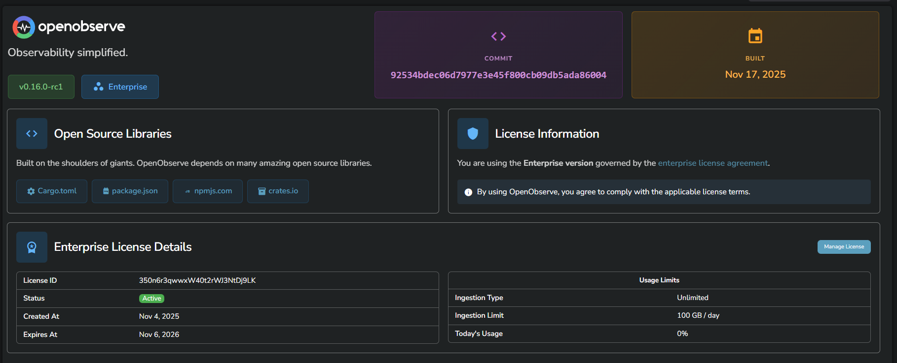
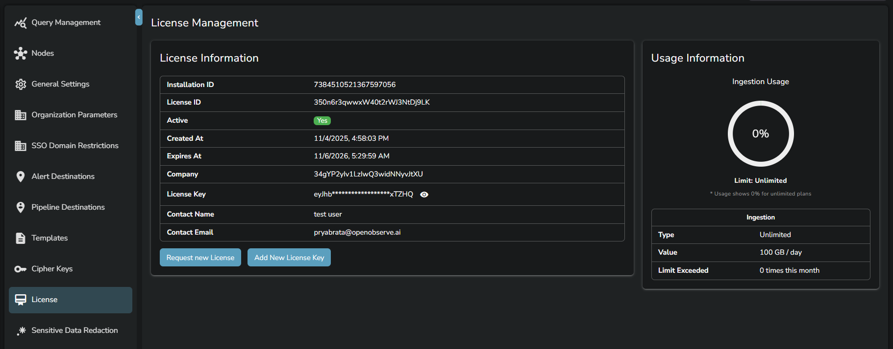
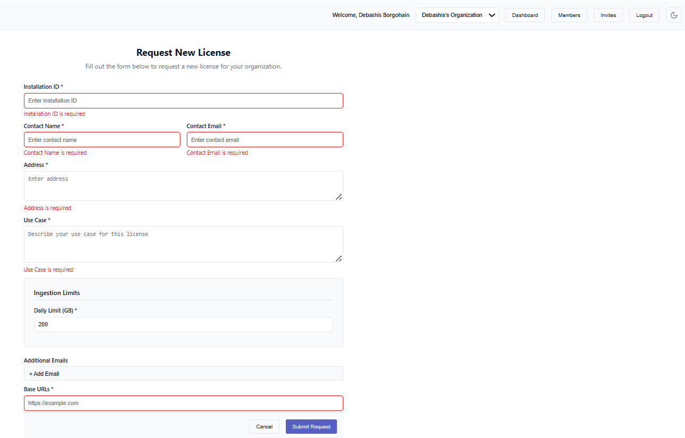
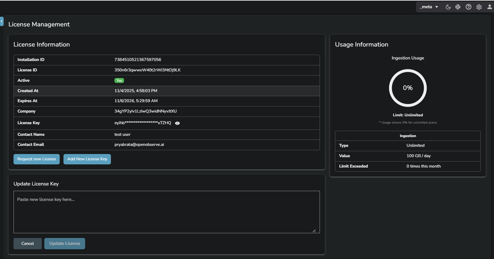

This page explains how OpenObserve Enterprise licenses work and how users can view, request, add, and update licenses. The guide is role based so that each user clearly understands what they can do and how to do it.

## Overview 
The license defines the daily ingestion capacity for your OpenObserve installation. It ensures that the installation operates within the allowed limits and that enterprise features remain active. The system monitors ingestion volume throughout the day and blocks ingestion and search when the daily limit is crossed.

!!! note "Who can access"

    OpenObserve provides access to license information based on the following roles. Your role decides what you can see and what actions you can perform.

    | **Role**                                                                                                                                             | **What you can do**                                                                                                                                                                                       | **What you cannot do**                                                                                                                                                                                       |
    | ---------------------------------------------------------------------------------------------------------------------------------------------------- | --------------------------------------------------------------------------------------------------------------------------------------------------------------------------------------------------------- | ------------------------------------------------------------------------------------------------------------------------------------------------------------------------------------------------------------ |
    | **If you have access to an organization**                                                                                    | - View license information in the About page of the organization.   - Check daily ingestion limits.   - Check current usage.                                                                        | - Use the Manage License button in the About page of the organization. Selecting it shows a `403` unauthorized message.   - Access the License page under Management.   - Add or update a license key. |
    | **If you have access to the meta organization but do not have the update permission for the License module under IAM > Roles > Permission** | - Open the License page under Management in the meta org and view detailed license information.   - Request a new license.   - Use the Manage License button in the About page of any organization. | - Add or update a license key in the License page under Management.                                                                                                                                          |
    | **If you have access to the meta organization and have create and update permission for the License module under IAM > Roles > Permission** | - Add a new license key in the License page under Management.   - Update an existing license key.                                                                                                      | -                                                                                                                                                           |

## How to manage licenses
To perform the following tasks, you must have appropriate permission. Review the **Who can access** section to know more. 

??? "View license information"
    ### View license information
    

    1. Click the Help (?) icon in the top-right corner.
    2. Click **About**.  
    2. In the **Enterprise License Details** section, review license status, ingestion limit, and daily usage.

??? "Request a new license"
    ### Request a new license

    1. In the **Enterprise License Details** section of the **About** page, click **Manage License**. 
    
    2. It takes you to the License page under **Management** in the `_meta` organization.
     
    3. Click **Request New License**. 
    4. Complete the form by following the guidelines mentioned below and click **Submit Request**.   

    !!! note "Guideline for completing the license request form"
        Use the information below to complete each field accurately when requesting a new license through the License Server page.
        

        - **Installation ID**: The Installation ID field is usually prefilled by the system. If it is not prefilled, copy it from the License page under Management in the meta organization.
        - **Contact Name and Email Address**: Enter the name and email address of the primary contact person for your organization. This person will receive the license key and future communication related to license renewal or verification.
        - **Address**: Provide the official address of your organization. This must be a valid, complete postal address because it is used for verification and record keeping.
        - **Use case**: Describe how you plan to use OpenObserve. Provide clear details about your expected data volume or operational requirements.
        - **Ingestion limit**: Select a limit based on the actual ingestion volume of your installation. To determine the correct value, review the usage stream in OpenObserve to identify your peak daily ingestion. Choose a limit that is higher than your highest observed ingestion volume to avoid data loss or ingestion failures.
        - **Additional email addresses**: List additional recipients who should receive notifications related to license issuance or updates.
        - **Base URLs**: Enter the base URLs used by your OpenObserve installation. The License Server accepts multiple base URLs because some installations may operate from more than one domain. Add each URL that users use to access your OpenObserve instance.

??? "Add a new license key"
    ### Add a new license key
    

    1. In the `_meta` organization, navigate to **Management** from the top-right corner.  
    2. Select **License**.  
    3. Select **Add New License Key**.  
    4. Paste the license key in the **Update License Key** field.  
    5. Select **Update License**.  

