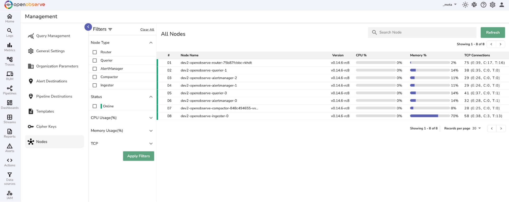
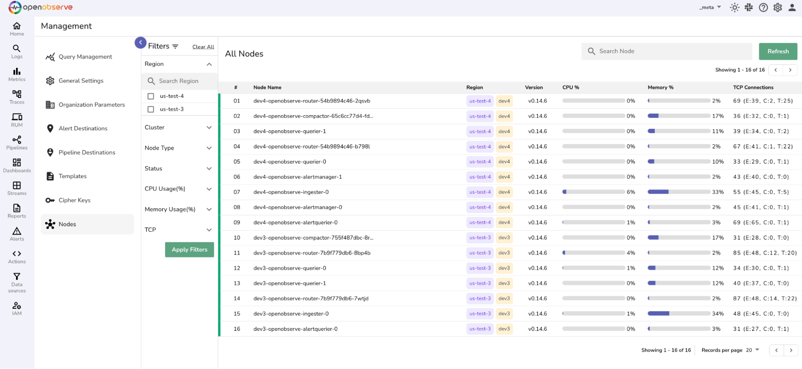
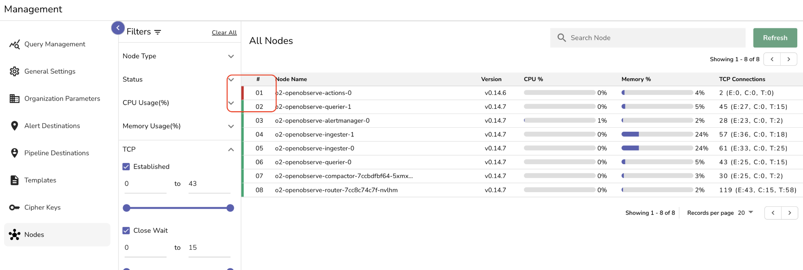
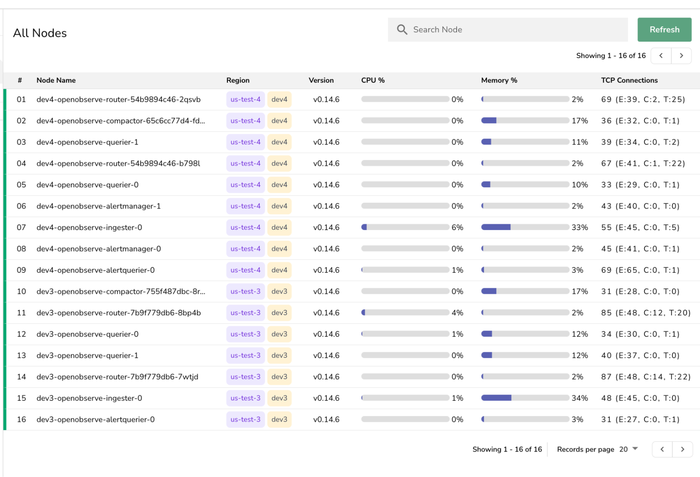
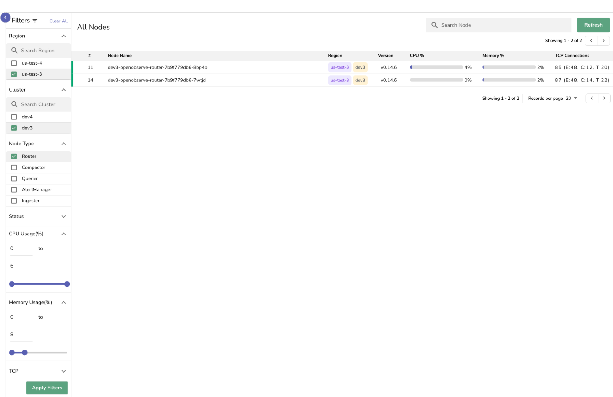

In OpenObserve, a node is an instance of the OpenObserve application. Each node performs one or more specific tasks, such as collecting incoming data, answering search queries, storing data efficiently, or managing alert rules.

A group of such nodes working together is called a cluster. Clusters allow OpenObserve to distribute work across nodes, helping the system scale, stay responsive, and remain available even if one node goes offline. Depending on how OpenObserve is deployed, this cluster can be:

- A single-cluster setup, where all nodes belong to the same local cluster.  
- A super-cluster setup, where multiple clusters, often in different regions, are linked together for global operations.

This guide explains how to monitor the health and performance of each node in your OpenObserve deployment.

### Availability
The **Nodes** page is available only when OpenObserve is running in a clustered deployment, either single-cluster or super-cluster

### Access
In the OpenObserve UI, select `_meta` organization and go to **Management > Nodes** from the top navigation menu.  

By default, only root users have access to this page. To grant access to other roles, use [Role-Based Access Control (RBAC)](https://openobserve.ai/docs/user-guide/identity-and-access-management/enable-rbac-in-openobserve-enterprise/) to assign the necessary permissions.

**For Single-Cluster Setup**  

**For Super-Cluster Setup** 

## Node Types

- **Ingester**: Handles incoming data and writes it to storage.  
- **Querier**: Responds to user queries and retrieves data from storage.  
- **Compactor**: Merges smaller data files and applies retention policies.  
- **Router**: Routes API requests and serves the OpenObserve user interface.  
- **Alert Manager**: Manages alerting rules and runs scheduled tasks.

## View Key Metrics

Each node displays the following metrics in a tabular format with progress bars and color indicators:

- **Name:** Displays the node’s type.  
- **Version:** Displays the OpenObserve version running on the node.  
- **Region and Cluster (for super-cluster setup):** Display the deployment location of the node.  
- **CPU (%):** Shows the percentage of CPU currently in use.  
- **Memory (%):** Indicates how much memory the node is using. In general, you want CPU and Memory usage to stay under 70%. Anything above 70% would typically be a red flag and require attention.  
- **TCP Connections:** Provides summary of active and pending TCP connection states for each node:  

    - **Established (E)**: Shows active, open connections.  
    - **Close Wait (C)**: Shows connections waiting for the node to close.  
    - **Time Wait (T):** Shows recently closed connections waiting to expire.  
    - **Total:** The total may include other states not listed, such as LISTEN, SYN_SENT, SYN_RECV, etc.  
    **Example:** 86 (E:43, C:11, T:29) means: 43 are Established, 11 are in Close Wait, and 29 are in Time Wait state. Total 86 TCP connections on the node.  
    
- **Status**: Shows the current status of each node using color indicators:  
  
    - **Offline** (Red): Node has missed heartbeats and is considered down. Access the Kubernetes cluster or the AWS environment (wherever the system is hosted) and troubleshoot or fix the issue directly from there.
    
    - **Prepare** (Orange): Node is starting up or initializing. No action needed unless it stays in this state too long.
    - **Online** (Green): Node is healthy and active.
    

## Use Refresh, Search, and Filters 

- **Refresh:** Click the **Refresh** button in the top-right corner of the page to update the list with the latest node data.  
- **Search Bar:** Use the search bar to locate nodes by names and version.  
- **Filters**: 

    - **Region and Cluster (for super-cluster setup):** View nodes by deployment zone.  
    - **Node Type**: Filter nodes by type, such as Ingester, Querier, or Alert Manager.  
    - **Status:** Show online or offline nodes.  
    - **CPU/Memory Usage:** Set value ranges to find over-utilized or under-utilized nodes.   
    - **TCP Connections**: Filter by connection state or count.  
        To apply filters, click **Apply Filters**. To reset all filters, select **Clear All**.

  

## Monitor and Troubleshoot Node Health
Use the following signals to monitor node health and take action when needed:

- **CPU and Memory Usage**: If you notice sustained usage above 70%, consider scaling out your deployment or investigating the workload on that node. Note that this percentage may vary depending upon the use case.
- **Spike in TCP Connections**: A sudden spike in Close Wait or Time Wait states could indicate networking issues or inefficient connection handling. Investigate application behavior if this persists.
- **Status is Offline**: Access the Kubernetes cluster or the AWS environment (wherever the system is hosted) and troubleshoot or fix the issue directly from there.
- **Status Fluctuates**: Frequent transitions between statuses can indicate unstable infrastructure or configuration issues.