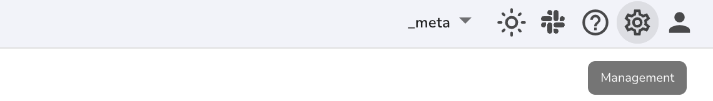
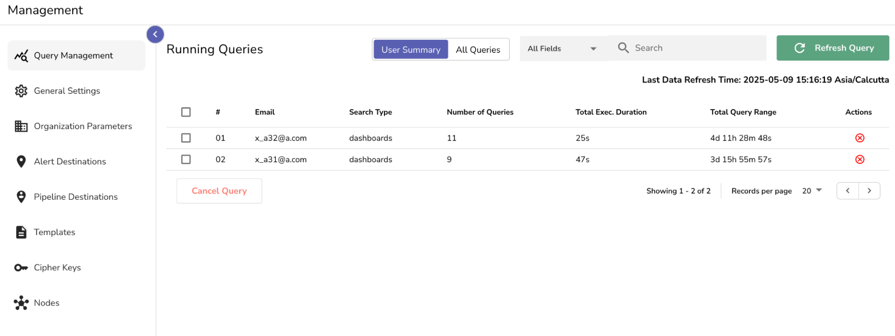
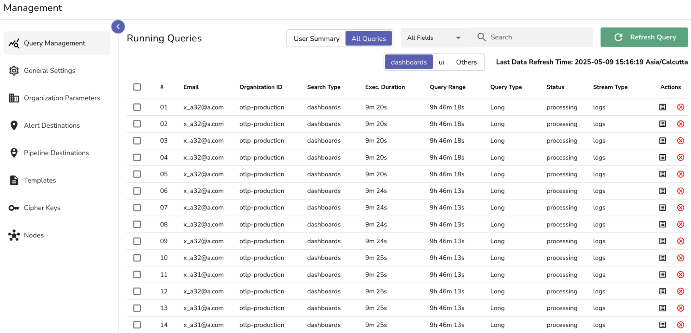
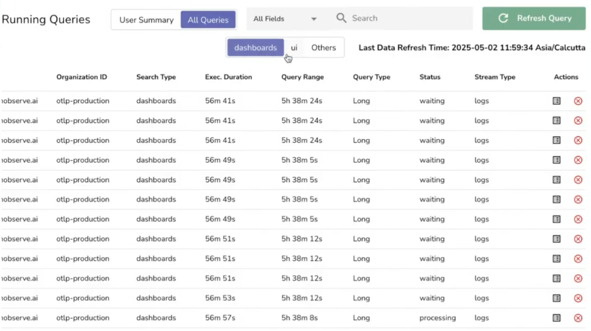
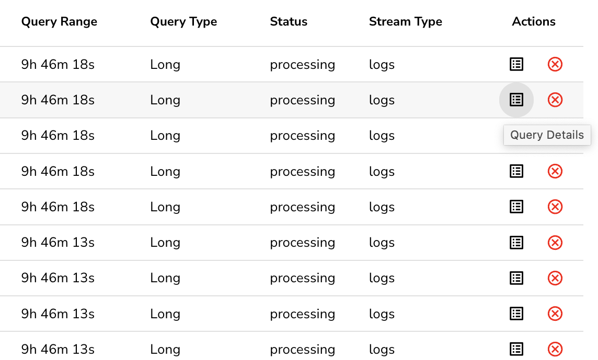
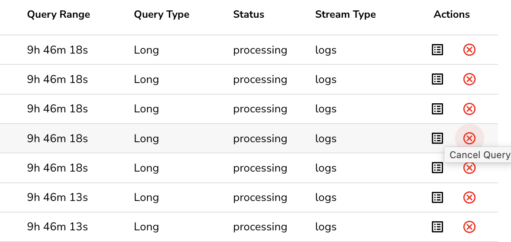

The **Query Management** page provides **real-time visibility and control** over all currently running queries across dashboards, alerts, logs, and reports within an OpenObserve instance. Using the **Query Management page**, you can decide whether to cancel a query or leave it running. 

## Availability

The Query Management feature is available only in high-availability (HA) deployments.

## Access

By default, `root` users and `Admins` with access to the `_meta` organization can access the Query Management page. RBAC cannot grant access to other custom roles. 

**To access the Query Management page:**

1. Select `_meta` organization from the top right corner.   
2. Go to Management. 
  
3. In the side panel, select **Query Management**.   
   You will be taken to the **Running Queries** section.

## Viewing Modes

You can toggle between:

- **User Summary**: Groups all queries by user and displays their combined activity.  
- **All Queries**: Displays each query individually with full details and filtering options.

Use **User Summary** for high-level monitoring. Switch to **All Queries** when you need to investigate specific query behavior.

## Page Layout and Field Descriptions

The **Running Queries** table displays the following fields:

- **Email**: The email ID of the user who initiated the queries.  
- **Search Type**: The origin of the query (for example, dashboards, alerts, or others).  
- **Number of Queries**: Total active queries for that user.  
- **Total Exec. Duration**: Combined time spent executing all active queries.  
- **Total Query Range**: Total log duration the queries are scanning.  
- **Actions**: Cancel queries initiated by a user.

The **All Queries** table displays the following fields: 

- **Email:** The email of the user who triggered the query.  
- **Organization ID:** The organization context.   
- **Search Type:** The source of the query, such as dashboards, UI, or alerts.  
- **Execution Duration:** The total time the query has been running.  
- **Query Range:** The time range being queried.  
- **Query Type:** Whether the system classifies the query as Short or Long.  
- **Status:** The current status of the query, whether it is still processing or waiting.  
- **Stream Type:** The type of data stream being queried, such as logs.  
- **Actions:** Two actions available: 

    - **View Details** to inspect the query details.  
    - **Cancel** to stop the query immediately.

## Filters and Searches

- **Search Bar**: Enter an email or keyword to filter queries.  
- **All Fields Dropdown**: The **All Fields dropdown** lets you filter queries based on either **Execution Duration** or **Query Range**. Range.  
- **Source Filter**: Filter queries by source. Select one of the following: 

    - **Dashboards**: Queries coming from Dashboards.  
    - **UI**: Queries run manually by users from the Logs interface.  
    - **Others**: Queries triggered by Alerts or Reports.
 

- **Refresh Query Button**: Click to reload the page with the latest query data. Refer to the **Last Data Refresh Time** section to confirm whether the query results are up to date before refreshing.

## How to View Query Details

To inspect a running query:

1. In the **All Queries** view, locate the query you want to examine.  
2. In the **Actions** column, click the icon to **view details**.

You will see a pop-up with full information about the query:

- Unique Trace ID.  
- Current status (e.g., waiting, processing).  
- User email and organization ID.  
- Stream type (e.g., logs).  
- The complete SQL query.  
- The start time and end time selected by the user. This defines the **Query Range**.  
- The **Execution Duration** and final **Query Range** calculated.  
- Additional technical metrics, including the number of records scanned within the selected time range, the original size of the scanned files, and their compressed size in Parquet format.

## How to Cancel a Query

You can cancel a query from either view:

**To cancel from User Summary**:

1. Locate the user whose queries you want to stop.  
2. Either select the checkbox and click **Cancel Query** at the bottom of the page, or click the red **X** icon in the **Actions** column.

**To cancel from All Queries**:

1. Find the query you want to cancel.  
2. In the **Actions** column, click the red `X` icon.

After you confirm, the query is terminated immediately.

## When Should You Cancel a Query

You should cancel a query if any of the following are true:

- The execution time has exceeded acceptable limits.  
- The time range being queried is too wide.   
- The system is under strain, and this query appears in a long or waiting state.

Avoid canceling if:

- The query is from a critical source. 

> **Note:** Canceling a query may interrupt active investigations. Confirm the impact before proceeding.

