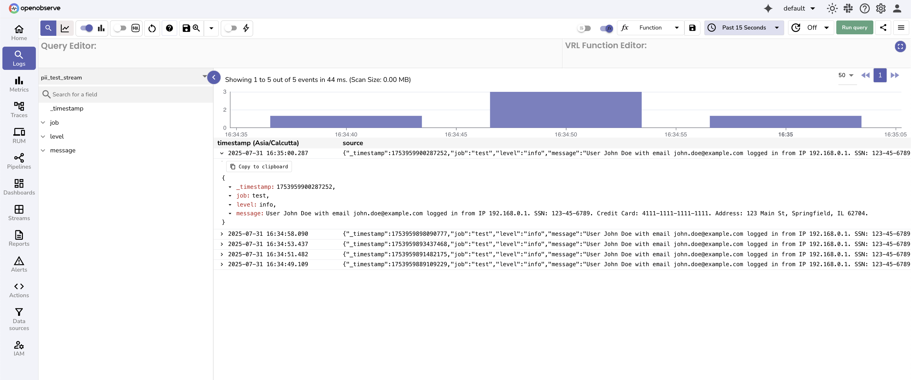
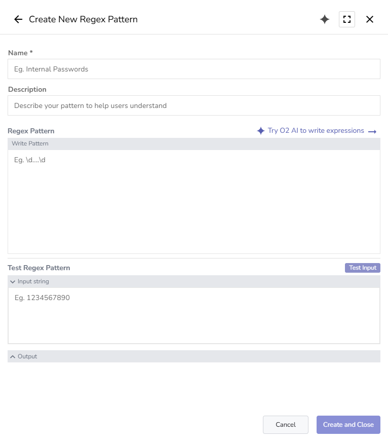
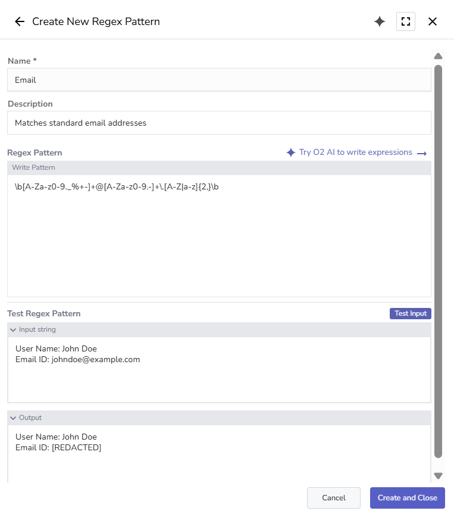
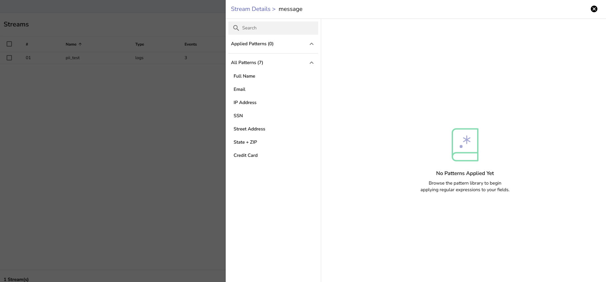

This document helps users understand, create, and use regex patterns to automatically redact or drop sensitive data and Personally Identifiable Information (PII) during log ingestion.
> Note: This feature is applicable to the OpenObserve [Enterprise Edition](../../../openobserve-enterprise-edition-installation-guide/).

## Overview 
The **Regex Pattern** feature in OpenObserve allows you to automatically detect and redact or drop sensitive data during log ingestion using regular expressions. This ensures field-level control over PII, authentication details, financial data, and other confidential values before they are stored or indexed.

!!! note "Where to find"
    To access the **Regex Pattern** interface:

    1. Select the appropriate organization from the dropdown in the top-right corner.
    2. Select **Management** > **Regex Pattern**.

    This opens the regex pattern management interface, where you can view, create, and manage regex patterns available to the selected organization.

!!! note "Who can access"
    Access to **Regex Pattern** is controlled via the **Regexp Patterns** module in the **IAM** settings, using [role-based access control (RBAC)](https://openobserve.ai/docs/user-guide/identity-and-access-management/role-based-access-control/).

    - `Root` users have full access by default.
    - Other user permissions must be assigned access through **Roles** in **IAM**.
    - You can control access at both the module level (all regex patterns) and the individual pattern level. This allows precise control over which users can view, create, edit, or delete specific regex patterns.

!!! warning "Important Note"
    - Regex patterns can only be applied to fields with UTF8 data type.
    - The stream must have ingested data before you can apply regex patterns. Empty streams will not show field options for pattern association.

## Create Regex Patterns

**To create a regex pattern:**
??? note "Step 1: Discover Sensitive Data"
    Identify which fields may contain sensitive or Personally Identifiable Information (PII). 

    1. From the left-hand menu, select **Logs**. 
    2. In the stream selection dropdown, select the stream. 
    3. Select an appropriate time range and click **Run Query**. 
    This shows the records for the selected time range. 
    <br>

    

    **Look for common sensitive patterns.**

    | Sensitive Data Category | Examples | Common Fields |
    |-----------|----------|---------------|
    | **Personal Information** | Names, emails, phone numbers | `message`, `user_info`, `contact` |
    | **Financial Data** | Credit cards, SSNs, bank accounts | `payment_info`, `transaction_data` |
    | **Authentication** | API keys, tokens, passwords | `headers`, `auth_data`, `debug_info` |
    | **Network Data** | IP addresses, MAC addresses | `client_ip`, `network_info` |

    **Example Sensitive Data in Logs:**<br>
    ```json
    {
    "message": "User John Doe with email john.doe@company.com logged in from IP 192.168.1.100. SSN: 123-45-6789. Credit Card: 4111-1111-1111-1111",
    "timestamp": "2025-07-30T10:30:00Z"
    }
    ```
??? note "Step 2: Create and Test Regex Patterns"
    To create regex patterns, naviagte to **Management** > **Regex Pattern** > **Create Pattern**. 
    

    In the pattern creation form, enter the following details: 

    1. **Name**: Enter a clear, descriptive name. For example, Email Detection. 
    2. **Description:** (Optional)  Explain what the pattern is intended to detect.
    3. **Regex Pattern**: Paste or write the regular expression you want to use. Refer to the following **common patterns** or this open source [pyWhat project](https://github.com/bee-san/pyWhat/tree/main/pywhat/Data). 
    4. **Test Pattern**: Provide a sample input to validate that the regex works as expected.
    5. Click the **Create and Close** button to save the pattern. 

    **Common Patterns**

    | Type | Pattern | Example |
    |------|---------|---------|
    | **Email** | `\b[A-Za-z0-9._%+-]+@[A-Za-z0-9.-]+\.[A-Z\|a-z]{2,}\b` | `user@company.com` |
    | **Full Name** | `\b[A-Z][a-z]+ [A-Z][a-z]+\b` | `John Doe` |
    | **Phone (US)** | `\+?1?[-.\s]?\(?[0-9]{3}\)?[-.\s]?[0-9]{3}[-.\s]?[0-9]{4}` | `+1-555-123-4567` |
    | **Credit Card** | `\b(?:\d{4}[-\s]?){3}\d{4}\b` | `4111-1111-1111-1111` |
    | **SSN (US)** | `\b\d{3}-?\d{2}-?\d{4}\b` | `123-45-6789` |
    | **API Key** | `\b[A-Za-z0-9]{32,}\b` | `sk_live_1234567890abcdef` |
    | **IP Address** | `\b(?:[0-9]{1,3}\.){3}[0-9]{1,3}\b` | `192.168.1.100` |
    | **Password Field** | `(?i)password[\"':\s=]+[\"']?([^\"'\s,}]+)` | `password: "secret123"` |

    **Example** <br>
    The following screenshots illustrate the pattern creation process:

    1. Reviewing a log that includes PII
    <br>
    The log message in the `pii_test_stream` contains names, email addresses, IP addresses, SSNs, and credit card numbers.
    <br>
    
    2. Creating and testing the regex patterns
    <br>
    **Full Name**: 
    
    <br>
    **Email Addresses**:
    
    3. Adding more patterns 
    <br>
    Continue creating patterns for additional sensitive fields such as IP addresses, SSNs, and credit card numbers. 
    


## Apply Regex Patterns 
Once your regex patterns are created and tested, you can apply them to specific fields in a stream to redact or drop sensitive data during ingestion.

**To apply a pattern to a field:**

??? "Step 1: Go to the Stream Field"
    1. From the left-hand menu, go to **Streams**.
    2. Locate the stream where you want to apply regex patterns and select **Stream Details** from the **Actions** column.
    3. In the **Stream Settings** tab, locate the field that contains sensitive data.
    <br>

??? "Step 2: Add Pattern" 
    1. Select **Add Pattern** for that field. This opens the pattern panel, where you can view Applied Patterns (if any) and browse all available patterns. <br>
    

    2. Select a pattern to apply. 
     
    <br>
    After you select a pattern, a detail view appears, showing the following:
    

        - **Pattern Name** and **Description**
        - The **Regex Pattern**
        - A **Test Input** area (optional)
        - Options for how to handle matches.

??? "Step 3: Choose Whether to Redact or Drop"
    When applying a regex pattern, you must choose one of the following actions.

    **Redact**:

    - Replaces only the matching portion of the field value with `[REDACTED]`, while preserving the rest of the field.  
    - Use this when the field contains both sensitive and non-sensitive information and you want to retain the overall context.

    **Drop**:

    - Removes the entire field from the log record if the regex pattern matches.  
    - Use this when the entire field should be excluded from storage or analysis.

    Select the appropriate action (Redact or Drop) and click **Add Pattern**.

??? "Step 4: Apply Multiple Patterns (Optional)"
    You can apply multiple patterns to the same field.  
    All applied patterns will appear in the left-hand panel with check marks. 
    

??? "Step 4: Save Configuration" 
    When finished, click **Update Changes** to save the configuration. This activates the regex rules for the selected field.
    

## Test Redaction and Drop
Once regex patterns are applied to a stream, you can verify the results by inspecting incoming log records.

**Note:** These tests assume that data ingestion is active for the target stream. If ingestion is paused, ensure that you select the correct time range while running search queries to include previously ingested test data.

??? "To test redaction and drop"

    1. Go to **Logs** in the left-hand menu.
    2. Select the stream where you applied the redaction pattern.
    3. Set an appropriate time range and select **Run Query**.

    **For redaction**: <br>
    When the pattern is configured to **Redact**, matched values will appear as `[REDACTED]` in the field.
    

    **For drop**: <br>
    To demonstrate drop behavior, the pattern configuration for the `message` field was updated by changing the match action in one of the applied patterns (for example, the credit card pattern) from **Redact** to **Drop**. <br>
    
    <br>
    When the pattern is configured to **Drop**, the target field, such as `message`, will not appear in the ingested record.
    

## Limitations

- **Pattern Matching Engine**: OpenObserve uses the Intel Hyperscan library for regex evaluation. All Hyperscan limitations apply to pattern syntax and matching behavior.
- **Field Type Restrictions**: Regex patterns can only be applied to fields with a UTF8 data type. Other field types are not supported.
- **Data Requirements**: Patterns can only be applied after the stream has ingested data. Empty streams will not show any fields in the Stream Settings tab for pattern association.
- **Performance**: Complex patterns may impact ingestion speed, but overall performance remains faster than VRL-based redaction. 
- **Data Impact**: Regex patterns apply only to newly ingested data. Existing log data is not modified.

## Troubleshooting

**Problem**: **Add Pattern** not visible in **Stream Details**. <br>
**Cause**: The field is not of UTF8 type. <br>
**Solution**: Check the field type in the Stream Details view. Only UTF8 fields support regex patterns.<br>

**Problem**: Pattern does not apply.<br>
**Cause**: Configuration changes were not saved.<br>
**Solution**: Ensure that you selected **Update Changes** after applying the pattern.


