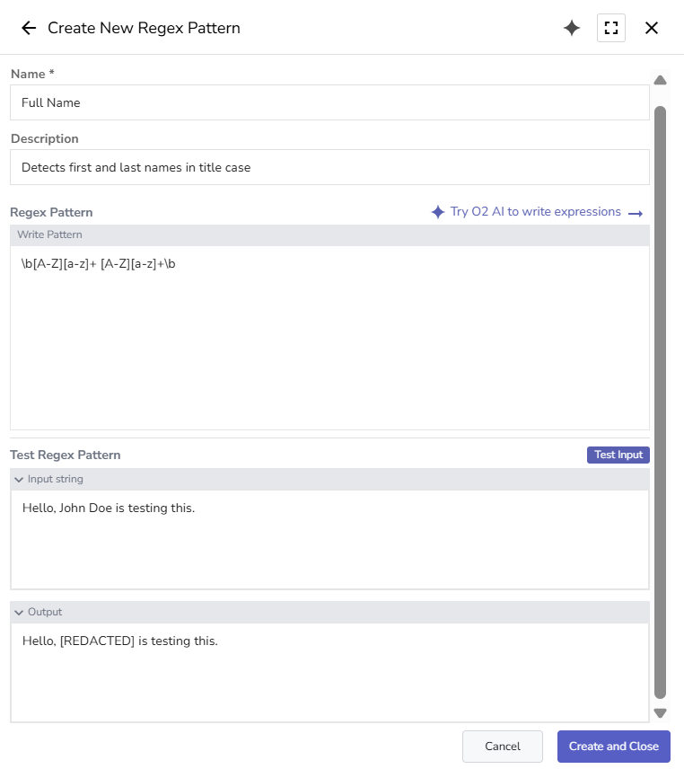
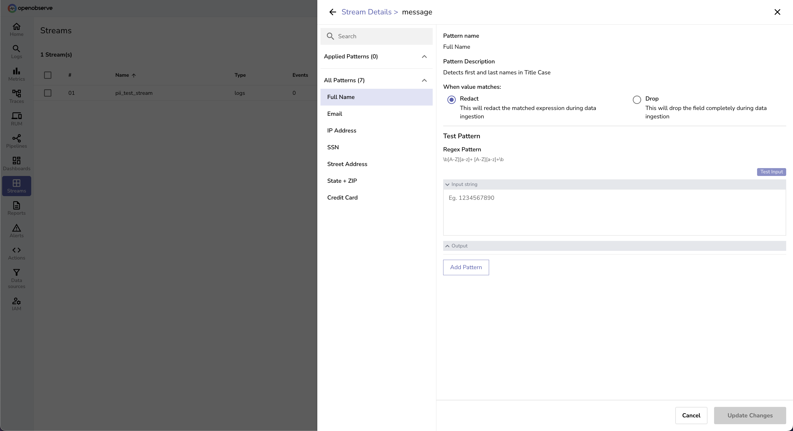
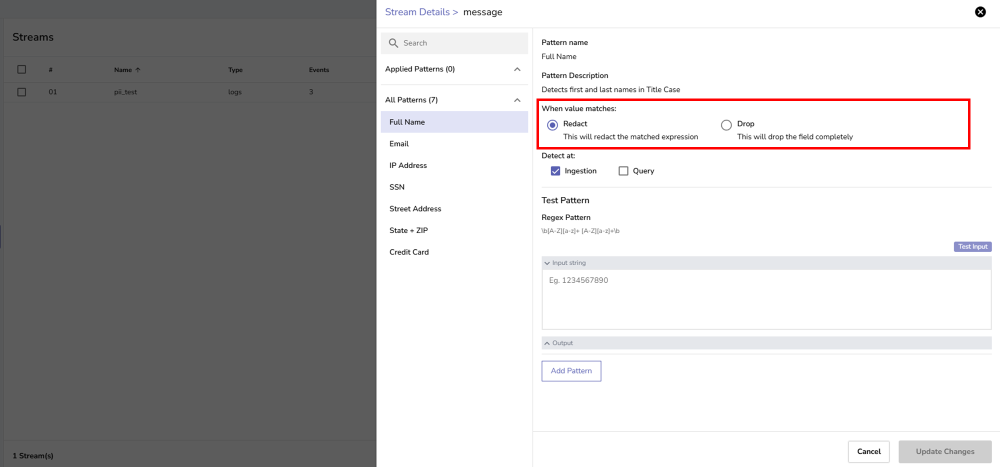
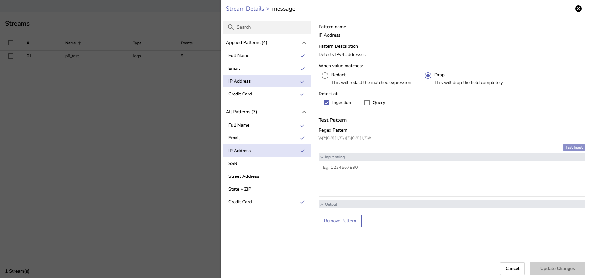
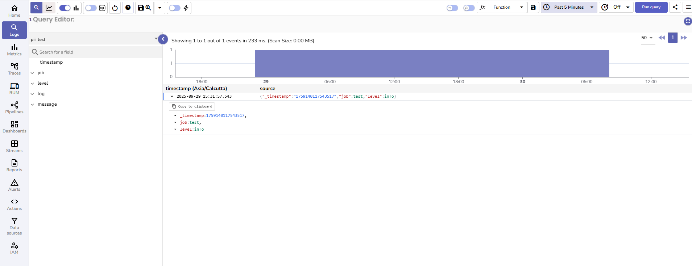
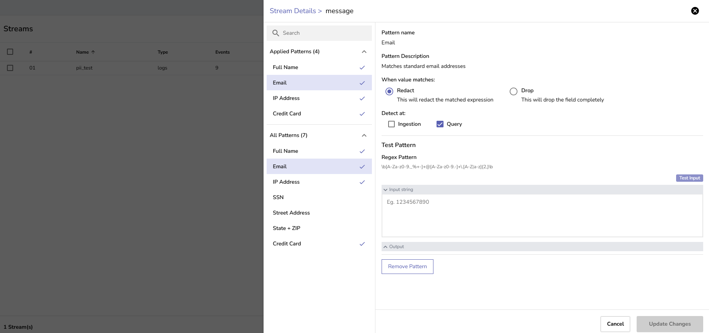
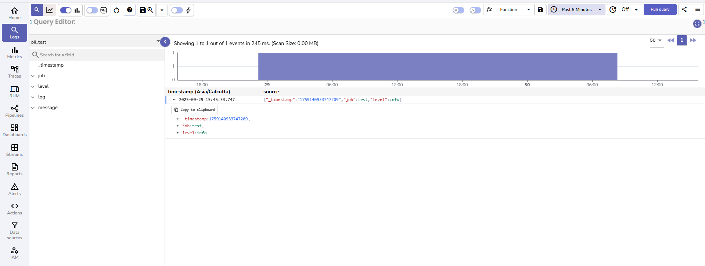

This document explains how to configure and manage regex patterns for redacting or dropping sensitive data in OpenObserve.
> Note: This feature is applicable to the OpenObserve [Enterprise Edition](../../../openobserve-enterprise-edition-installation-guide/).

## Overview 
The **Sensitive Data Redaction** feature helps prevent accidental exposure of sensitive data by applying regex-based detection to values ingested into streams and to values already stored in streams. Based on this detection, sensitive values can be either **redacted** or **dropped**. This ensures data is protected before it is stored and hidden when displayed in query results. You can configure these actions to run at ingestion time or at query time.

**Ingestion time**

> **Note**: Use ingestion time redaction or drop when you want to ensure sensitive data is never stored on disk. This is the most secure option for compliance requirements, as the original sensitive data cannot be recovered once it's redacted or dropped during ingestion.

- **Redaction**: Sensitive data is masked before being stored on disk.
- **Drop**: Sensitive data is removed before being stored on disk.

**Query time**
> **Note**: If you have already ingested sensitive data and it's stored on disk, you can use query time redaction or drop to protect it. This allows you to apply sensitive data redaction to existing data.

- **Redaction**: Sensitive data is read from disk but masked before results are displayed.
- **Drop**: Sensitive data is read from disk but excluded from the query results.

!!! note "Where to find"
    To access the **Sensitive Data Redaction** interface:

    1. Select the appropriate organization from the dropdown in the top-right corner.
    2. Select **Management** > **Sensitive Data Redaction**. 
    
    

    This opens the Sensitive Data Redaction interface, where you can view, create, and manage regex patterns available to the selected organization.

!!! note "Who can access"
    `Root` users have full access to both pattern creation and pattern association by default. For other users, permissions are controlled via the **Regexp Patterns** and **Streams** module in the **IAM** settings, using [role-based access control (RBAC)](https://openobserve.ai/docs/user-guide/identity-and-access-management/role-based-access-control/).

    **Pattern Creation:**

    - Users need permissions on the **Regexp Patterns** module to create, view, edit, or delete regex patterns.
    - You can control access at both the module level (all regex patterns) and the individual pattern level for precise control.

    **Pattern Association:**

    - To associate patterns with stream fields, users need List permission on **Regexp Patterns** AND edit permission on **Streams** modules. 

!!! warning "Important Note"
    - Regex patterns can only be applied to fields with UTF8 data type.
    - The stream must have ingested data before you can apply regex patterns. Empty streams will not show field options for pattern association.

## Create Regex Patterns

**To create a regex pattern:**

??? "Step 1: Discover sensitive data"
    ### Step 1: Discover sensitive data
    Identify which fields may contain sensitive data. 

    1. From the left-hand menu, select **Logs**. 
    2. In the stream selection dropdown, select the stream. 
    3. Select an appropriate time range and click **Run Query**. 
    This shows the records for the selected time range. 
    <br>
    

    **Look for common sensitive patterns.**

    | Sensitive Data Category | Examples | Common Fields |
    |-----------|----------|---------------|
    | **Personal Information** | Names, emails, phone numbers | `message`, `user_info`, `contact` |
    | **Financial Data** | Credit cards, SSNs, bank accounts | `payment_info`, `transaction_data` |
    | **Authentication** | API keys, tokens, passwords | `headers`, `auth_data`, `debug_info` |
    | **Network Data** | IP addresses, MAC addresses | `client_ip`, `network_info` |

    **Example Sensitive Data in Logs:**<br>
    ```json
    {
    "message": "User John Doe with email john.doe@company.com logged in from IP 192.168.1.100. SSN: 123-45-6789. Credit Card: 4111-1111-1111-1111",
    "timestamp": "2025-07-30T10:30:00Z"
    }
    ```
??? "Step 2: Create and test regex patterns"
    ### Step 2: Create and test regex patterns
    To create regex patterns, naviagte to **Management** > **Sensitive Data Redaction** > **Create Pattern**. 
    
    
 
    In the pattern creation form, enter the following details: 

    1. **Name**: Enter a clear, descriptive name. For example, Email Detection. 
    2. **Description:** (Optional)  Explain what the pattern is intended to detect.
    3. **Regex Pattern**: Paste or write the regular expression you want to use. Refer to the following **common patterns**. 
    4. **Test Pattern**: Provide a sample input to validate that the regex works as expected.
    5. Click the **Create and Close** button to save the pattern. 

    **Common Patterns**

    | Type | Pattern | Example |
    |------|---------|---------|
    | **Email** | `\b[A-Za-z0-9._%+-]+@[A-Za-z0-9.-]+\.[A-Z\|a-z]{2,}\b` | `user@company.com` |
    | **Full Name** | `\b[A-Z][a-z]+ [A-Z][a-z]+\b` | `John Doe` |
    | **Phone (US)** | `\+?1?[-.\s]?\(?[0-9]{3}\)?[-.\s]?[0-9]{3}[-.\s]?[0-9]{4}` | `+1-555-123-4567` |
    | **Credit Card** | `\b(?:\d{4}[-\s]?){3}\d{4}\b` | `4111-1111-1111-1111` |
    | **SSN (US)** | `\b\d{3}-?\d{2}-?\d{4}\b` | `123-45-6789` |
    | **API Key** | `\b[A-Za-z0-9]{32,}\b` | `sk_live_1234567890abcdef` |
    | **IP Address** | `\b(?:[0-9]{1,3}\.){3}[0-9]{1,3}\b` | `192.168.1.100` |
    | **Password Field** | `(?i)password[\"':\s=]+[\"']?([^\"'\s,}]+)` | `password: "secret123"` |

    **Example** <br>
    The following screenshots illustrate the pattern creation process:

    1. Review the logs that includes PII.
    <br>
    The `message` field in the `pii_test_stream` contains names, email addresses, IP addresses, SSNs, and credit card numbers.
    <br>
    
    2. Create and test the regex patterns.
    <br>
    **Full Name**: 
    
    <br>
    **Email Addresses**:
    

## Apply Regex Patterns 
Once your patterns are created and tested, you can apply them to specific fields in a stream to redact or drop sensitive data during ingestion or at query time.
<br>
**To apply a pattern to a field:**

??? "Step 1: Go to the stream field"
    ### Step 1: Go to the stream field
    1. From the left-hand menu, go to **Streams**.
    2. Locate the stream where you want to apply regex patterns and select **Stream Details** from the **Actions** column.
    3. In the **Stream Settings** tab, locate the field that contains sensitive data. 

    

??? "Step 2: Add pattern" 
    ### Step 2: Add pattern
    1. Select **Add Pattern** for the target field. This opens the pattern panel, where you can view already applied patterns and add new ones.
    
    2. From the **All Patterns** section, select a pattern you want to apply. 
     
    <br>
    After selecting a pattern, a detail view appears.
    

??? "Step 3: Choose whether to Redact or Drop"
    ### Step 3: Choose whether to Redact or Drop
    
    
    When applying a regex pattern, you must choose one of the following actions in the pattern details screen:

    **Redact**:

    - Replaces only the matching portion of the field value with `[REDACTED]`, while preserving the rest of the field.  
    - Use this when the field contains both sensitive and non-sensitive information and you want to retain the overall context.

    **Drop**:

    - Removes the entire field from the log record if the regex pattern matches.  
    - Use this when the entire field should be excluded from storage or analysis.

    Select the appropriate action between Redact and Drop. 

??? "Step 4: Choose when the action needs to be executed"
    ### Step 4: Choose when the action needs to be executed
    In the pattern details screen, select when the chosen action (redact or drop) should be executed, at ingestion time, query time, or both.
    
    

    **Ingestion**: 

    - The data is redacted or dropped before it is written to disk.  
    - This ensures that sensitive information is never stored in OpenObserve.  
    - Example: If an email address is redacted at ingestion, only the masked value `[REDACTED]` will be stored in the logs.

    **Query**:  

    - The data is stored in its original form but is redacted or dropped only when queried.  
    - This allows administrators to preserve the original data while preventing exposure of sensitive values during searches.  
    - Example: An email address stored in raw form will be hidden as `[REDACTED]` in query results.  

    You can select one or both options depending on your security and compliance requirements.
    **If neither ingestion time nor query time is selected, no redaction or drop is applied.**

??? "Step 5: Add pattern and update changes"
    ### Step 5: Add pattern and update changes

    1. To add the regex pattern to Applied Patterns, click **Add Pattern**. 
    
    2. Select **Update Changes**.
    

??? "Step 6: (Optional) Apply multiple patterns"

    You can apply multiple patterns to the same field, as shown below:
    Configure a regex pattern to detect emails:
    
    Configure a regex pattern to IP addresses:
     
    All applied patterns will appear in the left-hand panel with check marks.

??? "Step 7: Save configuration" 
    ### Step 7: Save configuration
    When finished, click **Update Changes** to save the configuration. This activates the regex rules for the selected field.


## Test Redaction and Drop Operations

The following regex patterns are applied to the `message` field of the `pii_test` stream:

| Pattern Name | Action | Timing | Description |
|--------------|--------|--------|-------------|
| Full Name | Redact | Ingestion | Masks names like "John Doe" |
| Email | Redact | Query | Masks email addresses at query time |
| IP Address | Drop | Ingestion | Removes IP addresses before storage |
| Credit Card | Drop | Query | Excludes credit card numbers from results |

??? "Test 1: Redact at ingestion time"
    ### Test 1: Redact at ingestion time
    **Pattern Configuration**:
    

    **Test Steps**:

    1. From the left-hand menu, select **Logs**. 
    2. Select the `pii_test` stream from the dropdown.
    3. Ingest a log entry containing a full name in the message field. 
    ```bash
    $ curl -u root@example.com:FNIB8MWspXZRkRgS -k https://dev2.internal.zinclabs.dev/api/default/pii_test/_json -d '[{"level":"info","job":"test","message":"User John Doe logged in successfully"}]'
    {"code":200,"status":[{"name":"pii_test","successful":1,"failed":0}]}
    ```
    4. Set the time range to include the test data.
    5. Click **Run Query**.
    6. Verify results:
    

    **Key points:**

    - The name "John Doe" is replaced with [REDACTED].
    - The rest of the message field remains intact.
    - This is the actual stored value on disk.


??? "Test 2: Drop at ingestion time"
    ### Test 2: Drop at ingestion time
    **Pattern Configuration**:
    

    **Test Steps:**

    1. From the left-hand menu, select **Logs**. 
    2. Select the `pii_test` stream from the dropdown.
    3. Ingest a log entry containing a IP address in the message field. 
    ```bash
    $ curl -u root@example.com:FNIB8MWspXZRkRgS -k https://dev2.internal.zinclabs.dev/api/default/pii_test/_json -d '[{"level":"info","job":"test","message":"Connection from IP 192.168.1.100 established"}]'
    {"code":200,"status":[{"name":"pii_test","successful":1,"failed":0}]}
    ```
    4. Set the time range to include the test data.
    5. Click **Run Query**.
    6. Verify results:
    

    **Key points:** 

    - The entire message field is missing from the stored record. 
    - Other fields remain intact. 
    - This demonstrates field-level drop at ingestion. 

??? "Test 3: Redact at query time"
    ### Test 3: Redact at query time
    **Pattern Configuration**:
    

    **Test Steps:**

    1. From the left-hand menu, select **Logs**. 
    2. Select the `pii_test` stream from the dropdown.
    3. Ingest a log entry containing a email addresses in the message field. 
    ```bash
    $ curl -u root@example.com:FNIB8MWspXZRkRgS -k https://dev2.internal.zinclabs.dev/api/default/pii_test/_json -d '[{"level":"info","job":"test","message":"Password reset requested for john.doe@company.com"}]'
    {"code":200,"status":[{"name":"pii_test","successful":1,"failed":0}]}

    ```
    4. Set the time range to include the test data.
    5. Click **Run Query**.
    6. Verify results:
    

    **Key points:** 

    - Original data is preserved on disk.
    - Email address appears as [REDACTED] in query results.
    - Useful for compliance while maintaining data for authorized access.


??? "Test 4: Drop at query time"
    ### Test 4: Drop at query time
    **Pattern Configuration**:
    

    **Test Steps:**

    1. From the left-hand menu, select **Logs**. 
    2. Select the `pii_test` stream from the dropdown.
    3. Ingest a log entry containing credit card details in the message field. 
    ```bash
    $ curl -u root@example.com:FNIB8MWspXZRkRgS -k https://dev2.internal.zinclabs.dev/api/default/pii_test/_json -d '[{"level":"info","job":"test","message":"Payment processed with card 4111-1111-1111-1111"}]'
    {"code":200,"status":[{"name":"pii_test","successful":1,"failed":0}]}
    ```
    4. Set the time range to include the test data.
    5. Click **Run Query**.
    6. Verify results:
    

    **Key points:** 

    - Original data is preserved on disk.
    - The `message` field with the credit card details gets dropped in query results.
    - This demonstrates field-level drop at query time. 


## Limitations

- **Pattern Matching Engine**: OpenObserve uses the Intel Hyperscan library for regex evaluation. All Hyperscan limitations apply to pattern syntax and matching behavior.
- **Field Type Restrictions**: Regex patterns can only be applied to fields with a UTF8 data type. Other field types are not supported.
- **Data Requirements**: Patterns can only be applied after the stream has ingested data. Empty streams will not show any fields in the Stream Settings tab for pattern association.
- **Performance**: Complex patterns may impact ingestion speed, but overall performance remains faster than VRL-based redaction. 

## Troubleshooting
| **Issue**                                                | **Cause**                             | **Solution**                                                                              |
| -------------------------------------------------------- | ------------------------------------- | ----------------------------------------------------------------------------------------- |
| The Add Pattern option is not visible in Stream Details. | The field is not of UTF8 type.        | Check the field type in the Stream Details view. Only UTF8 fields support regex patterns. |
| Pattern does not apply.                                  | Configuration changes were not saved. | Ensure that you selected **Update Changes** after applying the pattern.                   |


