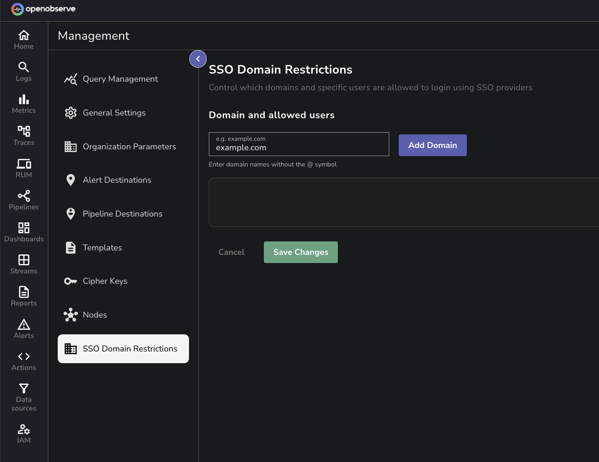
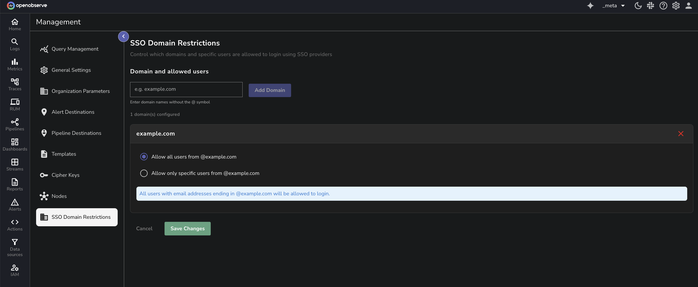
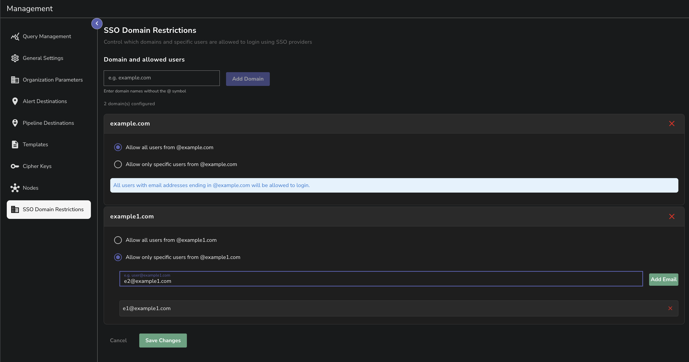

> This feature is only available in the OpenObserve Enterprise Edition. 

This user guide provides step-by-step instructions for configuring and managing **SSO Domain Restrictions** in OpenObserve.  
This feature allows you to control which users can log in to OpenObserve using Single Sign-On (SSO) providers. You can allow access to specific domains or even individual users from those domains.

!!! note "Where to find"
    The **SSO Domain Restrictions** page is available in the `_meta` org under **Management**.

!!! note "Who can access"
    `Root` user and any other user who has access to the `_meta` org can access the **SSO Domain Restrictions** page.

## Add Domain Restrictions

??? "Step 1: Add a new domain"
    ### Step 1: Add a new domain
    1. In the **Domain and allowed users** section, enter the domain name in the text field. 
    > Enter only the domain name, for example, `example.com` and do not include the `@` symbol. 
    2. Click the **Add Domain** button. 
    

??? "Step 2: Configure Domain Access"

    For each domain, you have two control options:

    **Option 1: Allow All Users from Domain** 
    It permits any user with an email address from the selected domain to log in using SSO.  
    > **Use case:** Allow all employees from your company domain `@example.com`. 
     
    

    **Option 2: Allow Specific Users Only** 
    It allows you to add individual email addresses that should be permitted to log in using SSO.  
    > **Use case**: Allow only certain users from a partner organization. For example, `e1@example1.com` and `e2@example1.com`. 

    When **Allow only specific users** is selected:
     
    

    1. Enter the complete email address in the input field. 
    2. Click **Add Email**. 
    3. The email address will be added to the allowed list. 
    4. Repeat for additional users.
    5. Use the **X** button next to any email to remove it. 

??? "Step 3: Save configuration"
    ### Step 3: Save configuration
    1. Review your domain restrictions.
    2. Click **Save Changes** to apply the configuration. 
    3. Click **Cancel** to discard changes. 

## Domain limits 
There is no limit on the number of domains you can configure. Add as many domains and specific users as needed for your organization. 

## Error messages
When **SSO Domain Restrictions** are configured, any user attempting to log in from domains or email addresses that are **NOT** in the allowed list will see an `unauthorized` error during SSO login.

## Supported SSO login options
OpenObserve allows users to log in through the following Single Sign-On options, and domain restrictions apply to all of them:

- GitHub 
- GitLab
- Google
- Microsoft

Domain restrictions will be enforced when users attempt to log in using any of these SSO options.

## Troubleshooting
| **Problem**                               | **Solution**                                                         |
| ----------------------------------------- | -------------------------------------------------------------------- |
| SSO Domain Restrictions menu not visible. | Verify that you are in the `_meta` organization.                     |
| Changes not taking effect.                | Ensure that you clicked **Save Changes** and refresh the login page. |

