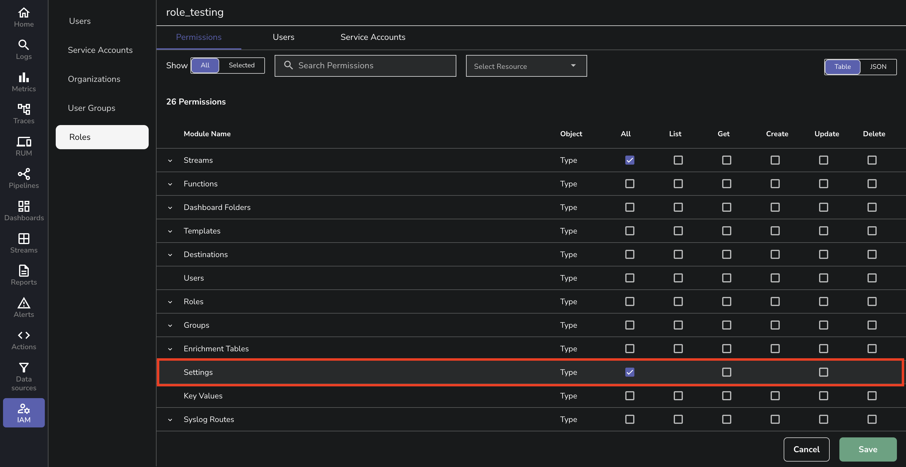
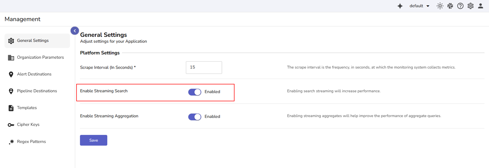
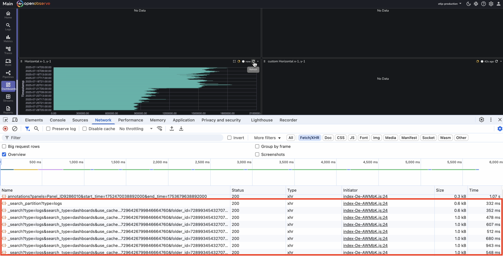
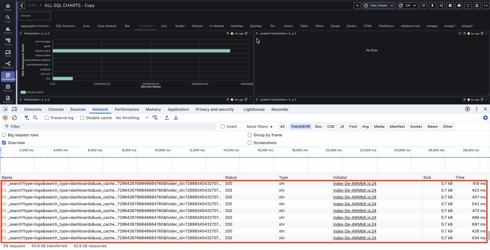
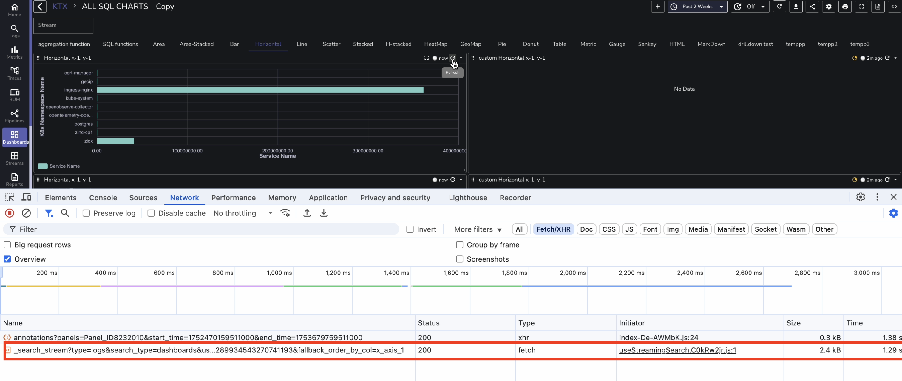

This user guide provides details on how to configure, and use the **Streaming Search** feature to improve query performance and responsiveness.  

## What is Streaming Search?

Streaming Search allows OpenObserve to return query results through a single, persistent HTTP/2 connection. Instead of issuing one HTTP request per partition, the system streams the entire result set over one connection. This reduces overhead, improves dashboard performance, and provides faster response times during long-range queries.

!!! note "Where to Find"
    The **Streaming Search** toggle is located under **Management > General Settings**.

!!! note "Who Can Access"
    The `Root` user and any other user with permission to **update** the **Settings** module can modify the **Streaming Search** setting. Access is controlled through role-based access control (RBAC).
     
    
    
## Concepts
### Partition

OpenObserve splits the total time range into partitions, each covering a segment of time or data volume. For example, an 8-hour query with 8 GB of data may be split into 8 partitions, each processing 1 GB. These partitions are executed sequentially and contribute partial results to the final output.

### Mini-Partition
Based on the environment variable `ZO_MINI_SEARCH_PARTITION_DURATION_SECS`, the first partition is divided into a mini-partition to return results faster. This is helpful when working with large time ranges.

The environment variable is enabled by default and it defines the duration of the mini-partition in seconds. By default, this is set to 60 seconds.

??? note "See how a mini-partition works:"
    Suppose you run a query over the past 12 hours.

    - The first partition might normally span 1 hour of data.
    - The mini-partition splits this into a smaller slice, such as 1 minute by default, or according to the configured duration.
    - This 1-minute slice is processed first and returned quickly, allowing partial results to appear faster, while the rest of the query continues in the background.

    > **Note:** Only the first partition is affected. All subsequent partitions are processed at their normal size.

### HTTP/2 Streaming

When **Streaming Search** is enabled, OpenObserve uses a single HTTP/2 connection to send the entire result set. 

This enables:

- A larger in-memory cache that persists for the entire query
- Fewer HTTP round trips
- Faster response and improved dashboard rendering

> **Note:** When **Streaming Search is enabled**, the mini-partition output is included in the same `_search_stream` response. All data is delivered over a single HTTP/2 connection. You do not see a separate request for the mini-partition. 

## Enable or Disable Streaming Search

1. Go to **Management**.
2. Select **General Settings**.  

3. Locate the **Enable Streaming Search** option.
4. Toggle this switch to **On** to enable streaming mode, or **Off** to disable it.
5. Click **Save** to apply the changes.

## Without Streaming Search

- OpenObserve splits the query time range into multiple partitions.
- Each partition triggers a separate `_search` request.
- The first partition includes a mini-partition by default.
- The mini-partition result is returned first in a separate request, followed by results from the full partitions.
- Each request has its own connection, and there is no query-wide cache across partitions.
- The browser must wait for multiple independent requests to complete, which can increase load times and perceived delay.

**Performance Test: 2-week Dashboard Query**  

Panel 1 triggers 7 `_search` requests and completes loading the data in 4.452 seconds.
 
 

Panel 2 triggers 57 `_search` requests and completes loading the data in 25.987 seconds.
 

## With Streaming Search

- OpenObserve still splits the query time range into partitions.
- The first partition includes a mini-partition by default.
- All partition results, including the mini-partition, are returned through a single `_search_stream` request.
- The entire result is returned over a single HTTP/2 connection.
- The system uses a query-wide cache, which improves efficiency and reduces recomputation.
- There is no duplication of requests, which lowers server and browser load.

**Performance Test: 2-week Dashboard Query**

Panel 1 triggers 1 `_search_stream` request and completes loading the data in 393 milliseconds. 
 

Panel 2 triggers 1 `_search_stream` request and completes loading the data in 1.29 seconds. 
 

## Considerations

- Requires HTTP/2 support in the network stack.
- Falls back to standard query mode if disabled.
- Partitioning behavior is automatic. Mini-partitioning improves the time-to-first-result without affecting the accuracy of final results.
