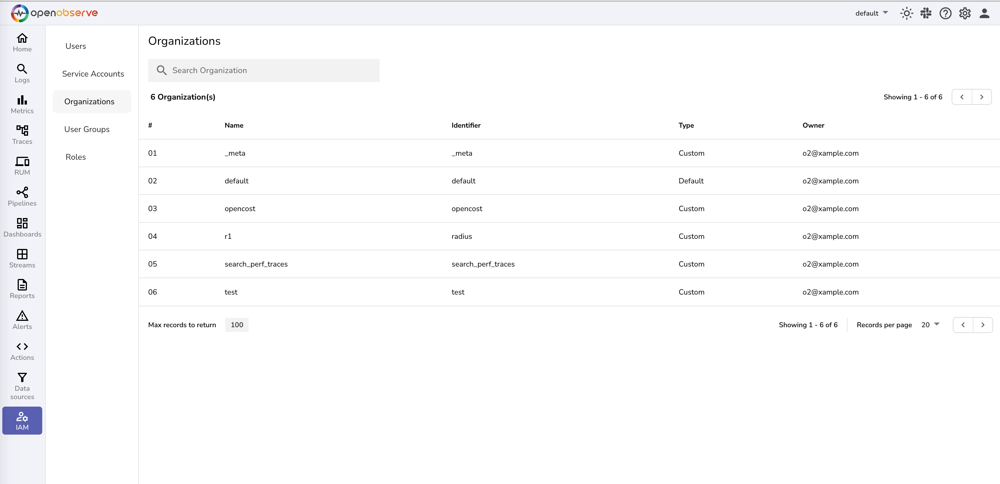

# Organizations

An organization is logical entity using which various streams , users , functions etc are grouped in OpenObserve An organization can represent a enterprize , a department of an enterprize or an application. All streams , users , functions etc are scoped to an organization.

As everything else is scoped to an organization, one has to choose an organization to use OpenObserve after login.

<kbd>

</kbd>

Organizations screen details :

1. To change or select organization use top navigation bar organization selection drop down 
2. To navigate to organizations page Organizations menu button
3. Search in listed organizations
4. Add new organization
5. Name of organization
6. Organization identifier (used in OpenObserve API's)
7. Role of current logged in user , possible values are admin , member
8. Type of organization , possible values are default , custom. Default organization is created for every user in OpenObserve 9. Owner of organization
10. Invited members of organization

