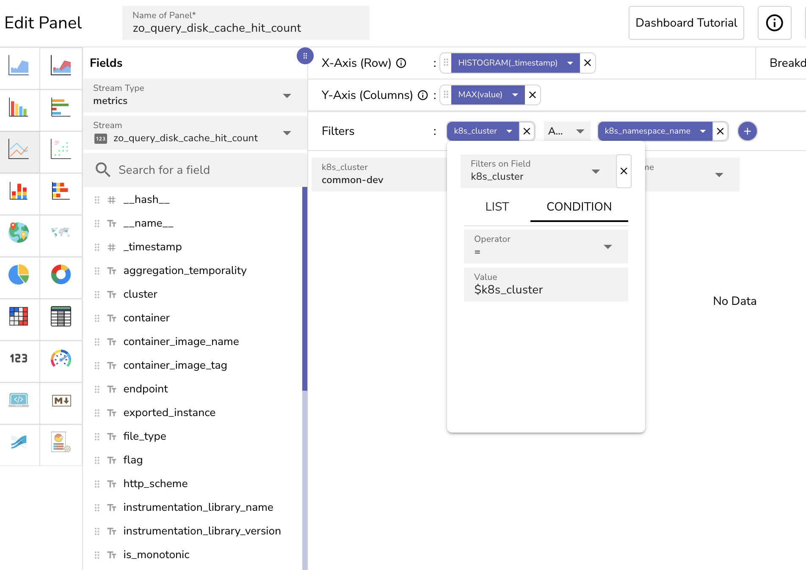

# Monitor Download Queue Size and Disk Cache Metrics

This guide helps you monitor internal metrics that measure how efficiently the [**dual queue system in the Download Manager**](download-manager.md) handles file downloads and how often queries are served from disk cache in OpenObserve. 

## What You Can Monitor

OpenObserve emits four key metrics that track how data files are downloaded and cached:

- `zo_file_downloader_normal_queue_size`: Number of files currently waiting in the [**normal** queue](download-manager.md#dual-queue-system).

- `zo_file_downloader_priority_queue_size`: Number of files in the [**priority** queue](download-manager.md#dual-queue-system). 

- `zo_query_disk_cache_hit_count`: Number of files that were already on disk when the query was executed. 
- `zo_query_disk_cache_miss_count`: Number of files that were not on disk and had to be downloaded before the query could run.

!!! Note
    When OpenObserve runs a query, the querier first checks whether the required Parquet files are already available on the local disk:

    - If the file is found locally, it results in a **cache hit**. The file is immediately read from the disk and used to serve the query.
    - If the file is not found, it results in a **cache miss**. The Download Manager is triggered to fetch the file from object storage and save it to the local disk before query execution can proceed.  


## Configuration

To use these metrics, you must configure the following environment variables in your `values.yaml` file, as shown below:

```yaml
extraEnv:
- name: ZO_SELF_METRIC_CONSUMPTION_ENABLED
    value: "true"
- name: ZO_SELF_METRIC_CONSUMPTION_ACCEPTLIST
    value: "zo_query_disk_cache_hit_count,zo_query_disk_cache_miss_count,zo_file_downloader_normal_queue_size,zo_file_downloader_priority_queue_size"
```

Ensure that you apply this configuration in the correct environment where you want to collect and view the metrics.


## Visualize Metrics in Dashboards
This section demonstrates how to plot the `zo_query_disk_cache_hit_count` metric to monitor how often queries are served from local disk across pods within a specific namespace and cluster. 
After plotting the chart, you will calculate the cache efficiency to evaluate overall cache performance.


!!! info "Before you begin"

    ### Understand Your Cluster Architecture
    When OpenObserve high-availability mode or multi-cluster mode is deployed in Kubernetes:

    - One cluster may host multiple namespaces.
    - Each namespace may include multiple nodes or services with different roles, such as querier, ingester, compactor, router, alert manager, and actions. 
    - Each node or service may be deployed across multiple pods. 

    > In OpenObserve single node deployment, a single node handles all the roles. 

    ### Understand the Nature of Metrics
    Each log line (metric entry) contains fields like `timestamp`, `value`, `cluster`, `namespace`, and `pod_name`. Explore the log line using the **Logs** page in the UI. 
    To isolate useful data, we need to filter and group this information accordingly.

## Step-by-Step Guide to Plotting the Metrics in Dashboards

### Step 1: Create a Panel 
1. In the top-right corner, select your organization.
2. Go to **Dashboards** from the left navigation menu.
3. Open an existing dashboard or create a new one.
4. Click **Add Panel** to start building a chart.
Refer to [Panels in Dashboards](../dashboards/dashboards-in-openobserve.md#panels) if needed. 

### Step 2: Choose a Chart Type
From the chart type panel, choose a visualization type suitable for time-series data. **Line Chart** is recommended for tracking values over time.

### Step 3: Select Stream Type
From the **Stream Type** dropdown, select **Metrics**. This enables access to the internal metrics.

### Step 4: Select the Metric
From the metrics dropdown, select the one you want to plot. For example, `zo_query_disk_cache_hit_count`. 


### Step 5: Configure the Axes 
**Configure the X-Axis:**

1. In the **Fields** section, locate the `timestamp` field.
2. Click the **+X** button to assign it to the x-axis.
> This sets the time progression for the chart.

**Configure the Y-Axis:**

1. In the **Fields** section, locate the value field.
2. Click the +Y button to assign it to the y-axis.
3. Use the **Aggregation** dropdown and select **Max** to show the highest value per interval. 
> Using the **Max** aggregation highlights the highest cache hit value observed in each interval.
 
 

### Step 6: Add Filters
Filters narrow the data to a specific cluster and namespace, ensuring the chart reflects the intended environment. In this example, we need to add two filters:

- Filter for cluster to isolate the specific Kubernetes cluster. For example, `common-dev` which is ingested as value in the `k8s_cluster` field. 
- Filter for namespace to filter down to the environment namespace. For example, `main` which is ingested as value in the `k8s_namespace_name` field. 



**Add Filter for Cluster:**

1. Click the + icon next to **Filters**. 
2. Select **Add Condition**.  
3. Click the **Filters on Field** dropdown and select the cluster field. For example, `k8s_cluster`. 
4. Under Condition, select operator as `=` and value as `$k8s_cluster`.

**Add Filter for Namespace:** 

Repeat the steps above to add a filter for the namespace field. For example, `k8s_namespace_name`. 

!!! Note
    Ensure both filters are connected using the **AND** operator. 

### Step 7: Add a Breakdown
To visualize the cache hit count on each pod, add a breakdown for pods. 

1. In the **Fields** section, locate the field that has the pod name values, for example, `k8s_pod_name`. 
2. Click **+B**, next to the pod name field to add it to the Breakdown section.  

This configuration allows the chart to display a separate line for each pod. It helps you compare cache hit behavior across pods in the same namespace.


### Step 8: Select the Time Range
Use the time range selector at the top of the panel editor to define the period you want to analyze. For example, select Last 6 hours or Last 12 hours to examine recent trends.

### Step 9: Click Apply
Click **Apply** to generate the chart using your selected configuration.
    

## Plot Additional Metrics
To complete cache performance analysis and monitor the download queue, repeat **Steps 1** through **9**, however, select `zo_query_disk_cache_miss_count`, `zo_file_downloader_normal_queue_size`, and `zo_file_downloader_priority_queue_size` in **Step 4**. Use the same filters, time range, and breakdown by pod.

## After Plotting the Chart
With both `zo_query_disk_cache_hit_count` and `zo_query_disk_cache_miss_count` charts available, you can calculate cache efficiency for each pod.

### Cache Hit Ratio
You can measure cache performance using a simple ratio:
```
cache_hit_ratio = hit_count / (hit_count + miss_count)
```
Where:

- `hit_count` is the value of `zo_query_disk_cache_hit_count`
- `miss_count` is the value of `zo_query_disk_cache_miss_count`

**Example**

If:
```
- hit_count = 9000
- miss_count = 1000
```
Then:
```
hit_ratio = 9000 / (9000 + 1000) = 0.9 or 90%
```
This means 90 percent of required files were already on disk at the time of query execution.

!!! Note
    A high cache hit ratio indicates efficient cache usage and reduced query latency.

## Troubleshooting
If the metrics do not appear:

- Verify that `ZO_SELF_METRIC_CONSUMPTION_ENABLED` is set to **true**.
- Check that `ZO_SELF_METRIC_CONSUMPTION_ACCEPTLIST` includes all the relevant metric names.
- Confirm that your dashboard filters match the environment where metrics are enabled. For example, `main`, `usertest`, etc.
