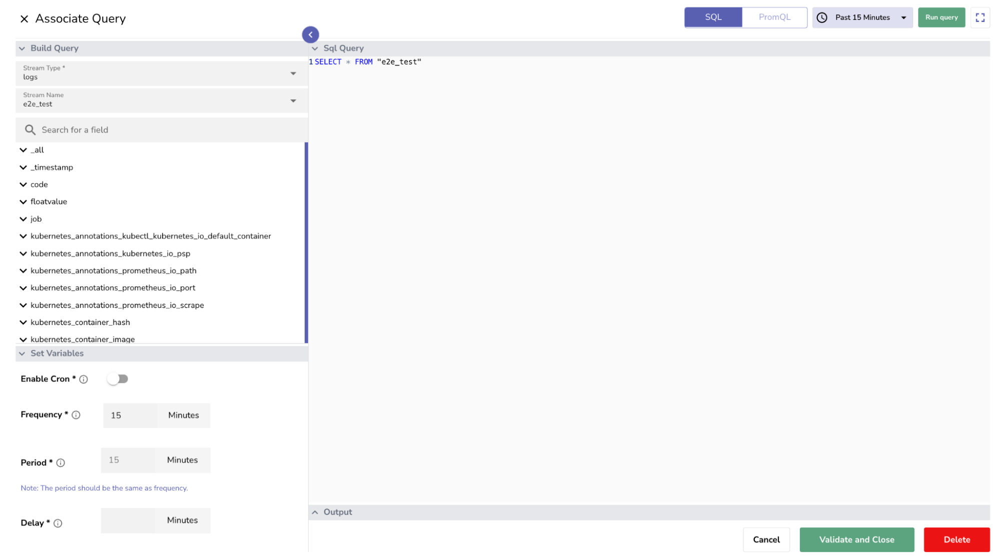

This guide explains how to use the configurable delay feature for [scheduled pipelines](../pipelines/create-and-use-scheduled-pipeline/).
This feature allows you to delay the execution of a scheduled pipeline by a set number of minutes after its scheduled start time. This is useful to ensure data completeness and accommodate late-arriving events before the pipeline runs.

## How to configure delay

When editing the **Associate Query** page:

1. In the **Set Variables** section, add **Delay**. Delay defines how many minutes the system waits after the scheduled trigger time. The pipeline runs only after this waiting period completes.

2. Select **Validate and Close**.

!!! note "Note"
    Since Delay is a required field when setting up a scheduled pipeline, enter 0 minutes if you want the pipeline to run exactly at the scheduled time without any delay.

!!! note "Example"

    If the pipeline is configured with the following settings:

    - Frequency: 5 minutes  
    - Period: 5 minutes  
    - Delay: 2 minutes

    **Behavior:** The pipeline is scheduled every 5 minutes and runs 2 minutes after each scheduled time, processing data from the previous 5-minute window.  
    At 10:00 AM (scheduled time), the pipeline executes at 10:02 AM, processing data from 9:55 AM to 10:00 AM.

    **Note**

    - **Works with Cron**: Delay also applies when using cron-based schedules.  
    - **Data Window Unchanged**: Delay only affects when execution starts. It does not change the data range.

## Related links
- [Pipelines in OpenObserve](../pipelines/pipelines/)
- [Create and Use Real-time Pipeline](../pipelines/create-and-use-real-time-pipeline/)
- [Create and Use Scheduled Pipeline](../pipelines/create-and-use-scheduled-pipeline/)
- [Manage Pipelines](../pipelines/manage-pipelines/)

