Use this guide to create and run real-time pipelines. Real-time pipelines process data immediately after it is ingested into a source stream. They allow you to apply conditions and functions and then route the processed data to one or more destinations.

> Visit the [Pipelines in OpenObserve](https://openobserve.ai/docs/user-guide/pipelines/pipelines/) page before starting. It explains pipeline concepts, types, and components used in this guide.

## Prerequisites
- Your OpenObserve Cloud or self-hosted instance is running.
- You have permissions to work with pipelines. Access is controlled from IAM > Roles > Permissions.

## Steps to create a real-time pipeline

??? "Step 1: Open the pipeline editor"
    ### Step 1: Open the pipeline editor
    1. Log in to OpenObserve.
    2. In the left navigation panel, select **Pipelines**. By default, the system opens the **Pipelines** tab. 
    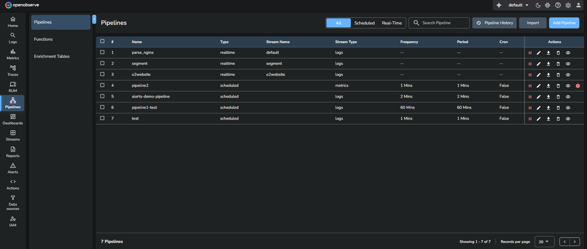
    3. Click **Add Pipeline** at the top-right corner.
    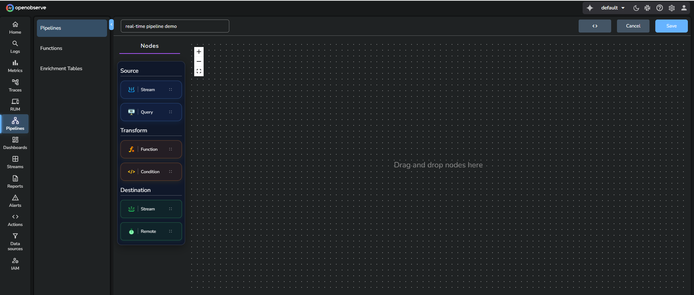
??? "Step 2: Enter a pipeline name"
    ### Step 2: Enter a pipeline name
    Provide a unique name for the pipeline.
    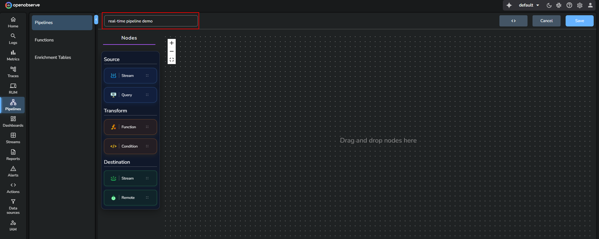

??? "Step 3: Configure the Source node"
    ### Step 3: Configure the Source node

    1. From the **Source** section, drag the **Stream** node into the editor.
    2. Edit the source node:

    - Select the **Stream Type**.
    - Choose one of the following options:

        - **Option A**: Select an existing stream. Choose a stream from the **Stream Name** dropdown.
        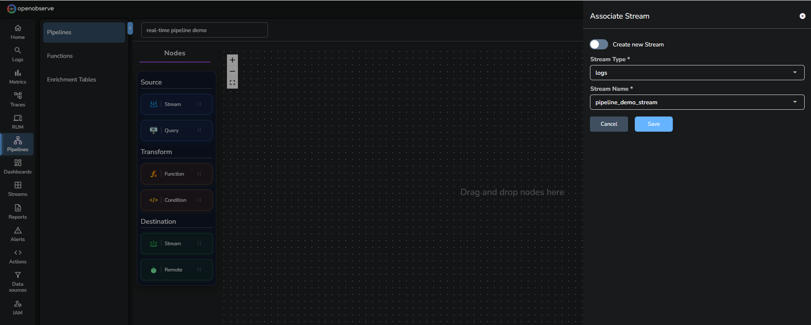
        - **Option B:** Create a new stream. Enable the **Create new Stream** toggle and create a new stream if necessary.
        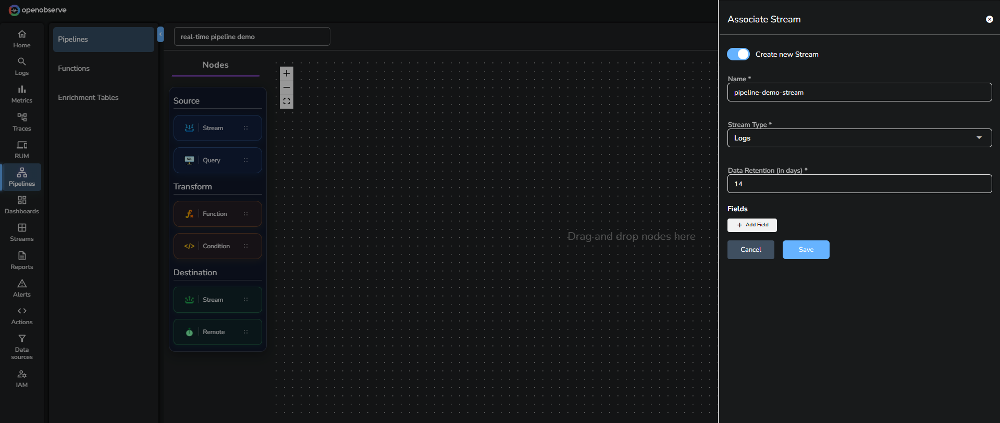
    3. Click **Save** to confirm the source node.

    !!! note "Important behavior"
        When you select a source stream for a real-time pipeline, OpenObserve automatically adds a destination that points back to the same stream. This preserves the original data.
        If you remove this default destination and add only filtered routes, events that do not match the filters will be dropped. Add a destination pointing to the source stream if you want to retain all data.

??? "Step 4: Configure the Transform node"
    ### Step 4: Configure the Transform node

    1. From the **Transform** section, drag either a **Condition** or **Function** node into the editor.
    2. If you add a Condition node:
        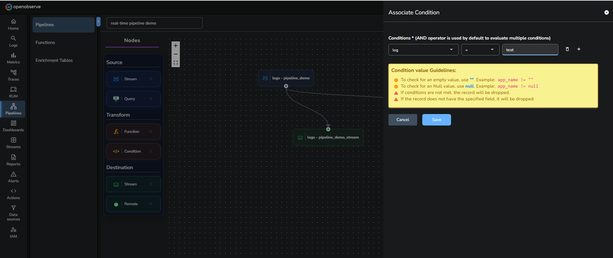

        1. In the **Associate Conditions** screen, select the field name in the **Column** drop-down list. This list displays the fields detected in the source stream.
        2. Select an operator from the **Operator** drop-down list.
        3. Enter a value in the **Value** input box.
        4. Add more conditions if needed.

        !!! note "Important"
            **Condition nodes require a stream schema.**  
            If you create a new stream in **Step 3** and do not define any fields, the **Condition** editor does not display field names.
            To use conditions, add at least one field while creating the source stream or ingest sample data so that the schema is inferred.
        !!! note "Guidelines"
            - Use an empty string to check for empty values. For example, `app_name != ""`
            - Use null to check for null values. For example, `app_name != null`
            - If the condition does not match, the record is dropped.
            - If the record does not contain the specified field, it is also dropped.

    3. If you add a Function node:

        Use a Function node to transform events using a VRL function.
        > A Function does not require predefined fields. You can use it even if the source stream has no schema.  
        !!! note "To create a new function:"
            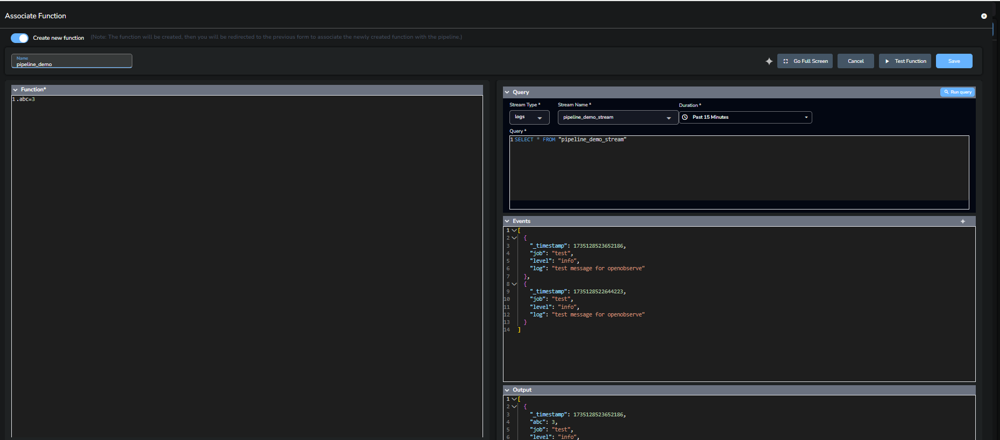

            1. Enable **Create new function** toggle.
            2. In the **Associate Function** tab, enter the function name. 
            3. Open the **Query** tab. 
            4. Select the stream type, stream name, and duration for which you want to query the data. 
            5. Click the **Run Query** option at the top-right corner of the **Query** tab. 
            6. In the **Function** tab, write a VRL function. 
            7. Click the **Test Function** button at the top-right corner of the screen. 
            8. Click **Save** to save the function. 

    4. The **After Flattening** toggle is enabled by default. It ensures the function processes normalized data. Disable this toggle only if you need the original structure.

        !!! note "Guidelines"
            - **RBF (Run Before Flattening)**: Function executes before data structure is flattened. 
            - **RAF (Run After Flattening)**: Function executes after data structure is flattened. 
            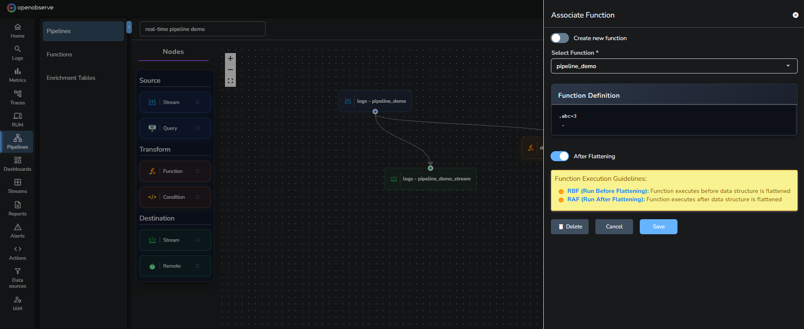

    5. Click **Save** to confirm the transform node.

??? "Step 5: Configure the Destination node"
    ### Step 5: Configure the Destination node
    A destination defines where the processed events are written. You can forward data to another stream or to an external system.

    **To add a stream destination:** 
    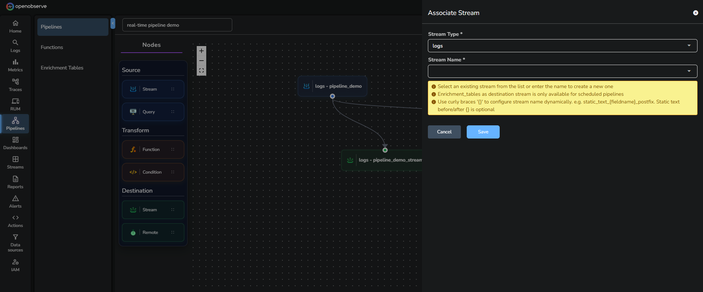

    1. Drag a **Stream** node into the editor.
    2. In the **Associate Stream** panel, configure the destination stream.
    3. Select an existing stream or create a new one. Stream creation follows the same configuration as shown in Step 3.  

        !!! note "Note"
            - For real-time pipelines, you can select **logs**, **metrics**, or **traces** as the destination stream type.  
            - **Enrichment_tables** as a destination stream is only available for scheduled pipelines. It cannot be used as a destination in real-time pipelines.
        
        !!! note "Dynamic stream names"
            You can configure the stream name dynamically with curly braces.  
            Example: `static_text_{fieldname}_postfix`  
            Static text before and after the braces is optional.

        !!! warning "Default destination and data loss"
            When you select a source stream for a real-time pipeline, OpenObserve automatically adds a destination that points back to the same stream. This default destination ensures that all ingested events continue to be stored in the source stream.  
            If you remove this default destination and only keep filtered routes, events that do not match any condition are dropped and are not written to the source stream.  
            Add at least one catch-all route back to the original stream if you want to preserve all events.

    **To add an external destination:** 
    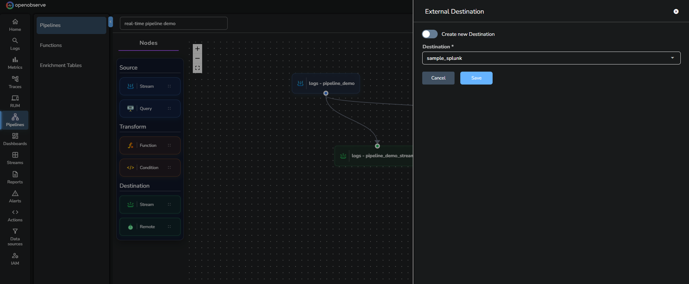

    1. Drag a **Remote** node into the editor.
    2. In the **External Destination** panel, either select an existing destination or enable **Create new Destination** and fill in the required details such as name, URL, method, output format, and headers.
    4. Click **Save**.

    > For detailed steps on configuring external destinations, see the [Remote Destination](https://openobserve.ai/docs/user-guide/pipelines/remote-destination/) guide. 

??? "Step 6: Connect the nodes"
    ### Step 6: Connect the nodes
    Use the connection icon to link Source > Transform > Destination. 
    To remove a link, select the link and press delete on your keyboard. 
    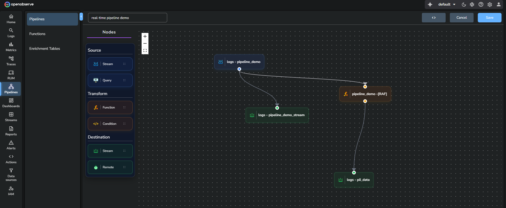

??? "Step 7: Save the pipeline"
    ### Step 7: Save the pipeline
    Click **Save**. The pipeline becomes active immediately.
    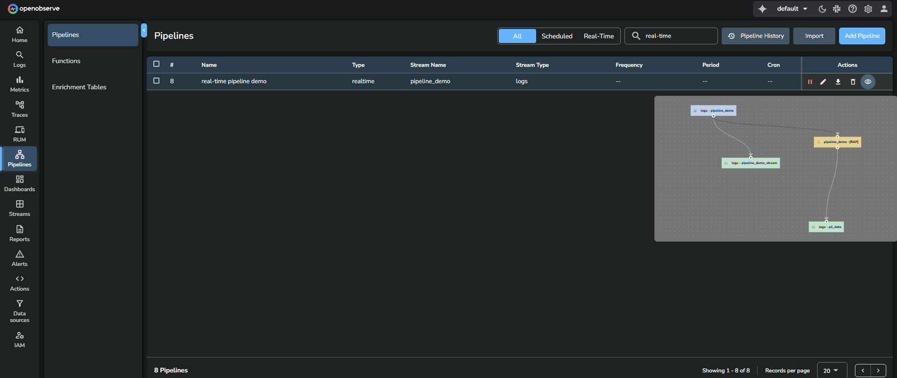

## Use the real-time pipeline

??? "Step 1: Ingest data"
    ### Step 1: Ingest data
    Use curl or any supported ingestion method.
    To find the sample curl command, go to **Data Sources** > **Custom** > **Logs** > **Curl**. 
    Each new event ingested into the source stream is processed instantly.

??? "Step 2: Verify output"
    ### Step 2: Verify output
    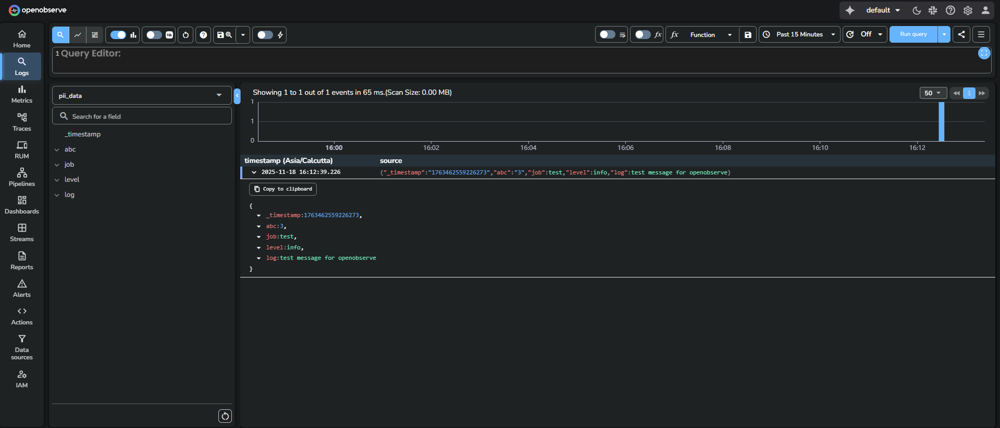

    1. Go to **Logs**.
    2. From the stream selection dropdown, select the stream you added as destination. 
    3. Select the time range from the time range selector. 
    3. Click **Run query** to view the result. 

## Related links
- [Pipelines in OpenObserve](../pipelines/pipelines/)
- [Create and Use Scheduled Pipeline](../pipelines/create-and-use-scheduled-pipeline/)
- [Import and Export Pipelines](../pipelines/import-and-export-pipelines/)
- [Manage Pipelines](../pipelines/manage-pipelines/)
- [Configurable Delay in Scheduled Pipelines](../pipelines/configurable-delay-in-scheduled-pipelines/)