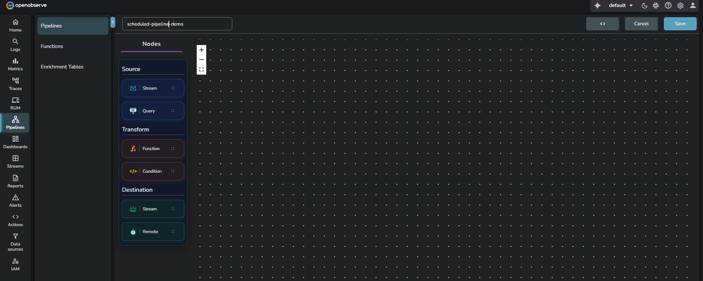
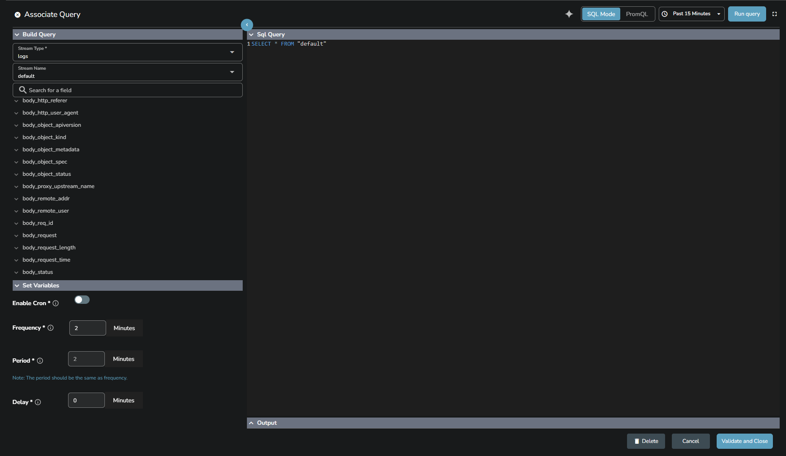
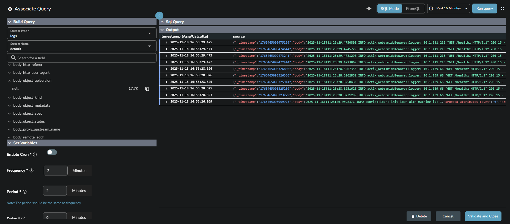
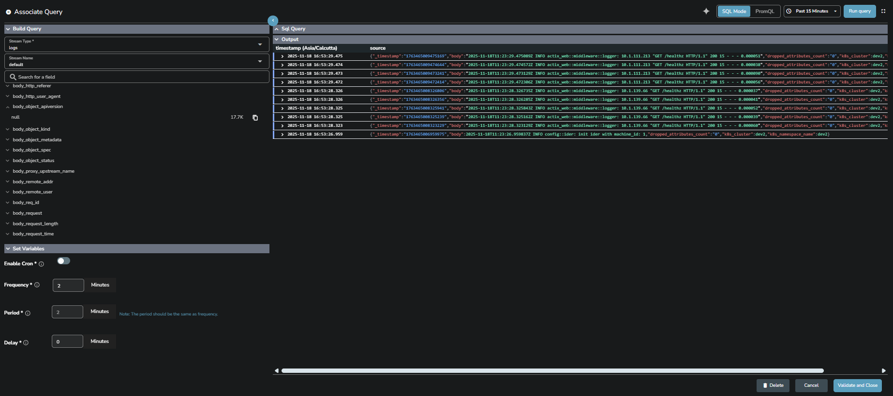
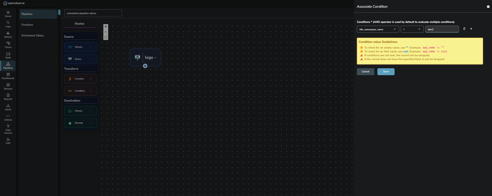
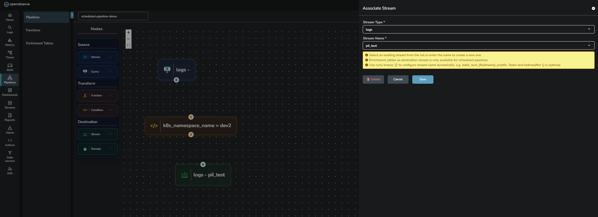
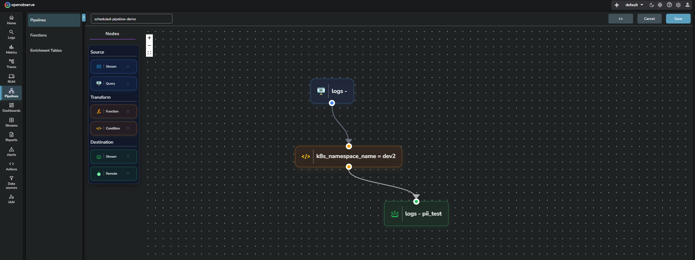
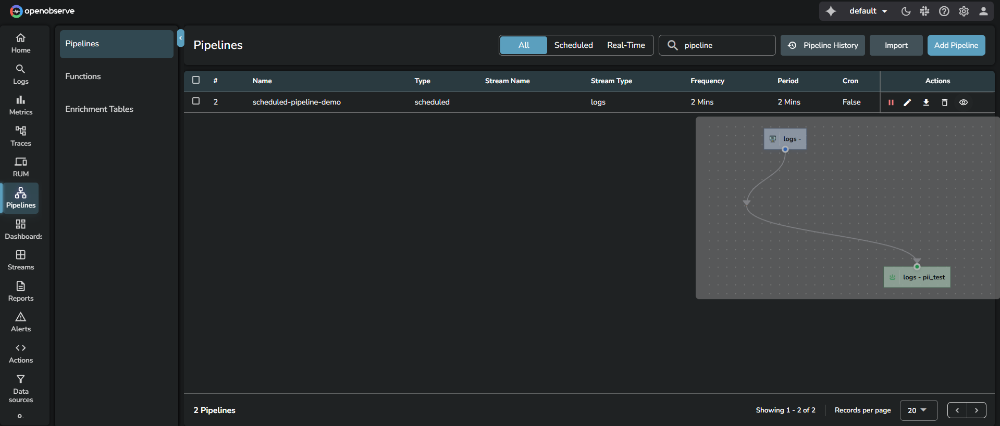
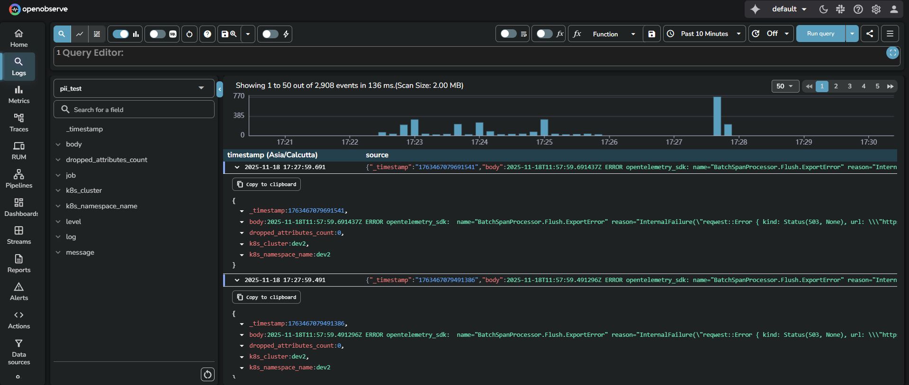

Use this guide to create and run scheduled pipelines. Scheduled pipelines run at a fixed interval. They query existing data from a stream using SQL or PromQL, apply optional transformations, and write the results to a destination stream or external system.

> Visit the [Pipelines overview](https://openobserve.ai/docs/user-guide/pipelines/pipelines/) page before starting. 

## Prerequisites
- Your OpenObserve Cloud or self-hosted instance is running.
- You have permissions to work with pipelines. Access is controlled from IAM > Roles > Permissions.

## Steps to create a scheduled pipeline

??? "Step 1: Open the pipeline editor"
    ### Step 1: Open the pipeline editor
    1. Log in to OpenObserve.
    2. In the left navigation panel, select **Pipelines**. By default, the system opens the **Pipelines** tab. 
    
    3. Click **Add Pipeline** at the top-right corner.
    
??? "Step 2: Enter a pipeline name"
    ### Step 2: Enter a pipeline name
    Enter a unique name in the input box at the top of the editor.
    
??? "Step 3: Configure the Source node (Query)"
    ### Step 3: Configure the Source node (Query)
    Scheduled pipelines do not use a **Stream** node as the source. They always begin with a **Query** node.

    1. From the **Source** section, drag the **Query** node into the editor.  
    2. The **Associate Query** panel opens. The panel contains the following sections, **Build Query**, **SQL Query** editor, **Output**, **Set Variables**. 
     
    3. In the **Build Query** section: 

        1. Select the **Stream Type**.  
        2. Select the **Stream Name**.  
    4. Edit or write your SQL query in the **SQL query** editor.  
    5. Select the time range from the time range selector at the top-right corner. 
    5. Click **Run query** to preview data in the **Output** panel.  
    
    6. In the **Set Variables** section configures how the pipeline runs using the following settings: 

        - **Enable Cron**: Switch from interval-based scheduling to cron-based scheduling.  
        - **Frequency**: How often the pipeline runs.  
        - **Period**: The data window to process. Period must equal Frequency.  
        - **Delay**: How many minutes the pipeline waits after the scheduled time before execution. 
        
        > See the [Pipelines overview](https://openobserve.ai/docs/user-guide/pipelines/pipelines/) page to learn more about frequency, period, and cron.
        > See the [Configurable Delay in Scheduled Pipelines](https://openobserve.ai/docs/user-guide/pipelines/configurable-delay-in-scheduled-pipelines/) page to learn how to configure delay in scheduled-pipelines.

        

    7. After configuring the query and variables, click **Validate and Close**. This adds the Query node to the editor.

??? "Step 4: Configure the Transform node"
    ### Step 4: Configure the Transform node

    1. From the **Transform** section, drag either a **Condition** or **Function** node into the editor.
    2. If you add a Condition node:
        

        1. In the **Associate Conditions** screen, select the field name in the **Column** drop-down list. This list displays the fields detected in the source stream.
        2. Select an operator from the **Operator** drop-down list.
        3. Enter a value in the **Value** input box.
        4. Add more conditions if needed.

        !!! note "Guidelines"
            - Use an empty string to check for empty values. For example, `app_name != ""`
            - Use null to check for null values. For example, `app_name != null`
            - If the condition does not match, the record is dropped.
            - If the record does not contain the specified field, it is also dropped.

    3. If you add a Function node:

        Use a Function node to transform events using a VRL function.
        > A Function does not require predefined fields. You can use it even if the source stream has no schema.  
        !!! note "To create a new function:"

            1. Enable **Create new function** toggle.
            2. In the **Associate Function** tab, enter the function name. 
            3. Open the **Query** tab. 
            4. Select the stream type, stream name, and duration for which you want to query the data. 
            5. Click the **Run Query** option at the top-right corner of the **Query** tab. 
            6. In the **Function** tab, write a VRL function. 
            7. Click the **Test Function** button at the top-right corner of the screen. 
            8. Click **Save** to save the function. 

    4. The **After Flattening** toggle is enabled by default. It ensures the function processes normalized data. Disable this toggle only if you need the original structure.

        !!! note "Guidelines"
            - **RBF (Run Before Flattening)**: Function executes before data structure is flattened. 
            - **RAF (Run After Flattening)**: Function executes after data structure is flattened. 

    5. Click **Save** to confirm the transform node.

??? "Step 5: Configure the Destination node"
    ### Step 5: Configure the Destination node
    A destination defines where the processed events are written. You can forward data to another stream or to an external system.

    **To add a stream destination:** 
    

    1. Drag a **Stream** node into the editor.
    2. In the **Associate Stream** panel, configure the destination stream.
    3. Select an existing stream or create a new one. Stream creation follows the same configuration as shown in Step 3.  

    !!! note "Note"
        You can add **Enrichment_tables** as a destination stream for scheduled pipelines. 
    
    !!! note "Dynamic stream names"
        You can configure the stream name dynamically with curly braces.  
        Example: `static_text_{fieldname}_postfix`  
        Static text before and after the braces is optional.

    **To add an external destination:** 

    1. Drag a **Remote** node into the editor.
    2. In the **External Destination** panel, either select an existing destination or enable **Create new Destination** and fill in the required details such as name, URL, method, output format, and headers.
    4. Click **Save**.

    > For detailed steps on configuring external destinations, see the [Remote Destination](https://openobserve.ai/docs/user-guide/pipelines/remote-destination/) guide. 

??? "Step 6: Connect the nodes"
    ### Step 6: Connect the nodes
    Use the connection icon to link Source > Transform > Destination. 
    To remove a link, select the link and press delete on your keyboard. 
    

??? "Step 7: Save the pipeline"
    ### Step 7: Save the pipeline
    Click **Save**. The pipeline becomes active immediately.
    

## Use the scheduled pipeline

??? "Step 1: Ingest data"
    ### Step 1: Ingest data
    Use curl or any supported ingestion method.
    To find the sample curl command, go to **Data Sources** > **Custom** > **Logs** > **Curl**. 
    The scheduled pipeline does not run immediately when data is ingested.  
    It processes data only when the schedule triggers, using the configured frequency, period, and delay.
??? "Step 2: Verify output"
    ### Step 2: Verify output
    

    1. Go to **Logs**.
    2. From the stream selection dropdown, select the stream you added as destination. 
    3. Select the time range from the time range selector. 
    3. Click **Run query** to view the result. 

## Related links
- [Pipelines in OpenObserve](../pipelines/pipelines/)
- [Create and Use Real-time Pipeline](../pipelines/create-and-use-real-time-pipeline/)
- [Import and Export Pipelines](../pipelines/import-and-export-pipelines/)
- [Manage Pipelines](../pipelines/manage-pipelines/)
- [Configurable Delay in Scheduled Pipelines](../pipelines/configurable-delay-in-scheduled-pipelines/)
