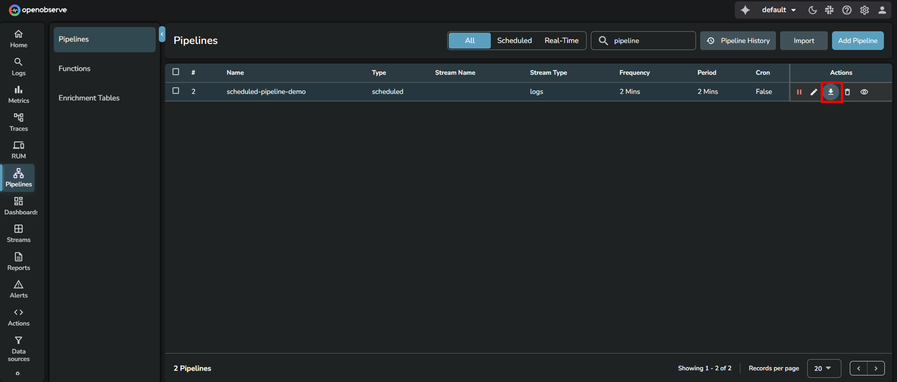
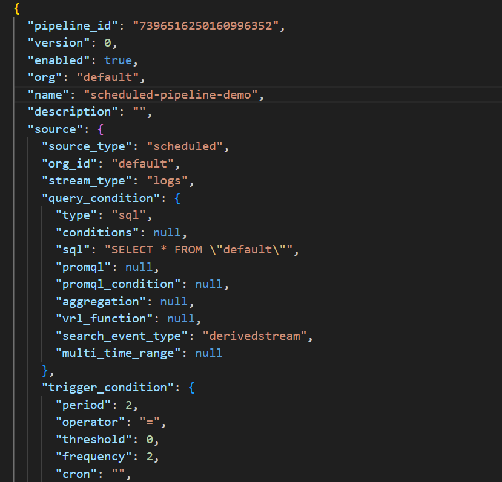
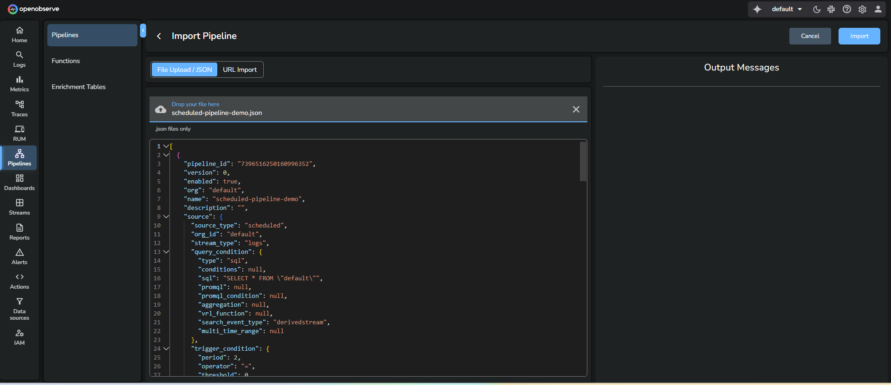

This guide explains how to import and export pipelines. Use this feature to replicate existing pipelines across environments without recreating them from scratch.

## Export a pipeline

To export an existing pipeline configuration:

1. From the left navigation menu, go to **Pipelines**.  
2. In the **Pipelines** tab, locate the pipeline you want to export.   
3. In the **Actions** column of the pipeline, click the download icon.  

The downloaded `.json` file contains the pipeline configuration and can be used to import the pipeline into another environment. 
Exporting the pipeline `scheduled-pipeline-demo` generates a JSON file similar to the following:  

## Import a pipeline
To import a previously exported pipeline:

1. Go to **Pipelines**.  
2. Click **Import Pipeline** in the top-right corner.   
3. Choose one of the supported import methods:  

    - **Upload JSON Files**: Select one or more JSON files containing pipeline configurations from your local system.  
    - **Enter URL**: Provide a URL to fetch the pipeline configuration.  
    - **Paste JSON Object**: Copy and paste the JSON pipeline definition in the JSON editor.

4. To import pipelines in bulk, choose multiple JSON files. 
5. Click **Import**. 
The imported pipeline appears in the **Pipelines** tab.

## Handle validation errors while importing pipelines

If any validation errors occur during import, refer to the following resolutions:

- **Pipeline name already exists:** Enter a unique pipeline name.  
- **Source stream name already exists**: Enter a unique source stream.   
- **Source stream type does not exist**: Enter stream type.    
- **Source time zone does not exist (for scheduled pipeline)**: Ensure the source time zone is accurate when you want to import scheduled pipelines.   
- **The SQL query does not exist (for scheduled pipeline):** Ensure the SQL query exists if you want to import scheduled pipelines.  
- **Destination stream type does not exist:** Enter the destination stream type.   
- **Organization ID does not exist:** Enter the organization ID.   
- **Function name does not exist:** Enter the function name  
- **Remote Destination does not exist:** Ensure the remote destination is accurate. 

## Related links
- [Pipelines in OpenObserve](../pipelines/pipelines/)
- [Create and Use Real-time Pipeline](../pipelines/create-and-use-real-time-pipeline/)
- [Create and Use Scheduled Pipeline](../pipelines/create-and-use-scheduled-pipeline/)
- [Manage Pipelines](../pipelines/manage-pipelines/)
- [Configurable Delay in Scheduled Pipelines](../pipelines/configurable-delay-in-scheduled-pipelines/)
