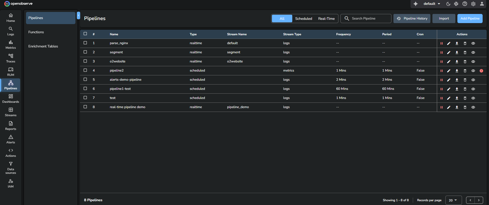

This page describes how to manage real-time and scheduled pipelines in OpenObserve. You can filter, search, view, edit, pause, resume, or delete pipelines from a single interface.

## Filter pipelines
Use the filter options **All**, **Real-Time**, and **Scheduled** to view only the type of pipelines you want to work with.

## Search pipelines
Use the search bar to locate pipelines by name or attributes.

## Pipeline list view
The pipeline list displays key information for each pipeline.

- **Pipeline Name**: Identifies the pipeline.
- **Type**: Indicates whether the pipeline is real-time or scheduled.
- **Stream Name**: Shows the associated source stream.
- **Stream Type**: Indicates the type of data in the stream such as logs, metrics, traces, or enrichment tables.
- **Frequency**: Displays how often the scheduled pipeline runs.
- **Period**: Shows the time duration used for each execution window of a scheduled pipeline.
- **Cron**: Indicates whether the pipeline is configured using a cron expression.

## Actions tab

Each pipeline row includes the following actions.

- Start or pause pipeline
- Edit pipeline
- Export pipeline configuration
- Delete pipeline
- View pipeline details

### Pause and resume pipelines

You can pause both real-time and scheduled pipelines.

**Pausing a pipeline:**

- When paused, the pipeline stops executing on its scheduled intervals. 
- The system preserves the exact timestamp when the pause occurred. 
- Pipeline configuration and state are maintained during the pause. 

**Resuming a real-time pipeline**:

- Real-time pipelines resume instantly with one click.
- No dialog or additional options are shown.
- Processing continues from the current moment.

**Resuming a scheduled pipeline**: 

Scheduled pipelines display a Resume Pipeline Ingestion dialog with two options.

  - **Continue from where it paused:**

    - Processes all data from the pause timestamp to the current time. 
    - Maintains complete data continuity with no gaps. 
    - May consume significant system resources for long pause periods. 

    > **Note:** Use the **Continue from where it paused** option, when data completeness is critical. 

  - **Start from now:**

    - Begins processing from the current timestamp. 
    - Creates a data gap between the pause and resume timestamps. 
    - Provides immediate resumption with minimal resource usage. 

    > **Note:** Use the **Start from now** option, when data gaps are acceptable. 

### Pipeline error
If a pipeline encounters an error, an error icon appears in the **Actions** column.

Selecting this icon opens a dialog that displays the full error summary.

## Pipeline history
You can view past executions, errors, and performance statistics in the Pipeline History page.

The [Pipeline History](https://openobserve.ai/docs/user-guide/pipelines/pipeline-history/) page provides a complete timeline of runs with detailed execution information.

## Import and export pipelines
You can export any pipeline and import pipeline configurations through the Import and **Export** options. For more details, see [Import and export pipelines](https://openobserve.ai/docs/user-guide/pipelines/import-and-export-pipelines/).

## Related links
- [Pipelines in OpenObserve](../pipelines/pipelines/)
- [Create and Use Real-time Pipeline](../create-and-use-real-time-pipeline/)
- [Create and Use Scheduled Pipeline](create-and-use-scheduled-pipeline.md)
- [Import and Export Pipelines](../pipelines/import-and-export-pipelines/)
- [Configurable Delay in Scheduled Pipelines](../pipelines/configurable-delay-in-scheduled-pipelines/)