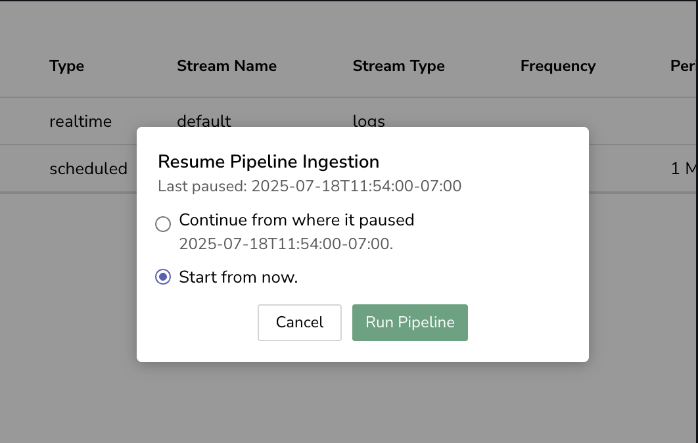

This page describes the features designed to help you manage your pipelines in OpenObserve.

## Filter Options

Toggle between **All**, **Real-Time**, and **Scheduled** pipelines to focus on the type of pipelines you want to view.

## Search Pipelines

Use the search bar to locate pipelines by name or attributes.

## Pipeline List View

View all pipelines in a tabular format, including:

- **Pipeline Name**: Identify the pipeline.
- **Type**: Displays whether it is real-time or scheduled.
- **Stream Name**: Indicates the associated source stream.
- **Stream Type**: Specifies the type of data in the stream- logs, metrics, traces, or enrichment tables.  
- **Frequency**: Shows how often the scheduled pipeline executes.
- **Period**: Indicates the interval duration for scheduled pipeline execution.
- **Silence**: Shows the configured silence period for scheduled pipelines.
- **Cron**: Specifies whether the scheduled pipeline uses a cron schedule (True/False).
- **SQL Query**: Displays the SQL query used in the scheduled pipeline configuration.

## Actions Tab

- **Edit Pipeline**: Modify the configuration of an existing pipeline.
- **Delete Pipeline**: Remove a pipeline permanently from your system.
- **Pause/Start Pipelines**: Temporarily stop or restart pipelines as needed.

!!! Info "Pause and Resume a Scheduled Pipeline"
    **Pausing a Scheduled Pipeline:**

    - When paused, the pipeline stops executing on its scheduled intervals. 
    - The system preserves the exact timestamp when the pause occurred. 
    - Pipeline configuration and state are maintained during the pause. 

    **Unpausing a Scheduled Pipeline:**

    When resuming a paused scheduled pipeline, OpenObserve presents a **Resume Pipeline Ingestion** dialog with two options:
     
    

    - **Continue from where it paused:**

        - Processes all data from the pause timestamp to the current time. 
        - Maintains complete data continuity with no gaps. 
        - May consume significant system resources for long pause periods. 

        > **Note:** Use the **Continue from where it paused** option, when data completeness is critical. 

    - **Start from now:**

        - Begins processing from the current timestamp. 
        - Creates a data gap between the pause and resume timestamps. 
        - Provides immediate resumption with minimal resource usage. 

        > **Note:** Use the **Start from now** option, when data gaps are acceptable. 
    
