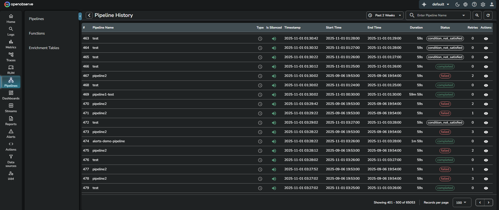
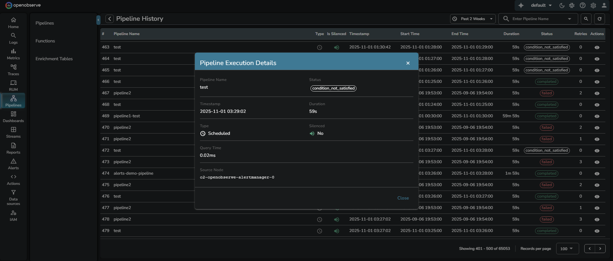

This guide provides information about how the Pipeline History feature in OpenObserve works, where the data originates from, who can access it, and how to interpret the pipeline execution records.

> For information on other pipeline management options, see the [Manage Pipelines](../pipelines/manage-pipelines/) page. 

## Overview
Pipeline History provides visibility into every pipeline run, including its execution time, status, and duration. Each record represents one instance of a scheduled or manually triggered pipeline execution.

!!! note "Who can access"
    Any user who has permission to view, update, or delete pipelines can also view pipeline history. This ensures that users responsible for managing or maintaining pipelines can monitor their performance and investigate failures without requiring elevated access.

## How to interpret the Pipeline History table

The table lists each pipeline run with key execution details.

- **Pipeline Name**: Name of the executed pipeline.
- **Type**: Execution type. The current verified value is Scheduled.
- **Is Silenced**: Indicates whether the pipeline was silenced during execution. The green speaker icon means it was not silenced.
- **Timestamp**: Time when the pipeline run was recorded.
- **Start Time**: Time when the execution started.
- **End Time**: Time when the execution finished.
- **Duration**: Total execution time for the pipeline run.
- **Status**: Final outcome of the execution. One of the following values:

    - **completed** – The pipeline ran successfully and completed execution.
    - **failed** – The pipeline encountered an error and did not complete.
    - **condition_not_satisfied** – The pipeline’s scheduled condition was evaluated but not met, so no data processing occurred.

- **Retries**: Number of times the scheduler retried the run after a failure. The maximum number of retries is defined by the environment variable `ZO_SCHEDULER_MAX_RETRIES`, which controls retry behavior for both pipelines and alerts.
- **Actions**: When you select the Actions icon, the Pipeline Execution Details dialog opens and displays additional metadata for that specific execution:

- **Query Time**: Time taken by the SQL query within the pipeline to execute. This helps measure query performance.
- **Source Node**: Node responsible for executing the run. This helps identify where the execution occurred for debugging and performance monitoring. 
Example:  
**Source Node**: `o2-openobserve-alertmanager-0`