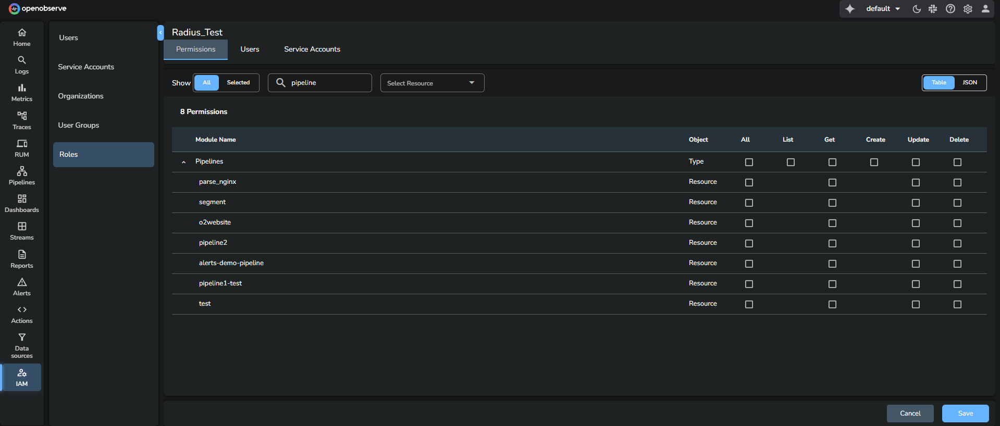
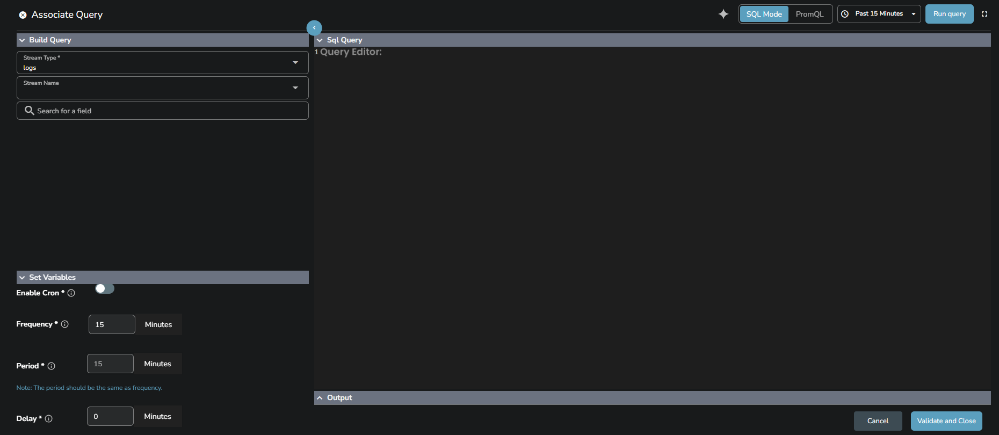

This page provides an overview of pipelines, their types, and how they work. 

## What pipelines do
Pipelines let you control what happens to your data after it is ingested into OpenObserve. They provide a clear way to read data from a source, apply changes, and send the processed output to a destination. Pipelines work continuously in the background and ensure that your data is transformed or routed exactly as required.  

!!! note "Who can access pipelines"
    Access to pipelines is controlled through role permissions.
    Administrators can grant or restrict access from IAM > Roles > Permissions.
    To allow a user to work with pipelines, the role must have permissions for the **Pipelines** module. These permissions control whether the user can list, create, update, or delete pipelines.
    

!!! note "Where to find pipelines"
    You can access pipelines from the main navigation panel. Select **Pipelines** to view, create, and manage real-time and scheduled pipelines.

## Types of pipelines
OpenObserve supports two types of pipelines: 

- **Real-time pipelines** 
- **Scheduled pipelines**

!!! note "Both types use the same building blocks:"

    - **Source** defines where the data is read from.
    - **Transform** defines how the data is changed or filtered.
    - **Destination** defines where the processed data is written.

    Supported source stream types are logs, metrics, and traces.
    Supported destination stream types are logs, metrics, traces, and enrichment tables. Enrichment tables are valid as destinations only for scheduled pipelines.

## Real-time pipelines
A real-time pipeline processes incoming data as soon as it is ingested into the source stream. It is used when you need immediate transformations, filtering, or routing. 

> For more details, refer to the [Create and Use Real-time Pipelines](../create-and-use-real-time-pipeline/) guide. 

### How real-time pipelines work

??? "Source" 
    The pipeline starts from a source stream. As soon as new data is ingested into this stream, the pipeline begins processing it.  
    **Each stream can be associated with only one real-time pipeline as its source.** This ensures a single, predictable processing flow for all new events in that stream.
    

??? "Transform" 
    The pipeline applies conditions or functions to filter and transform the data in real-time. 
    

??? "Destination" 
    The transformed data is written to one or more destinations: 

    - **Stream**: The supported destination stream types are Logs, Metrics, Traces, or Enrichment tables.  **Note**: Enrichment Tables can only be used as destination streams in scheduled pipelines.
    
    - **Remote**: Select **Remote** if you wish to send data from the pipeline to [external destinations](https://openobserve.ai/docs/user-guide/pipelines/remote-destination/).
     
    **Default destination added automatically**  
    When you select a source stream for a real-time pipeline, OpenObserve automatically adds a destination that points back to the same stream. This ensures that your original data continues to be stored in the source stream even when you add filters or functions in the pipeline.
     
    If this default destination is removed and you add only filtered or routed destinations, events that do not match any condition will be dropped. They will not be written to the source stream unless you explicitly add a destination for it.

    **Key points**: 

    - The automatic destination prevents data loss.
    - It guarantees that every ingested event has at least one route.
    - If you change the default routing and want to keep the original data, add a destination node that points to the source stream.

### When to use real-time pipelines
Use real-time pipelines when you need immediate processing, such as monitoring live data and cleaning logs in real-time.

## Scheduled pipelines
A scheduled pipeline processes historical data from an existing stream at user-defined intervals. This is useful when you need to extract, transform, and load (ETL) data at regular intervals without manual intervention. 

> For more details, refer to the [Create and Use Scheduled Pipelines](../create-and-use-scheduled-pipeline/) guide. 
    
### How scheduled pipelines work

??? "Source" 
    To create a scheduled pipeline, you need an existing stream, which serves as the source stream. The supported source stream types are Logs, Metrics, or Traces. 

??? "Query" 
    You define a SQL query that fetches historical data from the source stream. For metrics, you can also use PromQL. The query is controlled by **Frequency**, **Period**, and optional **Cron** settings. 
    

    !!! note "Frequency, period, and cron"
        Scheduled pipelines run according to the **Frequency** and **Period** you configure: 

        - **Frequency** defines how often the query runs. For example, a frequency of five minutes runs the query every five minutes.
        - **Period** defines the time range the query reads in each run. usually be the same as the frequency. For example, a period of five minutes means the query fetches the data ingested in the last five minutes.
        - **Cron** allows you to define custom execution schedules in a specific timezone.
        For example, the cron expression `0 0 1 * *` with timezone `Asia/Kolkata` runs the query at midnight on the first day of each month.

??? "Transform" 
    After the query runs, the retrieved data passes through transform nodes. It allows you to filter or modify data before it reaches the destination.
    

??? "Destination"
    The transformed data is written to one or more destinations.

    - **Stream** destinations can be Logs, Metrics, Traces, or Enrichment tables.  **Note**: Enrichment Tables can only be used as destination streams in scheduled pipelines.
    - **Remote** destinations send data to external systems. To learn more about remote destinations, click [here](https://openobserve.ai/docs/user-guide/pipelines/remote-destination/).

### When to use scheduled pipelines
Use scheduled pipelines for tasks that require processing at fixed intervals instead of continuously, such as generating periodic reports and processing historical data in batches.

!!! note "Cache for scheduled pipelines"
    OpenObserve maintains a cache for scheduled pipelines to prevent the alert manager from making unnecessary database calls. This cache becomes particularly beneficial when the number of scheduled pipelines is high. For example, with 500 scheduled pipelines, the cache eliminates 500 separate database queries each time the pipelines are triggered, significantly improving performance.

## Next steps

- [Create and Use Real-time Pipelines](../create-and-use-real-time-pipeline/)
- [Create and Use Scheduled Pipeline](../create-and-use-scheduled-pipeline/)
- [Manage Pipelines](../manage-pipelines/)
- [Environment Variables to Configure Pipelines](https://openobserve.ai/docs/environment-variables/#pipeline)