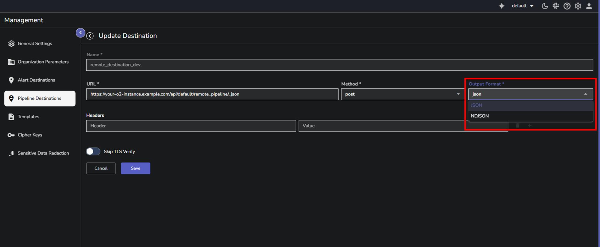

This document explains how to configure remote destinations in OpenObserve pipelines to send transformed data to external systems. It covers the setup process, technical architecture of the persistent queue mechanism, Write-Ahead Log (WAL) file operations, failure handling, retry logic, and performance optimization through environment variables.

=== "How to"
    ## What is a remote destination?
    A remote destination allows you to send transformed pipeline data to external systems outside your OpenObserve instance. When you select **Remote** as your destination type in a pipeline, the system routes data to an external endpoint of your choice while ensuring data integrity and reliability through a persistent queue mechanism.

    ## Configuring a remote destination

    ??? "Step 1: Access the Management page"
        ### Step 1: Access the Management page

        Navigate to the **Pipeline Destination** configuration page using either method:

        - **From the pipeline editor**: While setting up your pipeline, select Remote as the destination type > click the **Create New Destination** toggle. 
        
        
        - **From Management**: Click the settings icon in the navigation menu > **Pipeline Destinations** > **Add Destination**.
        

    ??? "Step 2: Create the destination"
        ### Step 2: Create the destination
        In the **Add Destination** form:

        1. **Name**: Provide a descriptive name for the external destination. For example, `remote_destination_dev`. 
        2. **URL**: Specify the endpoint where data should be sent. 
        
        !!! note "To send the transformed data to another OpenObserve instance:" 
            Use the following URL format: `https://<instance-url>/api/<organization>/<stream>/_json`  
            **Example**: To send data to a stream called `remote_pipeline` in the `default` organization on a different OpenObserve instance: `https://your-o2-instance.example.com/api/default/remote_pipeline/_json`
             
            After transformation, the transformed data will be sent to the `remote_pipeline` stream under the `default` organization in the destination OpenObserve instance.
        !!! note "To send data to an external endpoint:"
            Ensure that you provide the complete URL of your external service endpoint.
        3. **Method**: Select the HTTP method based on your requirement.
        
        !!! note "To send the transformed data to another OpenObserve instance:"
            Select **POST**.
        !!! note "To send data to an external endpoint:"
            Select the method required by your external service.
        4. **Output Format**: Select the data format for transmission. 
        
        !!! note "When to select JSON (default):"
            Standard JSON format. Use this when the destination API requires standard JSON arrays or objects. **Use JSON, when you send the transformed data to another OpenObserve instance**.
        !!! note "When to select NDJSON (Newline Delimited JSON):" 
            Each event is sent as a separate JSON object on its own line. Use this when sending the transformed data to observability platforms that expect NDJSON, for example, Datadog and Splunk. 
        **Important**: Always verify the data format expected by your destination system before selecting. Check the destination's API documentation or ingestion requirements to ensure compatibility.
        5. **Headers**: To send data to an external endpoint, you may need to provide authentication credentials, if required. In the **Header** field, enter Authorization and in the **Value** field, provide the authentication token.
        !!! note "To send the transformed data to another OpenObserve instance:"
            
            1. Log in to the destination OpenObserve instance. 
            2. Navigate to **Data Sources** > **Databases**. 
            3. Copy the authorization token value displayed there. 
            4. Paste this token in the **Value** field. 
            
        !!! note "To send data to an external endpoint:"
            Add the authentication headers required by your external service. This could be API keys, bearer tokens, or other authentication methods depending on the service.
        6. **Skip TLS Verify**: Use this toggle to enable or disable Transport Layer Security (TLS) verification. Enable this toggle to bypass security and certificate verification checks. **Use with caution, as disabling verification may expose data to security risks.**
        7. Click **Save** to create the destination.

    ??? "Step 3: Use in your pipeline"
        ### Step 3: Use in your pipeline

        After creating the remote destination, you can select it from the **Destination** dropdown when configuring the remote destination node in your pipeline. The dropdown displays all previously created remote destinations with their names and URLs for easy identification.
        
    
    ## Environment variables for remote destination 

    | **Environment Variable** | **Description** |
    | --- | --- |
    | ZO_PIPELINE_REMOTE_STREAM_CONCURRENT_COUNT | • Defines the number of concurrent threads the exporter uses to send data from Write-Ahead Log (WAL) files to the remote destination. • Controls export parallelism. Higher values increase throughput but also increase CPU usage. • Set this value to match or slightly exceed the number of CPU cores. Increase when export speed lags behind ingestion, and decrease if CPU usage stays above 80 percent. |
    | ZO_PIPELINE_FILE_PUSH_BACK_INTERVAL | • Specifies how long a reader waits before checking the queue again after catching up to the writer. • Balances latency and CPU utilization. Lower values reduce event latency but raise CPU load; higher values lower CPU usage but increase latency. • Use 1 second for low-latency pipelines. Increase to 5–10 seconds in resource-limited systems or when small delays are acceptable. |
    | ZO_PIPELINE_SINK_TASK_SPAWN_INTERVAL_MS | • Determines how often the scheduler assigns new export tasks to reader threads, measured in milliseconds. • Controls backlog clearing speed and CPU overhead. Shorter intervals improve responsiveness but raise CPU usage. • Use 10–50 ms to clear persistent backlogs faster. Use 200–500 ms to reduce CPU load in low-throughput environments. Keep 100 ms for balanced performance. |
    | ZO_PIPELINE_MAX_RETRY_COUNT | • Sets the maximum number of retry attempts per WAL file after export failure. • Prevents endless retries for failed exports and limits disk growth when destinations are unreachable. • Increase to 10 when the destination is unreliable or often unavailable. Keep the default of 6 for stable networks. |
    | ZO_PIPELINE_MAX_RETRY_TIME_IN_HOURS | • Defines the longest allowed interval between retry attempts during exponential backoff.  • Ensures failed files are retried at least once in the defined period and prevents retries from spacing out indefinitely. • Keep the default 24 hours for typical conditions. Increase to 48 hours if the destination experiences long outages. |
=== "Overview"
     
    This section explains the technical architecture and internal mechanisms of remote destinations. After configuring a remote destination, understanding the underlying systems helps with troubleshooting, performance optimization, and operational decisions.

    ## How remote destinations work
    The remote destination feature allows you to send pipeline data to external systems. However, the core challenge is that the data must not be lost if the system crashes, restarts, or if the destination becomes temporarily unavailable. 
     
    To resolve this issue, OpenObserve writes data to disk first, then sends it to the remote destination. This creates a safety buffer.

    ## How data flows in a pipeline
    Data moves through five stages:
    Pipeline > Transformations > Disk Storage > Transmission > Cleanup
    
    !!! note "Stage details:"

        - **Stage 1 - Pipeline Source:** Data enters from the source stream via the source node of the pipeline. 
        - **Stage 2 - Transformations:** All configured functions and conditions are applied to process the data.
        - **Stage 3 - Disk Storage:** After all transformations complete, the processed data is written to Write-Ahead Log files on disk. This write happens before any transmission attempt.
        - **Stage 4 - Network Transmission:** Data is read from disk and sent to the remote destination via HTTP.
        - **Stage 5 - Cleanup:** After successful transmission and acknowledgment from the destination, the disk files are deleted.
        **Note**: Disk storage occurs only after all transformations finish. WAL files contain the final processed version of the data, not the original input.

    ## Write-Ahead Log files
    Write-Ahead Log files, or WAL files, are the disk storage mechanism used in stage 3. These are files written to disk that temporarily hold data between processing and transmission.

    - **How many WAL files are created in advance**: The total number of WAL files created depends on how many remote destinations you have configured. For each remote destination, OpenObserve creates the number of files specified in the `ZO_MEMTABLE_BUCKET_NUM` environment variable.
    - **Where these files are stored**T: he files are written to the `/data/remote_stream_wal/` directory on disk.

    !!! note "Note"
        During normal operation, when data flows through the pipeline, these files are simultaneously being written to and read from. Files in this state are called **active files**.

    ## How WAL files operate
    The WAL file system uses a multi-threaded architecture to achieve high throughput.

    ### Writer thread
    The system uses multiple writer threads, equal to the `ZO_MEMTABLE_BUCKET_NUM` setting, to add data to WAL files. 
    Each writer thread:

    - Receives transformed data from the pipeline
    - Writes data sequentially to the current active WAL file
    - Moves to the next file when the current file reaches capacity
    - Operates continuously as long as data flows through the pipeline

    **Important**: A file reaches capacity when either of two conditions is met: the file size reaches `ZO_PIPELINE_MAX_FILE_SIZE_ON_DISK_MB` or the file has been open for `ZO_PIPELINE_MAX_FILE_RETENTION_TIME_SECONDS`.

    ### Reader threads
    Multiple reader threads, 30 by default, handle transmission to the remote destination. Each reader thread:

    - Selects a WAL file that contains unsent data
    - Reads data from the file
    - Sends the data to the remote destination via HTTP
    - Tracks successful transmission progress

    Multiple readers enable parallel transmission. While one reader sends data from file A, another reader can simultaneously send data from file B. This parallel processing allows the system to handle high data volumes. In production deployments, the system consistently achieves throughput of 30-40 MB per second. 

    ### FIFO ordering
    The system maintains First-In-First-Out ordering. The oldest data, meaning the data that was transformed earliest, is always transmitted first. This guarantee ensures that data arrives at the destination in the same temporal order it was processed.
     
    The reader threads coordinate to maintain this ordering even while operating in parallel. Files are assigned to readers based on age, ensuring older files are prioritized.

    ## WAL file lifecycle
    WAL files are deleted under four conditions:
      
    **Condition 1: Successful Transmission**
     
    All data in the file has been sent and the destination has acknowledged receipt. The file is immediately deleted. This is the normal deletion path during healthy operation.
      
    **Condition 2: Disk Space Limit**
     
    When remote destination WAL files consume 50% of available disk space (default), the system stops writing new files and deletes the oldest files to free space. Deletion occurs regardless of transmission status. This limit prevents remote destination operations from consuming disk space needed by other OpenObserve components like data ingestion and query processing. The disk space limit is configurable via the `ZO_PIPELINE_WAL_SIZE_LIMIT` environment variable. On a 1 TB disk with the default 50% limit, remote destination files will not exceed approximately 500 GB.
      
    **Condition 3: Data Retention Policy**
     
    WAL files containing data older than the stream's retention period are deleted regardless of transmission status. Each pipeline inherits retention settings from its associated stream. If a stream has 30-day retention, WAL files with data older than 31 days are deleted even if never transmitted. This aligns remote destination data lifecycle with overall retention policy.
      
    **Condition 4: Retry Exhaustion**  
    After repeated transmission failures, the system stops retrying the file. By default, this happens after 6 failed attempts. The file then remains on disk but is no longer scheduled for transmission.

    - This behavior can be changed using the `ZO_PIPELINE_REMOVE_WAL_FILE_AFTER_MAX_RETRY` configuration. When set to true, failed files are permanently deleted instead of being kept on disk.
    - The retry limit is configurable via `ZO_PIPELINE_MAX_RETRY_COUNT`.

    ## Failure handling and retry

    When transmission fails, the system waits before retrying. Wait times increase with each failure: 5 minutes after the first failure, 10 minutes after the second, 20 minutes after the third, and so on, doubling each time. This is called exponential backoff. It gives a failed or overloaded destination time to recover instead of immediately retrying, which would consume bandwidth and potentially worsen the problem.

    - **Maximum wait time**: Retry intervals cannot exceed 24 hours (configurable via `ZO_PIPELINE_MAX_RETRY_TIME_IN_HOURS`), ensuring files are retried at least once daily.
    - **Random variation**: The system adds small random delays to retry times. This prevents many failed files from retrying at the exact same moment and overwhelming the destination. This is known as preventing the "thundering herd" problem, where multiple requests hitting a recovering system simultaneously can cause it to fail again.
    - **Retry limit**: After 6 failed attempts (configurable via `ZO_PIPELINE_MAX_RETRY_COUNT`), the system stops retrying. File handling then follows the rules described in Condition 4 of the  section.

    ## Persistent queue architecture
    The combination of disk-based storage, multi-threaded processing, FIFO ordering, and retry logic implements a system pattern known as a persistent queue. A persistent queue is a queue that stores items on disk so it survives restarts and failures, preserves order, and resumes transmission without duplication.
     
    Internally, OpenObserve achieves this pattern through the same components described earlier. Write-Ahead Log files act as the queue storage, the exporter manages the queue, a single writer thread adds transformed records, and multiple reader threads transmit them to the destination in order. Together, these elements ensure fault-tolerant and consistent data flow across restarts and retries.

    ## Storage organization of WAL files

    OpenObserve stores remote destination Write-Ahead Log (WAL) files separately from the files used in normal data ingestion. This separation ensures that export operations do not interfere with the system’s core ingestion and query processes.
     
    Remote destination WAL files are stored in the `/data/remote_stream_wal/` directory, while the standard ingestion process uses the `/data/wal/` directory.

    ## Performance  
    Remote destinations in OpenObserve support high-throughput workloads:

    - **Production-validated**: 30-40 MB/second sustained throughput (tested on 4 vCPU nodes)
    - **Peak capacity**: 80+ MB/second during traffic spikes
    - **Mixed workloads**: Efficiently handles both low-volume streams (1-2 events/hour) and high-volume streams (30+ MB/second) simultaneously

    The system prevents disk pileup on ingester nodes by matching export rates with ingestion rates under normal operating conditions.

    ## Environment variables for remote destination 

    | **Environment Variable** | **Description** |
    | --- | --- |
    | ZO_PIPELINE_REMOTE_STREAM_CONCURRENT_COUNT | • Defines the number of concurrent threads the exporter uses to send data from Write-Ahead Log (WAL) files to the remote destination. • Controls export parallelism. Higher values increase throughput but also increase CPU usage. • Set this value to match or slightly exceed the number of CPU cores. Increase when export speed lags behind ingestion, and decrease if CPU usage stays above 80 percent. |
    | ZO_PIPELINE_FILE_PUSH_BACK_INTERVAL | • Specifies how long a reader waits before checking the queue again after catching up to the writer. • Balances latency and CPU utilization. Lower values reduce event latency but raise CPU load; higher values lower CPU usage but increase latency. • Use 1 second for low-latency pipelines. Increase to 5–10 seconds in resource-limited systems or when small delays are acceptable. |
    | ZO_PIPELINE_SINK_TASK_SPAWN_INTERVAL_MS | • Determines how often the scheduler assigns new export tasks to reader threads, measured in milliseconds. • Controls backlog clearing speed and CPU overhead. Shorter intervals improve responsiveness but raise CPU usage. • Use 10–50 ms to clear persistent backlogs faster. Use 200–500 ms to reduce CPU load in low-throughput environments. Keep 100 ms for balanced performance. |
    | ZO_PIPELINE_MAX_RETRY_COUNT | • Sets the maximum number of retry attempts per WAL file after export failure. • Prevents endless retries for failed exports and limits disk growth when destinations are unreachable. • Increase to 10 when the destination is unreliable or often unavailable. Keep the default of 6 for stable networks. |
    | ZO_PIPELINE_MAX_RETRY_TIME_IN_HOURS | • Defines the longest allowed interval between retry attempts during exponential backoff. • Ensures failed files are retried at least once in the defined period and prevents retries from spacing out indefinitely. • Keep the default 24 hours for typical conditions. Increase to 48 hours if the destination experiences long outages. |
