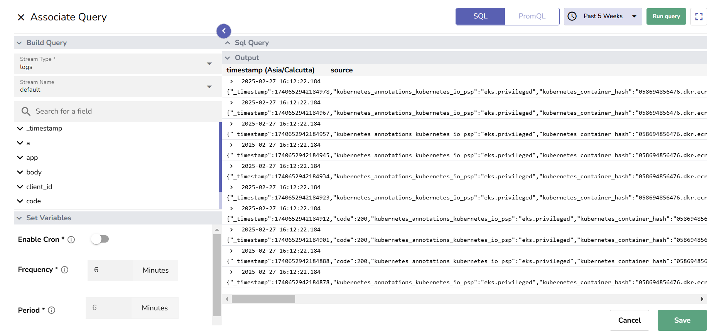
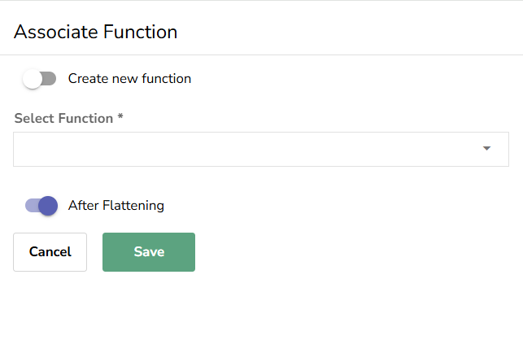
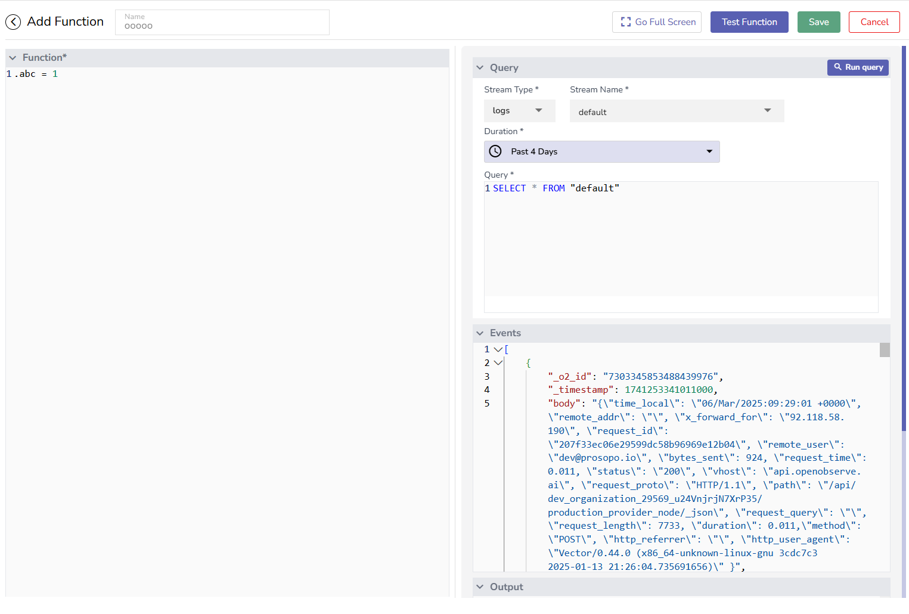
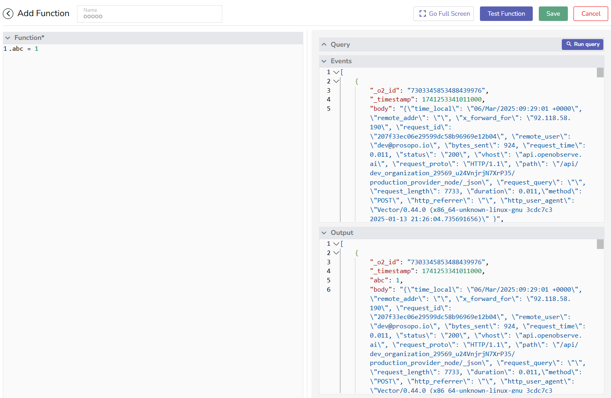
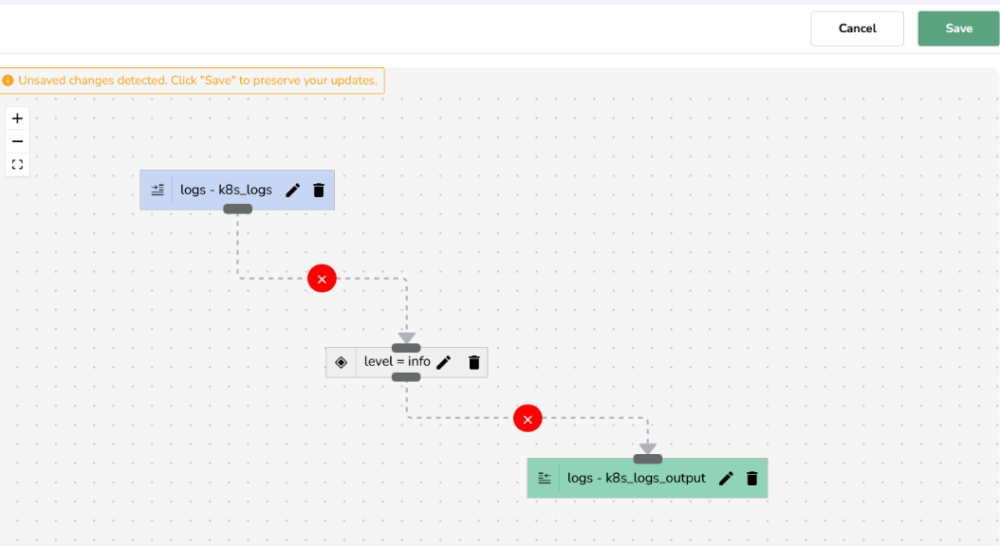

This guide shows you how to create and use real-time and scheduled pipelines in OpenObserve.

## Create a Pipeline
### Prerequisites

- Your OpenObserve Cloud or the self-hosted instance is up and running.
- You have a functioning [**Stream**](https://openobserve.ai/docs/user-guide/streams/) where data gets ingested. This **Stream** will be used as a source stream in the pipeline.

### Step 1: Open the pipeline editor
1. Log in to OpenObserve.
2. From the navigation panel, select **Pipelines**.
3. In the **Pipelines** tab, click the **Add Pipeline** button in the top-right corner. 
This opens up the pipeline editor.

### Step 2: Enter a unique pipeline name

### Step 3: Configure the Source node based on the pipeline type (real-time or scheduled)
1. From the **Source** section, drag a **Stream** or **Query** node into the editor based on the following requirement:

    - **To set up a real-time pipeline**: Select **Stream**.
    - **To set up a scheduled pipeline**: Select **Query**.

2. Edit the source node:

    - Select **Stream Type**:
    - **If you selected Stream in the previous step to create a real-time pipeline**: Use the drop-down menu under **Stream Name** to select the source stream. Ensure that the source stream is active and receiving data. 
    
    - **If you selected Query in the previous step to create a scheduled pipeline**: 
        - In the **Build Query** section, select the **Stream Type** (Logs, Metrics, or Traces) and **Stream Name**. Use the seach bar to search for the desired field in the source stream. 
        - In the **SQL Query** section, write a query to fetch data from a source. For **Metrics**, you also have the option to write **PromQL**.
        
        - Under **Set Variables**, schedule the query execution by setting the **Frequency** and **Period**. For more details, visit [Pipelines in OpenObserve](../pipelines/).
        - Adjust the time filter and click **Run Query** to view the output.
         
         In the above example, data is ingested periodically into the stream `default`. The query runs every 6 minutes and fetches all data that was ingested into the stream `default` in the preceding 6-minute interval.
        **Note**: You can configure the source query in full screen mode. Click the full screen icon next to the **Run Query** button at the top right corner.

 
3. Click **Save** to confirm the source node.

### Step 4: Configure the Transform node
1. From the **Transform** section, drag a **Function** or **Condition** node into the pipeline editor.
2. Click the edit icon to configure the selected node.

    - **For a Condition node**: In the **Associate Condition** form, add one or more conditions to refine the data. Select the field name from the drop-down menu.  
        **Note**: If the selected source stream is active, the drop-down list shows all the field names from the ingested data.

      
    
    - **For a Function node**: In the **Associate Function** form, select an existing function or create a new function to associate with the pipeline.  
    
     
    To create a new function:

        1. In the **Associate Function** form, enable the **Create new function** toggle.
        
        2. In the **Query** tab:

            - Select the **Stream Type**. Enter the **Stream Name** from where data will be fetched. Select the appropriate **Duration**.  
            - In the **Query** to fetch the data as per requirement.
            - Use the **Run Query** button to view the query result. The query result is shown in the **Event** tab.

        3. In the **Function** tab: 
        
            - Write the **Vector Remap Language (VRL)** function. 
            - Click the **Test Function** button and see the output in the **Output** tab.
            - If the output displays desired result, click **Save**.   
            After saving, you can associate the function with pipelines in the **Associate Function** form. 
        

    **Note**: In the **Associate Function** fom, the **After Flattening** toggle is enabled by default. Disable it only if necessary.
     The **After Flattening** toggle determines whether the function processes data after it has been transformed into a simpler, flat structure. When enabled (default), the function operates on pre-processed, structured data, making it easier to analyze. Disabling it allows the function to work with the original data.
     For more details, see the [Functions Guide](https://openobserve.ai/docs/user-guide/functions/).

3. Click **Save** to confirm the transform node.

### Step 5: Edit the Destination node

!!! warning "Important"
    If you create a route with a condition or filter that forwards events to a new destination, only the matching events go there.  
    Events that do not match the condition are dropped. They are not stored in the source stream unless you explicitly add a destination node that points to the source stream.

    **Recommended pattern:** Always add two routes in your real-time pipeline.

    - **Route A**: Add your filter or transformation and forward matching events to the new destination.
    - **Route B**: Add a catch-all route without a filter that points back to the same source stream to prevent data loss.

1. Drag a **Stream** node into the editor.
2. Click the edit icon in the destination **Stream** node.
3. In the **Associate Stream** form:

    - From the **Stream Name** drop-down, select an existing stream or toggle **Create New Stream** to create a new destination stream.
    - Select the **Stream Type**.

4. Click **Save** to confirm the destination node.

### Step 6: Connect the Source, Transform, and Destination nodes to complete the data flow order

- : Use the **remove icon** to remove any incorrect connection.
- : Use the **connection icon** to build a connection between two nodes.

 

### Step 7: Save the pipeline

After you click Save, it gets activated automatically. Learn how to [manage pipelines](../manage-pipelines/).

## Use the Pipeline

### Prerequisite
Ensure that the pipeline is active.

### Step 1: Ingest Data 

Use `curl` or other [data ingestion options in OpenObserve](https://openobserve.ai/docs/user-guide/ingestion/).

**Example**: Ingesting new data from the `k8slog_json.json` file into the `k8s_logs` stream, which is under the `default` organization:
> `curl http://localhost:5080/api/default/k8s_logs/_json -i -u 'root@example.com:Complexpass#123' --data-binary "@k8slog_json.json"`

### Step 2: Execute Pipeline 

- **For real-time pipelines**: As soon as you ingest data into the source stream, the pipeline gets executed, and starts fetching and processing the data in real time.
- **For scheduled pipelines**: The pipeline executes according to the user-defined schedule, fetching and processing data from the source stream at the specified intervals.

### Step 3: Verify Output 
1. Click **Streams** in the navigation panel.
2. Select the destination stream and click the **Stream Details** icon to verify that the transformed data is present.  

Your pipeline has successfully transformed the ingested data and sent them to the destination stream.  

### Example of a Complex Pipeline
The above example illustrates a basic pipeline setup. However, pipelines can become more complex depending on speficic requirements, as shown in the example below: 

  

## Troubleshoot

1. **Unable to view the field names while configuring Transform Condition node?**  

    Verify if the source stream is functioning:

    a. In the navigation panel, select **Streams**.  
    b. Select the desired stream and check if the **Records** and **Ingested data** fields are populated.

2. **No data in destination stream?**

    - Ensure the pipeline is active.
    - Check the **Transform** node for errors.

3. **No data in the stream where the data is being ingested?** 
     When you select a source stream in the pipeline, OpenObserve automatically assigns a default destination stream that connects to the same source stream. To ensure the data remains in the source stream, do not remove this default connection.  
    If you need to transform data, add new **Transform** and **Destination** nodes as required. This ensures that the transformed data flows to the new destination. 

 

## FAQ
**Q**: If I set the frequency to 5 minutes and the current time is 23:03, when will the next runs happen?  
**A**: OpenObserve aligns the next run to the nearest upcoming time that is divisible by the frequency, starting from the top of the hour in the configured timezone. This ensures that all runs occur at consistent and predictable intervals.
**Example** 
If the current time is 23:03, here is when the next run will occur for different frequencies:

- Frequency 4 minutes > 23:04
- Frequency 5 minutes > 23:05
- Frequency 7 minutes > 23:07

Each run continues at fixed intervals from that point onward, such as 23:08, 23:12, and so on for 4-minute frequency.

## Next Step
- [Manage Pipelines](../manage-pipelines/) 