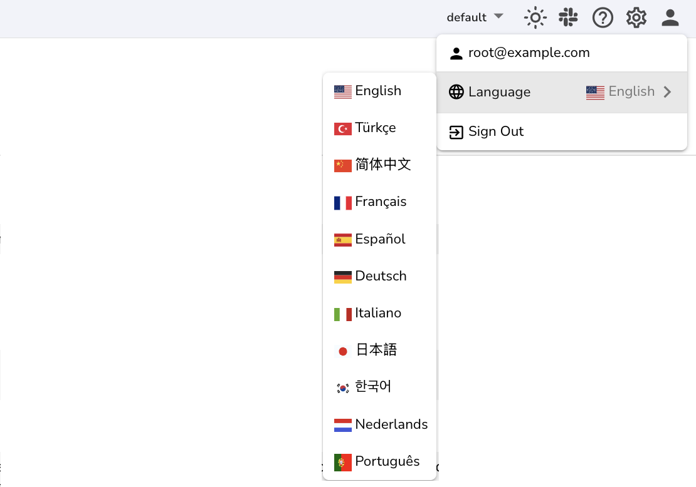

OpenObserve supports multiple UI languages. You can switch the interface language to your preference in just a few clicks. 

**Key Points**

- OpenObserve’s UI language is user-specific. Any user accessing the instance can set their own preferred language from the profile menu, regardless of the language in which the instance was originally created.  
- Changing the language does not affect logs, metrics, traces, or queries.

## How to Change the UI Language

1. Go to the top-right corner of the screen.  
2. Click your profile icon.  
3. In the dropdown, find the **Language** selector.  
4. Choose your preferred language from the list.  
   The UI will instantly update to reflect your selected language.

## Supported Languages

- English (Default)  
- Türkçe  
- 简体中文  
- Français  
- Español  
- Deutsch  
- Italiano  
- 日本語  
- 한국어  
- Nederlands  
- Português

## What Gets Translated  
All built-in user interface (UI) elements, including labels, menus, buttons, settings, tooltips, and other components, are translated into the selected language.

## What Does Not Get Translated 
Dynamic and user-generated content such as pipelines, dashboards, alerts, charts, and ingested data remains in the original language in which it was created or received.