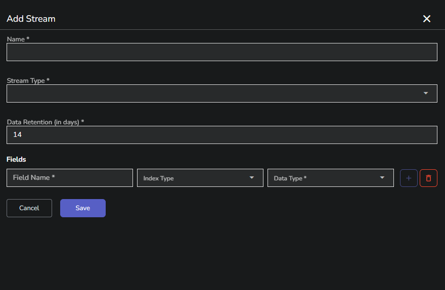

This guide explains how to define and configure stream fields in OpenObserve, including supported field types and index options. 

## Define stream fields

When creating a stream, each field requires three components:

1. **Field Name**: A unique identifier for the field within the stream.
2. **Data Type**: The data type that values in this field will use.
3. **Index Type**: The indexing strategy to optimize query performance.

## Data types

Each field in a stream must have a defined data type. OpenObserve supports the following:

- **utf8**: Text fields. Use for messages, names, or IDs.
- **int64**: Signed 64-bit integers. Use for counts, timestamps, or status codes.
- **uint64**: Unsigned 64-bit integers. Use for numeric IDs or large counters.
- **float64**: Floating point numbers. Use for durations, sizes, or metrics.
- **boolean**: True or false flags. Use for condition checks or binary states.

Maintain consistent data types across all records. Mixed types in the same field can cause indexing and query issues.

## Full text search

Each field may use one index type to accelerate queries. Once applied, it cannot be changed. Choose based on query patterns and field characteristics.

- **Best for**: utf8 fields with unstructured text such as logs or messages.
- **Common filters**: `match_all('timeout')`.
- **Performance**: High speed for large text searches.
- **Storage impact**: Approximately 25 percent overhead.
- **Avoid if**: The field contains structured values like hostnames or IDs.

## Secondary index

- **Best for**: Fields with repeated values such as status codes or namespaces.
- **Common filters**: Equality or list inclusion, such as `status_code = 500` or `namespace IN ('core', 'admin')`.
- **Performance**: Fast exact-match lookups.
- **Storage impact**: Moderate and grows with cardinality.
- **Avoid if**: The field has mostly unique values.

## Bloom filter

- **Best for**: High-cardinality fields such as trace_id or request_id.
- **Common filters**: Specific equality filters, such as `trace_id = 'abc123'`.
- **Performance**: Quickly skips unrelated data.
- **Storage impact**: Minimal.
- **Avoid if**: The field has few distinct values or if you filter using ranges.

## Key-value partition

- **Best for**: Low-cardinality fields such as environment or service.
- **Common filters**: Exact value filters, such as `environment = 'prod'`.
- **Performance**: Reads only relevant partition.
- **Storage impact**: Efficient if files remain large.
- **Avoid if**: The field has many distinct values.

## Prefix partition

- **Best for**: utf8 fields with repeated prefixes such as hexadecimal identifiers.
- **Common filters**: Filters for specific full values, such as `session_id = '1a3f...'`, where '1a' is the prefix.
- **Performance**: Limits scanning to a group based on prefix.
- **Storage impact**: Lower index size and improved compression.
- **Avoid if**: The field has no meaningful prefix structure.

## Hash partition

- **Best for**: Fields with many values that are unevenly distributed.
- **Common filters**: Equality filters, such as `user_id = 'u4567'`.
- **Performance**: Distributes records evenly into fixed partitions.
- **Storage impact**: Balanced partition sizes and predictable access.
- **Avoid if**: The field has only a few distinct values.

