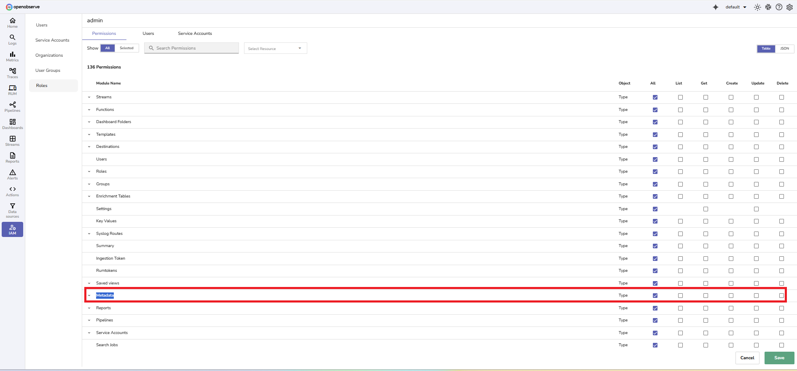

This document explains how the distinct values feature in OpenObserve works.

## Overview
The distinct values feature automatically collects unique values for a stream when data is ingested. The system writes these values to disk at a defined interval. Distinct values are stored in a special stream named `distinct_values`, which is used to accelerate distinct queries.

!!! note "Who can access it"
    By default, the `Root` user has access. Access for other users is managed through **IAM** permissions in the **Metadata** module.
    

!!! note "Where to find it"
    Distinct values are written into automatically created metadata streams. The naming pattern is `distinct_values_<type>_<stream>`. For example, For example: `distinct_values_logs_default` and `distinct_values_logs_k8s_events`.

## Environment variables
| Variable                             | Description                                                                                                                                                                                                               | Default |
| ------------------------------------ | ------------------------------------------------------------------------------------------------------------------------------------------------------------------------------------------------------------------------- | ------- |
| `ZO_DISTINCT_VALUES_INTERVAL`        | Defines how often distinct values collected during ingestion are written from memory to the `distinct_values` stream on disk. This prevents frequent small writes by batching distinct values at the configured interval. | `10s`   |
| `ZO_DISTINCT_VALUES_HOURLY`          | Enables hourly deduplication of distinct values stored in the `distinct_values` stream. When set to true, repeated values within one hour are merged into a single record, and a count of occurrences is logged.          | `false` |

## How it works
1. During ingestion, OpenObserve automatically collects distinct values for each stream.
2. These values are stored in memory and written to disk in the `distinct_values_<type>_<stream>` under **Streams > Metadata** at intervals defined by `ZO_DISTINCT_VALUES_INTERVAL`.

3. If `ZO_DISTINCT_VALUES_HOURLY` is enabled, values in the `distinct_values` stream are further deduplicated at the hourly level, with counts aggregated.
- The `distinct_values` streams help accelerate `DISTINCT` queries by using pre-computed distinct values instead of scanning all ingested logs.

## Example
Ingested data:
```json
2025/09/10T10:00:01Z, job=test, level=info, service=test, request_id=123
2025/09/10T10:00:02Z, job=test, level=info, service=test, request_id=124
2025/09/10T10:01:03Z, job=test, level=info, service=test, request_id=123
2025/09/10T10:10:00Z, job=test, level=info, service=test, request_id=123
2025/09/10T11:10:00Z, job=test, level=info, service=test, request_id=123
```
With `ZO_DISTINCT_VALUES_INTERVAL=10s`, the system first collects values in memory and then writes to disk:
```yaml
2025/09/10T10:00:01Z request_id: 123, count: 2
2025/09/10T10:00:02Z request_id: 124, count: 1
2025/09/10T10:10:02Z request_id: 123, count: 1
2025/09/10T11:10:02Z request_id: 123, count: 1
```
If `ZO_DISTINCT_VALUES_HOURLY=true`, the system merges values by hour:
```yaml
2025/09/10T10:00:01Z request_id: 123, count: 3
2025/09/10T10:00:02Z request_id: 124, count: 1
2025/09/10T11:10:02Z request_id: 123, count: 1
```