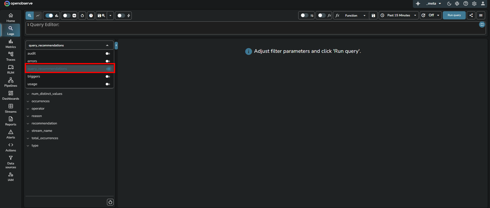
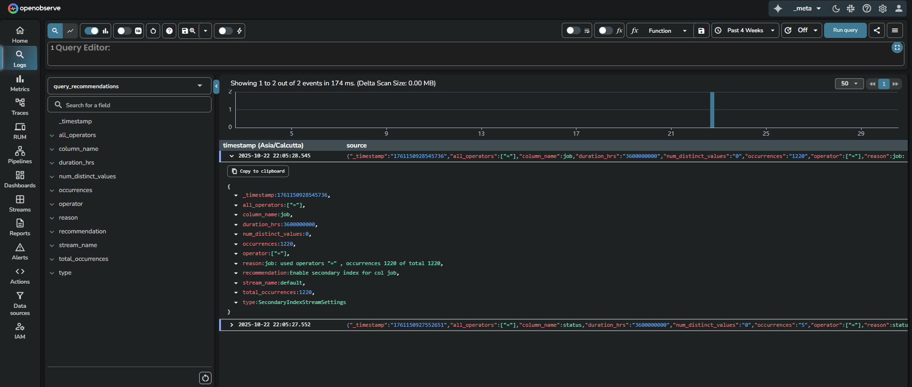
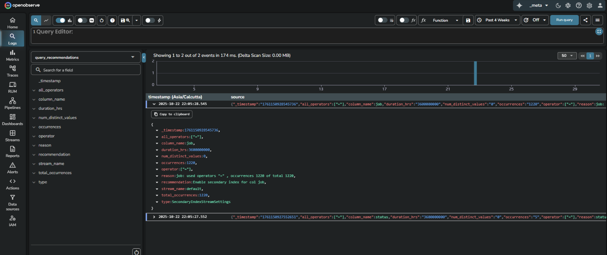
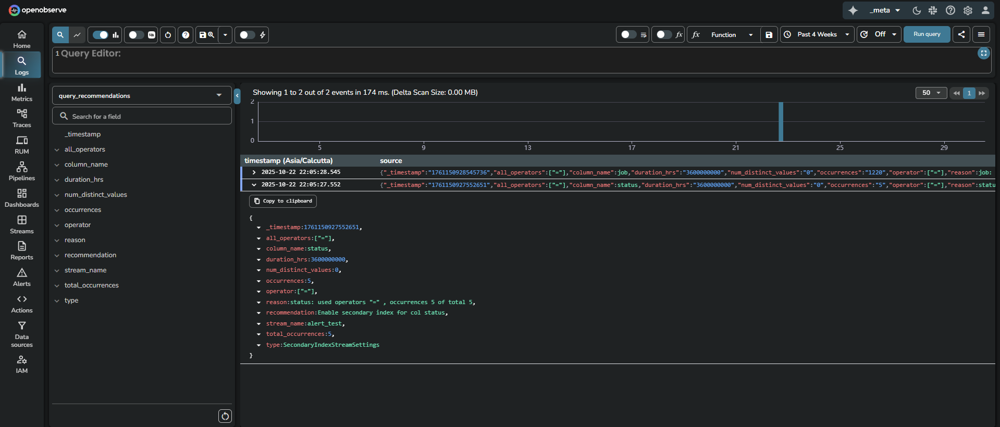

This document explains the function and application of the `query_recommendations` stream within the `_meta` organization in OpenObserve. It provides guidance for users who want to optimize query performance using system-generated recommendations based on observed query patterns.

!!! info "Availability"
    This feature is available in Enterprise Edition. 

## Overview
OpenObserve continuously analyzes user queries across streams to identify optimization opportunities. These suggestions are stored in the `query_recommendations` stream under the `_meta` organization. The recommendations focus on improving performance by suggesting secondary indexes when patterns in field access indicate consistent and potentially costly lookups.

!!! note "Where to find it"
    The query recommendations are published into the `query_recommendations` stream under the `_meta` organization.
    

!!! note "Who can access it"
    All Enterprise Edition users with access to the `_meta` organization can access the `query_recommendations` stream. 

!!! note "When to use it"
    Use this stream when:

    - You notice slow query performance for specific fields or patterns.
    - You are planning schema-level optimizations.
    - You want to validate whether frequently queried fields would benefit from indexing.

## How recommendations are generated
OpenObserve periodically analyzes recent query usage for each organization and stream. It examines which fields were queried, what operators were used, and how frequently. Based on this analysis, OpenObserve generates system recommendations that appear in the `query_recommendations` stream.

The following scenarios can trigger a recommendation:

| Recommendation                             | Trigger condition (When this recommendation is shown)                                                                                      | Why the recommendation is made                                                                                                           |
| ------------------------------------------ | ------------------------------------------------------------------------------------------------------------------- | ------------------------------------------------------------------------------------------------------------------ |
| **Use `str_match`**                          | The field already has a secondary index, but queries on that field do not use `=`, `IN`, or `str_match`.            | These operators are optimized for indexed fields. Using them allows queries to take advantage of existing indexes. |
| **Use `match_all`**                          | The field is configured for full-text search, but queries on that field do not use the `match_all` function.        | The `match_all` function uses the full-text index efficiently. Without it, queries may perform slower scans.       |
| **Enable secondary index for col `field`** | Queries frequently use equality or membership operators (`=`, `IN`, or `str_match`) on a field that is not indexed. | Adding a secondary index on such fields can significantly reduce query latency.                                    |
| **Use full text search**                   | Queries frequently use pattern-based operators (`LIKE` or regex match) on a field.                                  | This pattern suggests that the field would perform better with full-text search enabled.                           |

!!! note "Additional details"
    - Fields used as partition keys are excluded from recommendations.  
    - The engine estimates distinct value counts for the most active streams to help decide whether indexing will be effective.  
    - Each recommendation includes the observed operators, total occurrences, and reasoning.

## How to use it
1. Switch to the `_meta` organization in OpenObserve.
2. Go to the **Logs** section.
3. From the stream selection dropdown, select the `query_recommendations` stream. 
4. Select the desired time range. 
5. Click **Run query**. 

## Field descriptions
| Field                 | Description                                                                 |
|-----------------------|-----------------------------------------------------------------------------|
| `_timestamp`          | Time when the recommendation was recorded.                                 |
| `column_name`         | Field name in the stream that the recommendation applies to.               |
| `stream_name`         | The stream where this field was queried.                                   |
| `all_operators`       | All operators observed for the field (example: =, >, <).                   |
| `operator`            | Primary operator considered for recommendation.                            |
| `occurrences`         | Number of times the field was queried with the specified operator.         |
| `total_occurrences`   | Total number of queries examined.                                           |
| `num_distinct_values` | Count of distinct values seen in the field.                                |
| `duration_hrs`        | Duration (in hours) over which this pattern was observed.                  |
| `reason`              | Explanation behind the recommendation, including observed operators and occurrence counts. |
| `recommendation`      | Specific suggestion such as **Use str_match**, **Use match_all**, **Enable secondary index**, or **Use full text search**. |
| `type`                | Indicates the type of optimization. Can be `SecondaryIndexStreamSettings`, `FTSStreamSettings`, or `QueryOptimisation`. |

## Examples and how to interpret recommendations
The examples below show how OpenObserve surfaces query patterns and recommends indexing or operator changes based on the above logic.

**Example 1**  

This recommendation indicates that across the last 360000000 hours of query data, the job field in the `default` stream was queried with an equality (`=`) operator 1220 times out of 1220 total queries. Since all queries used this field with the `=` operator, a secondary index could improve performance.

!!! note "Interpretation"
    Add a secondary index on the `job` field in the `default` stream for improved performance.

 

**Example 2**  

This recommendation is for the `status` field in the `alert_test` stream. All 5 queries used `status` with an equality operator. Although the number is small, the uniform pattern indicates a potential for future optimization.

!!! note "Interpretation"
    Consider indexing status if query volume increases or performance becomes a concern.

