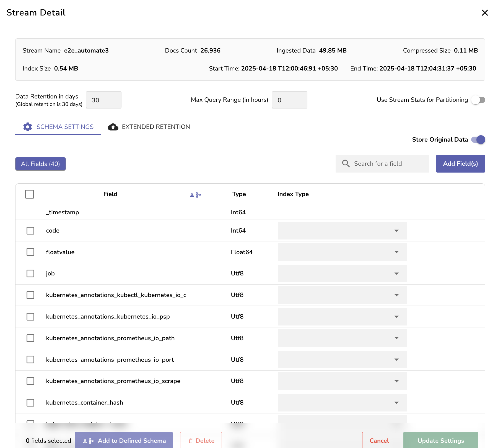
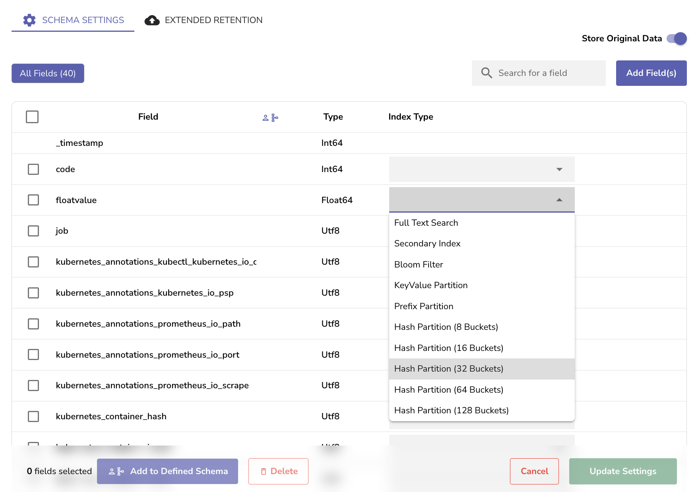
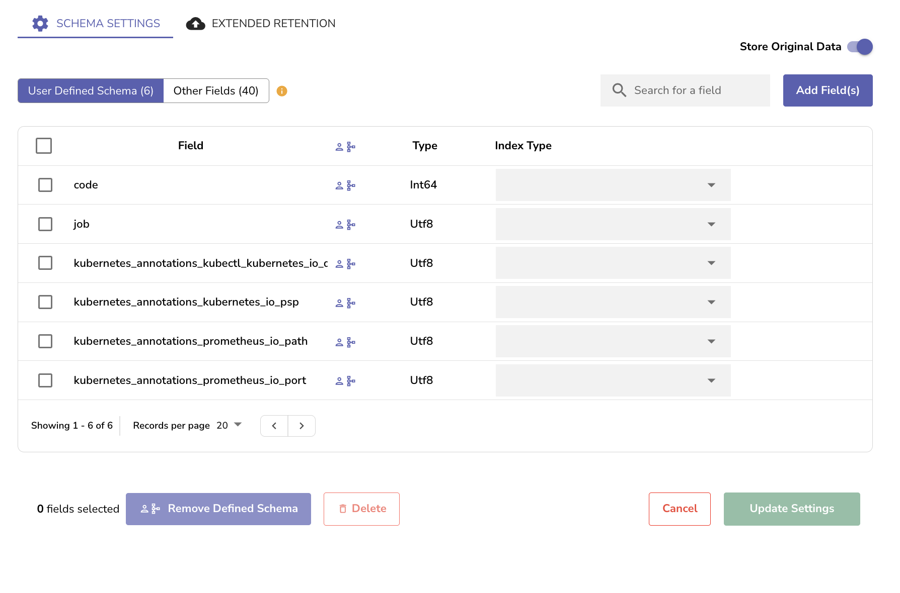

The **Schema Settings** tab in [Stream Details](stream-details.md) allows you to inspect and manage the schema used to store and query ingested data. A schema defines the structure of log data in a stream, including:

- The fields present in the logs  
- The detected data types for each field  
- The index type set for the field by user

Each field represents a key from the JSON log, automatically detected during ingestion. Fields are shown with their name, inferred data type, and any associated index.

## Field Type Detection

When OpenObserve receives logs, it automatically infers the data type of each field.   
For example:

- `58` will be inferred as `Int64`  
- `58.0` as `Float64`  
- `"58%"` as `Utf8`

!!! Note
    **Update the field type with caution.**
    Once a field is detected as a certain type, changing the type in future log entries, for example, from **Utf8** to **Int64**, can result in inconsistent search behavior. It is recommended to maintain consistent field types across all log entries.

## Index Types

You can assign an index type to a field to improve search performance. Indexing can reduce the amount of data that must be scanned during queries. OpenObserve supports multiple index types, such as KeyValue filters and hash partitions.  

!!! Warning  
    Once an index type is applied to a field and saved, it can only be **disabled.**  
    You cannot assign a new index type to that field after disabling the current one. This limitation exists because index types affect how data is stored on disk. Changing the index after storing data may lead to inconsistent query results or data retrieval failures.

## User-Defined Schema (UDS)

By default, OpenObserve stores all fields it detects. However, in high-ingestion environments, especially those with thousands of unique fields per log, such as large-scale services, this can degrade performance.  
User-Defined Schema (UDS) allows you to select a subset of fields that are:

- Retained for storage  
- Searchable and indexable

All other fields will either be ignored or stored in a special `_raw` field if the **Store Original Data** toggle is enabled. These unselected fields will not be searchable.

To enable UDS support, set the following environment variable `ZO_ALLOW_USER_DEFINED_SCHEMAS` to `true` .

## How to Add a User-Defined Schema

1. From the **Streams** page, click the **Stream Details** option under the **Actions** column.   
2. Go to the **Schema Settings** tab.  
3. Select the fields you want to retain from the **All Fields** section.  
4. Click **Add to Defined Schema**.  
5. Save your changes using the **Update Settings** button.

Once this is done:

- The schema interface switches to show **User Defined Schema** and **Other Fields** tabs.  
- Only fields under **User Defined Schema** will be searchable.  
- Fields not included will no longer appear in queries or field selectors.

You can also manually add a field to the schema using the **Add Field(s)** button. This is useful when a field may not have appeared in the logs yet but is expected later. For example, an `error_code` field that appears only during failures can be added before the actual error happens using this.

## Next Steps

- [Extended Retention](extended-retention.md)
	
