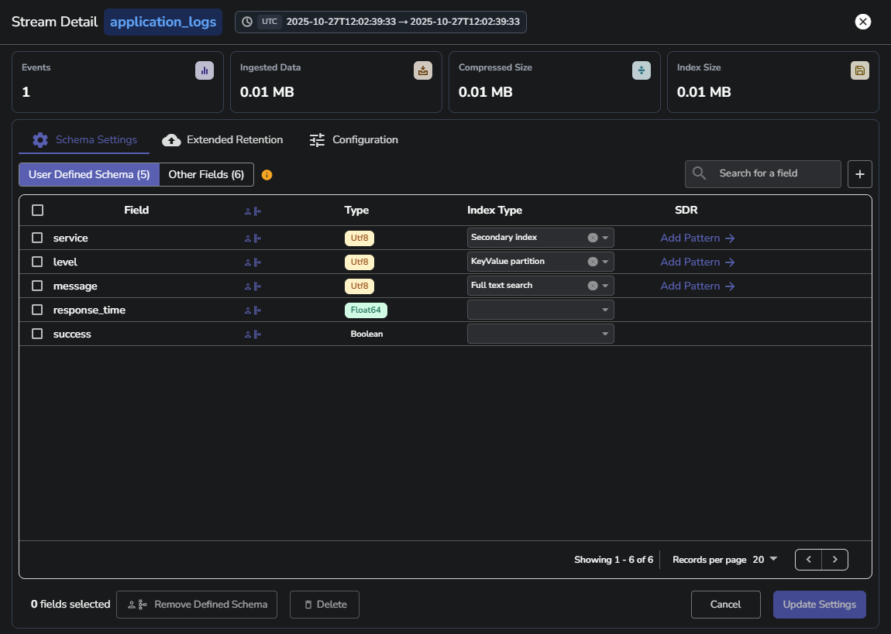
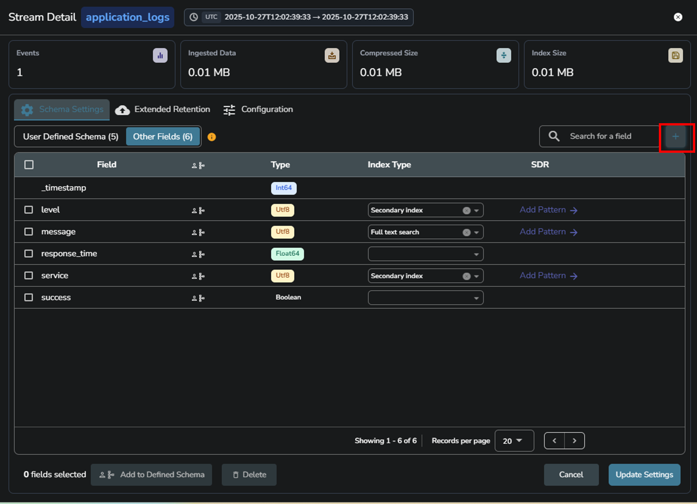
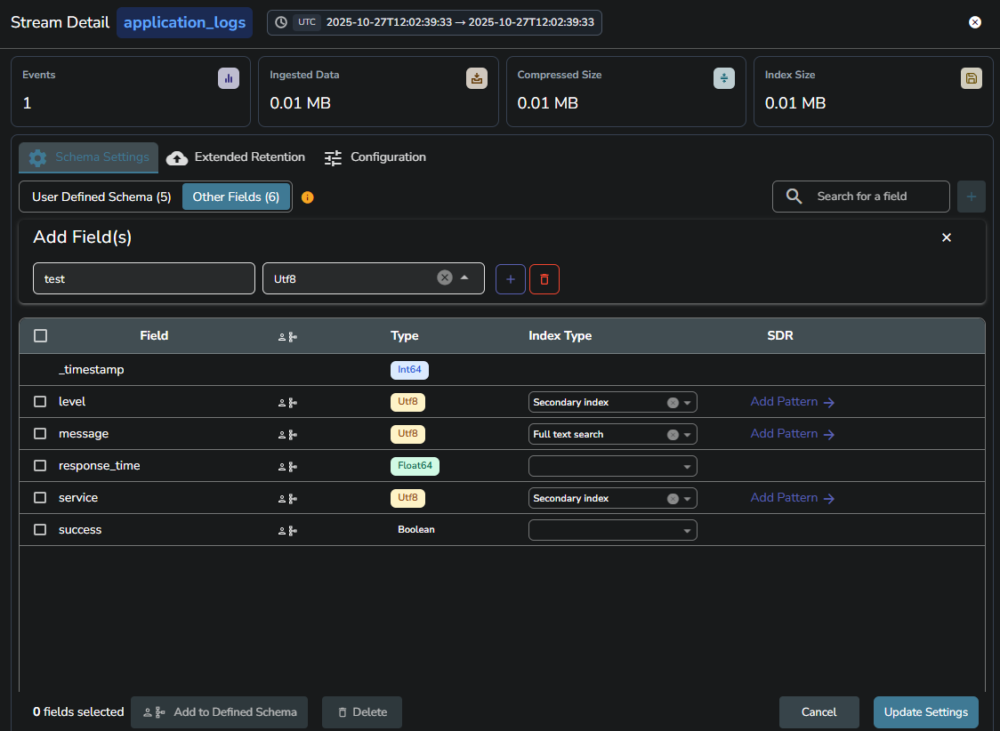
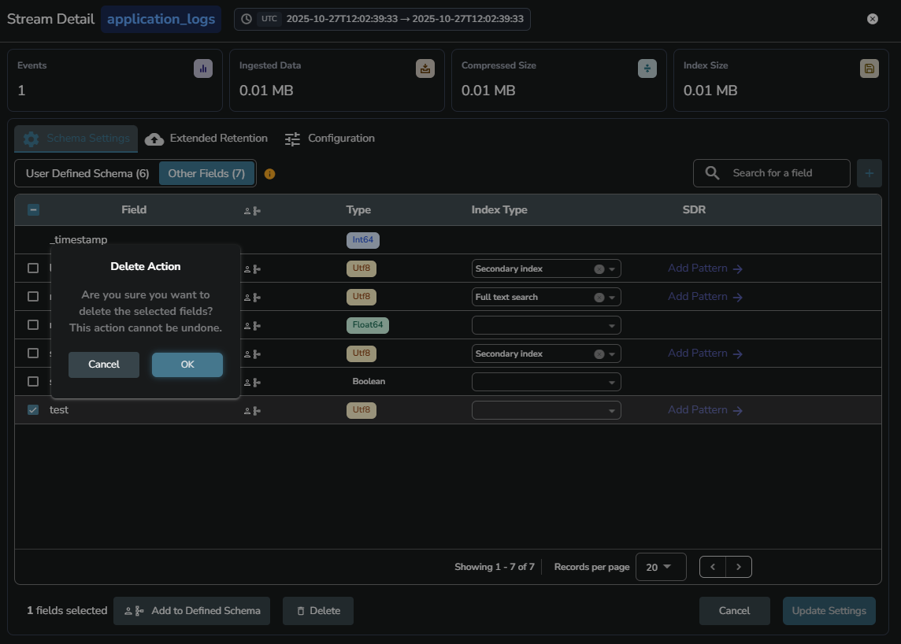

The **Schema Settings** tab in [Stream Details](stream-details.md) allows you to inspect and manage the schema used to store and query ingested data. A schema defines the structure of log data within a stream and includes:

- The fields detected during ingestion  
- The inferred data types for each field  
- The index type assigned to each field  
- Optional sensitive data redaction rules 

Each field represents a key from the JSON log, automatically detected during ingestion. Fields are shown with their name, inferred data type, and any associated index.

## Field type
When OpenObserve receives logs, it automatically infers the data type of each field.   
For example:

- `58` will be inferred as `Int64`  
- `58.0` as `Float64`  
- `"58%"` as `Utf8`

## Index type
You can modify or assign an index type to a field to improve search performance. Indexing can reduce the amount of data that must be scanned during queries. 

To learn more, visit the [Fields and Index in Streams](https://openobserve.ai/docs/user-guide/streams/data-type-and-index-type-in-streams/) page.

!!! Warning  
    Changing the index after storing data may lead to inconsistent query results or data retrieval failures.

## User-Defined Schema (UDS)

By default, OpenObserve stores all fields it detects. However, in high-ingestion environments, especially those with thousands of unique fields per log, such as large-scale services, this can degrade performance.  

> UDS applies to logs, metrics, and traces.

User-Defined Schema (UDS) allows you to select a subset of fields that are:

- Retained for storage  
- Searchable and indexable

All other fields will either be ignored or stored in a special `_all` field if the **Store Original Data** toggle is enabled. These unselected fields will not be searchable.

To enable UDS support, set the following environment variable `ZO_ALLOW_USER_DEFINED_SCHEMAS` to `true` .

### How to add a User-Defined Schema

1. From the **Streams** page, click the **Stream Details** option under the **Actions** column.   
2. Go to the **Schema Settings** tab.  
3. Select the fields you want to retain from the **All Fields** section.  
4. Click **Add to Defined Schema**.  
5. Save your changes using the **Update Settings** button.

After you save the changes:

- The schema interface switches to show **User Defined Schema** and **Other Fields** tabs.  
- Only fields under **User Defined Schema** will be searchable.  
- Fields not included will no longer appear in queries or field selectors.

You can also manually add a field to the schema using the **Add Field(s)** button. This is useful when a field may not have appeared in the logs yet but is expected later. For example, an `error_code` field that appears only during failures can be added before the actual error happens using this.

## Sensitive Data Redaction (SDR)
Sensitive Data Redaction (SDR) lets you redact or drop sensitive data during ingestion or at query time using regex-based rules.

For detailed steps to create and manage SDR rules, refer to the [Sensitive Data Redaction](https://openobserve.ai/docs/user-guide/management/sensitive-data-redaction/) guide. 

## Manage fields in Schema Settings
The Schema Settings tab in the Stream Details page allows you to view, search, and manage fields in your stream schema. You can add, remove, or delete fields as needed to maintain accurate schema definitions for your data.

### Search fields
Use the search bar in the top-right corner to quickly find a **field by name** or **index type**.
This feature helps locate specific fields efficiently, especially in large schemas.

### Add field
To add a new field manually: 
1. Select the **+** icon next to the search bar.

2. The **Add Field**(s) section appears above the field list.
3. Enter the **Field Name** and **Data Type**.

4. Select **Update Settings** to save the new field to the schema.

You can define multiple fields in this section before applying the changes. This option is used when creating or extending the User Defined Schema (UDS).

### Remove defined schema
To remove defined schema entries, first select one or more fields using the checkbox beside each field name.
Then select **Remove Defined Schema** at the bottom of the panel.

This action removes the selected fields from the **User Defined Schema** but does not delete them from the stream. The removed fields appear under **Other Fields**.

### Delete fields
To delete fields from the schema, first select one or more fields using the checkbox beside each field name.
Then select Delete at the bottom of the panel.

This action permanently deletes the selected fields from the schema. Use this action carefully, as it directly modifies the schema definition.

### Bulk selection
Each field includes a checkbox for selection. You can select multiple fields and apply **Add to Defined Schema**, **Remove Defined Schema**, or **Delete** actions in bulk to simplify schema management and save time.

## Next Steps

- [Extended Retention](extended-retention.md)
	
