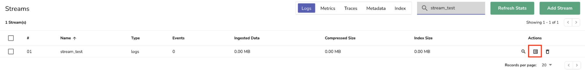
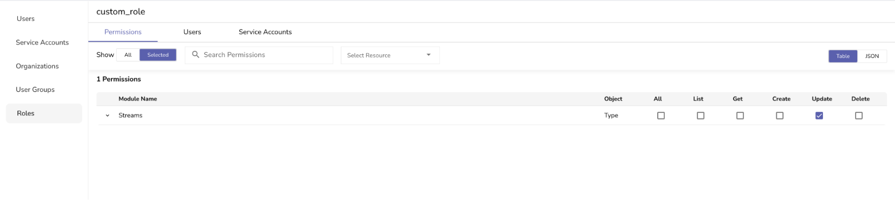
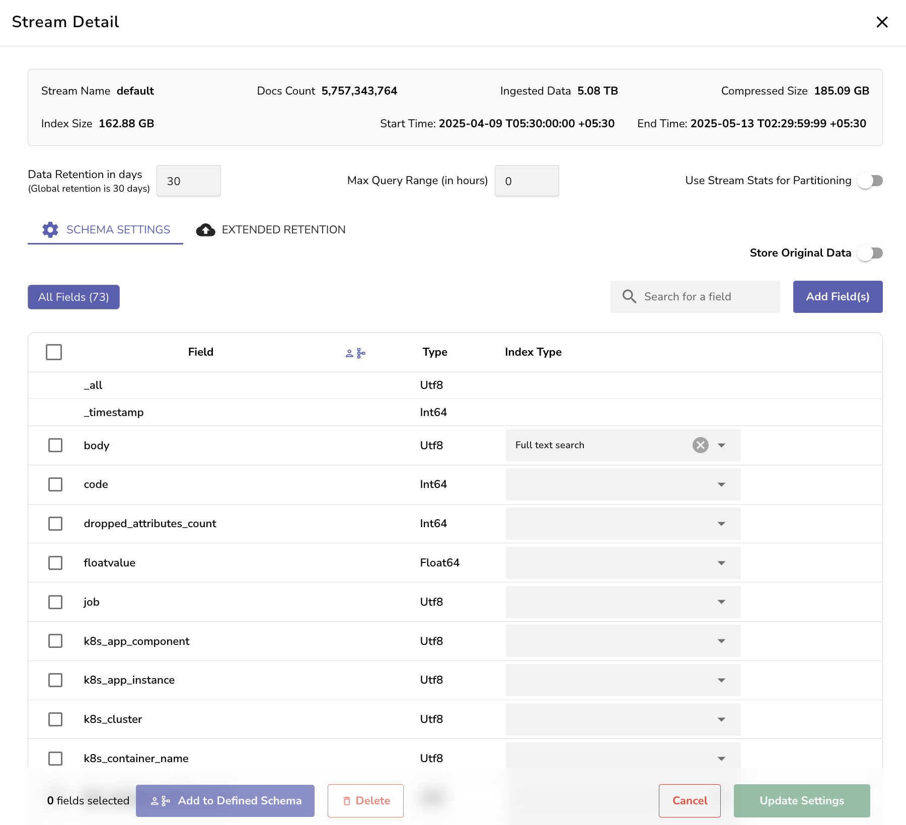

After After you complete [data ingestion](streams-in-openobserve.md#ingest-data-into-stream), use **Stream Details** to view configuration and usage information for a stream and update its settings.

This guide explains how to open **Stream Details** and the information it displays. 

## Access the Stream Details 
From the **Streams** page, select the **Explore** icon from the **Actions** column.   
 

## Permission
User roles that have permission to update Streams can modify the stream settings from the **Stream Details** page. The permission needs to be assigned to appropriate user roles using role-based access control (RBAC). 



## Stream Details
**Stream Details** shows key configuration and usage information for the selected stream:



## General Information

- **Stream Name**: Name of the selected stream.  
- **Docs Count**: Total number of ingested events.  
- **Ingested Data**: Uncompressed size of the stored data.  
- **Compressed Size**: Storage space used after compression.  
- **Index Size**: Size of the tantivy files generated for full text search index. Other index types, such as KeyValue filters and hash partitions, do not affect this value.   
- **Start Time and End Time**: Start time is the timestamp of the oldest data and end time is the timestamp of the newest data.   

!!! Note

    - If the ingested data has a `_timestamp` field, it will be according to that.  
    - If the ingested data does not have a ` _timestamp` field, then the start time will be the oldest time of ingestion and end time will be the newest time of ingestion.  

## Retention and Query Settings

- **Data Retention in Days**: Sets how long data is retained in this stream. If not configured, the global retention period applies. By default, this is 30 days.  
- **Max Query Range in Hours**: Sets the maximum time span allowed per query. This can help reduce query load. Note that this is stream and org specific.   

    You can set a global value as the maximum query range, for all streams across all organizations using the following environment variable:  

    ```
    ZO_DEFAULT_MAX_QUERY_RANGE_DAYS  
    ```  
    > However, when a non-zero Max query range is set on a stream, the value set through **Stream Details** overrides the global value. <br> By default, both the environment variable and the **Max Query Range** value are set to zero, which means there is no limit.
  
- **Use Stream Stats for Partitioning**: When you enable this toggle, OpenObserve assumes that all your data present in the stream is equally split and creates equal sized partitions between the start and end time. 

## Troubleshooting

- If stream details appear blank, verify that the data has been successfully ingested.
- Ensure you have the necessary role permissions to view or modify stream settings.

## Next Steps

- [Schema Settings](schema-settings.md)
- [Extended Retention](extended-retention.md)