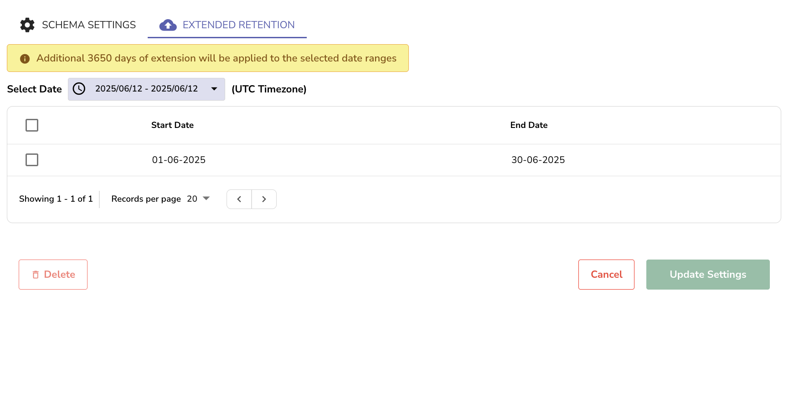

After After you complete [data ingestion](streams-in-openobserve.md#ingest-data-into-stream), use **Stream Details** to view stream details and manage stream settings.

## Overview 
Use **Stream Details** to inspect schemas, apply sensitive-data redaction using regex patterns, set data retention and query limits, and configure ingestion options such as flatten level, storing original data, and enabling distinct values.

!!! note "Where to find it" 
    1. Go to **Streams**.
    2. In the **Actions** column, select **Stream Details**.
     

!!! note "Who can access it" 
    User roles that have permission to update Streams can modify the stream settings from the **Stream Details** page. The permission needs to be assigned to appropriate user roles using role-based access control (RBAC). 


## Stream details
The header cards in the **Stream Details** page shows high-level status for the selected stream:

- **Stream Name**: Name of the selected stream.
 
- **Events**: Total number of ingested events.
   
- **Ingested Data**: Uncompressed size of the stored data.  
- **Compressed Size**: Storage space used after compression.  
- **Index Size**: Size of the tantivy files generated for full text search index. Other index types, such as KeyValue filters and hash partitions, do not affect this value.   

- **Time range**: Start time is the timestamp of the oldest data and end time is the timestamp of the newest data. If the ingested data has a `_timestamp` field, it will be according to that. If the ingested data does not have a ` _timestamp` field, then the start time will be the oldest time of ingestion and end time will be the newest time of ingestion.  

## Schema Settings
Inspect and manage the schema of a stream. <br>
This tab allows you to review detected fields, assign index types, define user-defined schemas, and apply sensitive data redaction patterns. <br>

<br>
To learn more about Schema Settings, visit the [Schema Settings](https://openobserve.ai/docs/user-guide/streams/schema-settings/) page. 


## Extended Retention

Allows you to retain specific segments of your stream data beyond the configured stream-level or global retention period. To learn more, see the [Extended Retention](https://openobserve.ai/docs/user-guide/streams/extended-retention/) page.

## Configuration
The **Configuration** tab provides options to configure stream-level limits and ingestion behavior.


### Data Retention in days
Sets how long data is retained in this stream. If not configured, the global retention period applies. Default global is 30 days.

### Max Query Range in hours
Sets the maximum time span allowed per query. This can help reduce query load. Note that this is stream and org specific.   

- You can set a global value as the maximum query range, for all streams across all organizations using the following environment variable:  
```
ZO_DEFAULT_MAX_QUERY_RANGE_DAYS  
```  
However, when a non-zero Max query range is set on a stream, the value set through **Stream Details** overrides the global value. <br> By default, both the environment variable and the **Max Query Range** value are set to zero, which means there is no limit.

### Flatten Level
 
Controls how deeply nested JSON is flattened during ingestion for this stream.
Flattening converts nested structures into dot-delimited keys.

- Streams can have different nesting depths. Set a suitable level here without changing the global default.
- The flatten level accepts non-negative integers. A value of 0 means no limit, all nested fields are flattened.
If left blank, the stream inherits the global ZO_INGEST_FLATTEN_LEVEL. The UI displays the current global value for context. 

### Use Stream Stats for Partitioning 
When you enable this toggle, OpenObserve assumes that all your data present in the stream is equally split and creates equal sized partitions between the start and end time. 

### Store Original Data
Keeps the raw, original document alongside parsed fields.
Useful for audits and reprocessing. Increases storage because raw payloads are preserved.

### Enable Distinct Values
Enables tracking of distinct values for fields to speed up filters and aggregations that rely on unique values.
Improves responsiveness on high-cardinality fields. 


## Troubleshooting

- If stream details appear blank, verify that the data has been successfully ingested.
- Ensure you have the necessary role permissions to view or modify stream settings.

## Next Steps

- [Schema Settings](schema-settings.md)
- [Extended Retention](extended-retention.md)
