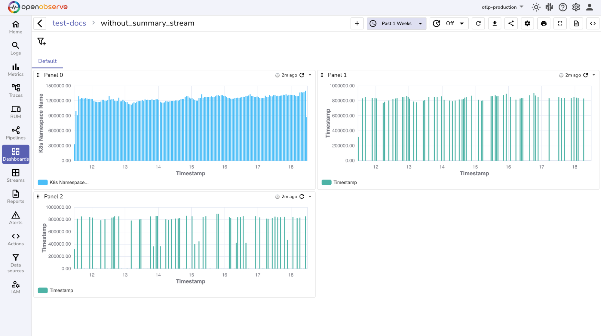
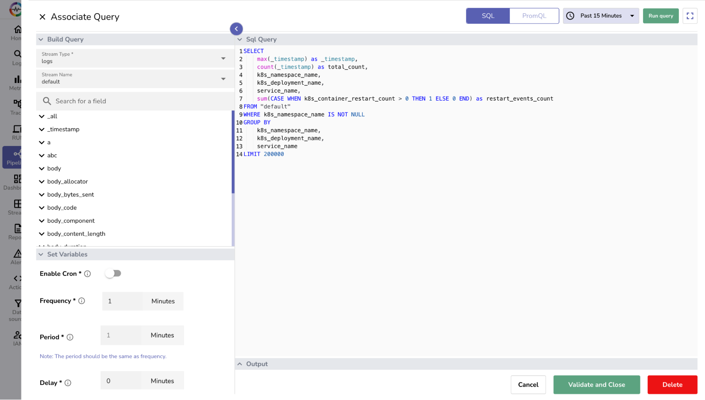
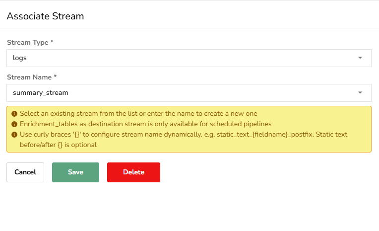
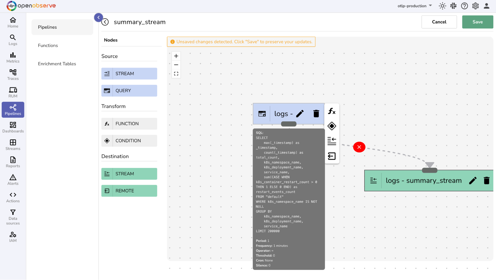
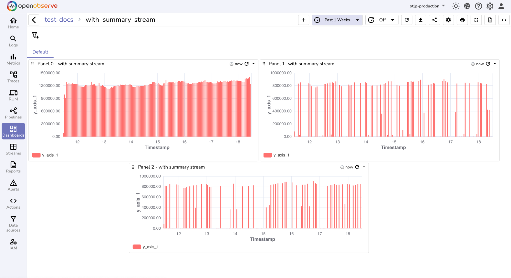
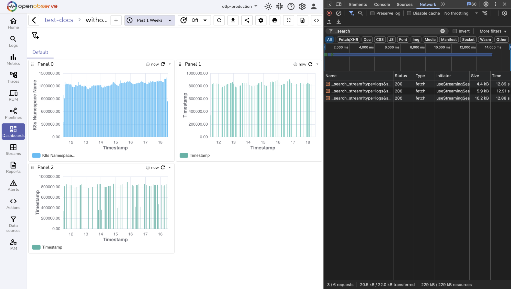
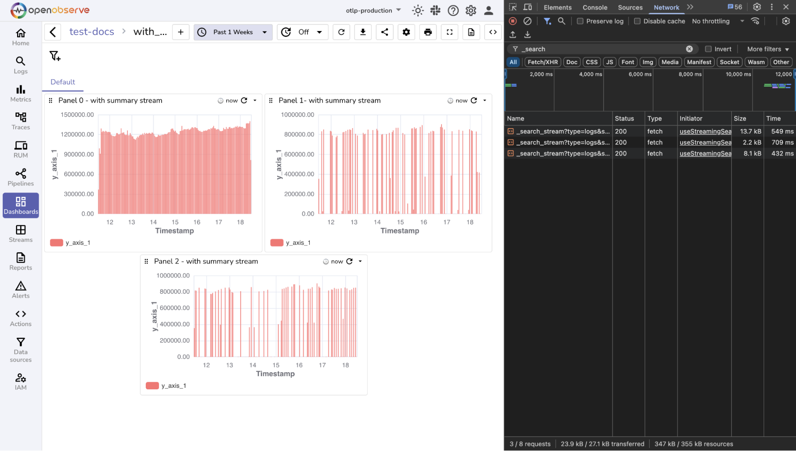
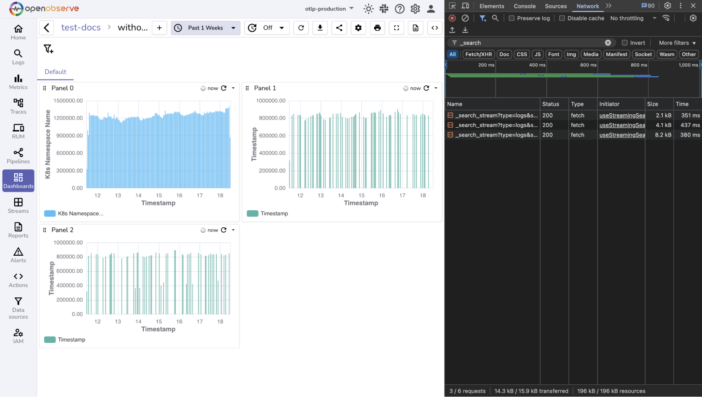
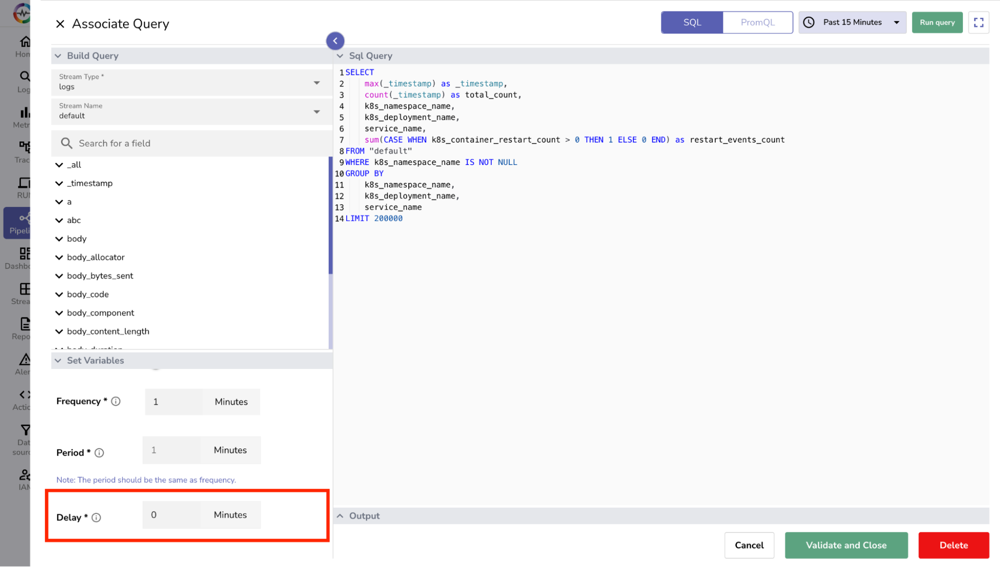

This guide explains how summary streams work, who can use them, and how to create and apply them to optimize dashboards. It also includes example queries, troubleshooting steps, and performance comparison insights to help you make informed decisions.

!!! info "For Enterprise Users"
    Enterprise users should consider using **Aggregation Cache** instead of summary streams for optimal performance. In production testing, these features reduced dashboard load times by up to **97 percent**, significantly outperforming summary streams in most scenarios.

## Overview

A summary stream is a stream that contains pre-aggregated results, generated periodically by a scheduled pipeline. You define a summary SQL query that performs the required aggregations on the raw data. A scheduled pipeline runs this query at regular intervals and stores the output in the summary stream.

Dashboards can then read from this pre-computed summary stream instead of querying raw data directly. This reduces the volume of data scanned during query execution and improves panel load times.

!!! info "Note"
    Based on production testing, summary streams have improved dashboard performance by up to **95 percent** when compared to querying raw data.

!!! note "Where to find"
    Summary streams are created using scheduled pipelines. There is no separate summary stream interface. You build the summary logic as a query in a pipeline, then set it to run automatically and output to a new stream.

!!! note "Who can use"
    Summary stream is an open source feature available to all OpenObserve users. A summary stream is a scheduled pipeline, and its Role-Based Access Control (RBAC) can be managed through the **Pipeline** module in **IAM > Roles > Permissions**.

## Create and apply a summary stream

This example shows how to transform three slow Kubernetes monitoring panels into a fast summary stream solution.

??? "Step 1: Analyze your existing panels"

    Analyze your slow dashboard panels to identify common patterns. <br>
    

    **SQL Query used in original Panel 0:**

    ```sql
    SELECT histogram(_timestamp) as "x_axis_1", 
        count(k8s_namespace_name) as "y_axis_1" 
    FROM "default" 
    WHERE k8s_namespace_name IS NOT NULL
    GROUP BY x_axis_1 
    ORDER BY x_axis_1 ASC
    ```

    **SQL Query used in original Panel 1:**

    ```sql
    SELECT histogram(_timestamp) as "x_axis_1", 
        count(_timestamp) as "y_axis_1", 
        k8s_namespace_name,
        k8s_deployment_name,
        service_name
    FROM "default" 
    WHERE k8s_namespace_name IS NOT NULL 
    AND service_name IS NOT NULL
    AND k8s_deployment_name LIKE '%controller%'
    GROUP BY x_axis_1, k8s_namespace_name, k8s_deployment_name, service_name
    ORDER BY x_axis_1 ASC
    ```

    **SQL Query used in original Panel 2:**

    ```sql
    SELECT histogram(_timestamp) as "x_axis_1",
        count(_timestamp) as "y_axis_1", 
        sum(CASE WHEN k8s_container_restart_count > 0 THEN 1 ELSE 0 END) as "restart_events",
        k8s_namespace_name
    FROM "default" 
    WHERE k8s_namespace_name IS NOT NULL
    GROUP BY x_axis_1, k8s_namespace_name
    ORDER BY x_axis_1 ASC
    ```

??? "Step 2: Identify common elements"

    Look for patterns across your slow panels. This helps you build one summary stream that serves all panels.

    | Component      | Panel 0                     | Panel 1                                             | Panel 2                                    | Summary Decision |
    | -------------- | --------------------------- | --------------------------------------------------- | ------------------------------------------ | ---------------- |
    | Stream         | "default"                   | "default"                                           | "default"                                  | Use "default"    |
    | Common filters | k8s_namespace_name IS NOT NULL | k8s_namespace_name IS NOT NULL, service_name IS NOT NULL | k8s_namespace_name IS NOT NULL             | Include the filters common to all panels |
    | Fields used    | k8s_namespace_name           | k8s_namespace_name, k8s_deployment_name, service_name | k8s_namespace_name, k8s_container_restart_count | Include all fields |
    | Aggregations   | count(k8s_namespace_name)    | count(_timestamp)                                   | count(_timestamp), sum(CASE WHEN...)       | Do all these calculations once in the summary stream |

??? "Step 3: Design your summary query"
    ```sql
    SELECT 
        max(_timestamp) as _timestamp,
        count(_timestamp) as total_count,
        k8s_namespace_name,
        k8s_deployment_name,
        service_name,
        sum(CASE WHEN k8s_container_restart_count > 0 THEN 1 ELSE 0 END) as restart_events_count
    FROM "default"
    WHERE k8s_namespace_name IS NOT NULL
    GROUP BY 
        k8s_namespace_name,
        k8s_deployment_name,
        service_name
    LIMIT 200000
    ```
    **Key design decisions in the summary query** <br>

    1. Preserve time information

        - **What was done**: Used `max(_timestamp)` instead of grouping by time.
        - **Why**: This keeps a single representative timestamp for each group. Time grouping is not performed here because panels apply `histogram(_timestamp)` when building charts.
        - **Action in panels**: When updating panel queries, always apply `histogram(_timestamp)` on this preserved timestamp to create time buckets.

    2. Pre-calculate counts

        - **What was done**: Added `count(_timestamp) as total_count`.
        - **Why**: This shifts the heavy counting operation into the summary query, so panels do not need to calculate counts over raw data.
        - **Action in panels**: Replace `count(...)` with `sum(total_count)` in panel queries.

    3. Include all dimension fields

        - **What was done**: Added `k8s_namespace_name`, `k8s_deployment_name`, and `service_name`.
        - **Why**: These fields are used in filters and groupings across different panels. Including them ensures the same summary stream can serve all panels.
        - **Action in panels**: Apply filters or groupings on these fields directly from the summary stream instead of raw data.

    4. Pre-compute restart events

        - **What was done**: Added a `CASE` expression to calculate `restart_events_count`.
        - **Why**: This avoids recalculating restart events repeatedly in panels, which was previously done in Panel 2.
        - **Action in panels**: Replace the restart calculation with `sum(restart_events_count)` when updating the query.

    5. Filter invalid data early

        - **What was done**: Added `WHERE k8s_namespace_name IS NOT NULL`.
        - **Why**: This removes rows without namespace information, reducing unnecessary data before panels process it.
        - **Action in panels**: Apply additional filters if needed, but rely on this base filter already built into the summary stream.

    6. Group by attributes, not time

        - **What was done**: Grouped by `k8s_namespace_name`, `k8s_deployment_name`, and `service_name`.
        - **Why**: These are the key attributes needed across panels. Time is left out because each panel applies its own time grouping.
        - **Action in panels**: Always combine `histogram(_timestamp)` with these attributes for flexible visualizations.

    7. Limit the result size

        - **What was done**: Added `LIMIT 200000`.
        - **Why**: This prevents the summary stream from growing too large, which could slow down dashboards.
        - **Action in panels**: No change is needed. The panels automatically work with the limited dataset.

??? "Step 4: Create the summary pipeline"

    1. Navigate to **Pipelines > Add Pipeline**.  
    2. From the **Source** section, add a **Query Node** and select **Edit**.  
    3. In the **Associate Query** screen, select the **Stream Type** and **Stream Name**.  
    4. Set **Frequency** as per your data freshness needs.  
    <br>
    
    5. In the Sql Query editor, enter the summary query. 
    6. Click **Run Query** to test the summary query. 
    7. Select **Validate and Close** to save the changes.
    8. From the **Destination** section, add a **Stream Node**.
    <br>
     
    9. Enter the destination stream name and select **Save**. 
    10. In the pipeline editor, connect the source node to the destination node.
    11. Enter a pipeline name and select **Save**. 
    <br>
    

??? "Step 5: Update your panel queries"
    Update your panels to use the summary stream. <br>
    

    **SQL query used in updated Panel 0 with summary stream:**

    ```sql
    SELECT histogram(_timestamp) as "x_axis_1", 
        sum(total_count) as "y_axis_1" 
    FROM "k8s_summary_stream" 
    GROUP BY x_axis_1 
    ORDER BY x_axis_1 ASC
    ```

    **SQL query used in updated Panel 1 with summary stream:**

    ```sql
    SELECT histogram(_timestamp) as "x_axis_1", 
        sum(total_count) as "y_axis_1", 
        k8s_namespace_name,
        k8s_deployment_name,
        service_name
    FROM "k8s_summary_stream" 
    WHERE service_name IS NOT NULL
    AND k8s_deployment_name LIKE '%controller%'
    GROUP BY x_axis_1, k8s_namespace_name, k8s_deployment_name, service_name
    ORDER BY x_axis_1 ASC
    ```

    **SQL query used in updated Panel 2 with summary stream:**

    ```sql
    SELECT histogram(_timestamp) as "x_axis_1",
        sum(total_count) as "y_axis_1", 
        sum(restart_events_count) as "restart_events",
        k8s_namespace_name
    FROM "k8s_summary_stream" 
    GROUP BY x_axis_1, k8s_namespace_name
    ORDER BY x_axis_1 ASC
    ```

    **Key transformation patterns**

    When updating panels to use summary streams, apply the following transformations:

    - **Original Pattern:** `count(field_name)`  
    **Summary Stream Pattern:** `sum(total_count)`  
    **Why:** The summary stream has already counted rows. Use `sum` to aggregate the pre-calculated counts.

    - **Original Pattern:** `sum(CASE WHEN...)`  
    **Summary Stream Pattern:** `sum(pre_calculated_field)`  
    **Why:** Use the pre-calculated conditional sum from the summary stream.

    - **Original Pattern:** `FROM "original_stream"`  
    **Summary Stream Pattern:** `FROM "summary_stream"`  
    **Why:** Change the source to read from the summary stream.


## Performance Benefits

The following performance results are based on testing with a one-week time range:

??? "Original dashboard loads data in `36.68 seconds`:"
    
??? "After updating the dashboard to use a summary stream, the load time reduced to `1.69 seconds`:"  
    
??? "When running the original dashboard with aggregation cache enabled, the load time reduced to `1.16 seconds`:"
    


**Performance improvements:**

- Summary streams reduced panel load time by approximately **95.39 percent** compared to the unoptimized dashboard.  
- Aggregation cache further reduced load time by approximately **96.84 percent**.


## Best Practices

??? "1. Data Delay Consideration"

    By default, summary streams do not include data that arrives after the scheduled pipeline has executed.

    - Example: A pipeline runs every 5 minutes and scans the last 5 minutes of data. A run at 11:00 scans data from 10:55 to 11:00. If data with a timestamp of 10:58 arrives at 11:04, the run at 11:05 scans data from 11:00 to 11:05 and does not include the delayed 10:58 data.  
    - To include late-arriving data, configure the **Delay** field in the pipeline query editor. This field is in the **Set Variables** section at the bottom left of the editor. 
         
    - The delay value specifies how long the system waits after the scheduled time before running the query.  
    - Example: If the period is 5 minutes and the delay is 5 minutes, the pipeline scheduled for 11:05 runs at 11:10 and scans data from 10:55 to 11:00.  
    - Set the delay to a multiple of the pipeline period, such as 0, 5, or 10 minutes for a 5-minute period. This helps keep time ranges aligned and avoids overlaps or gaps in the processed data.


??? "2. Query Design"
    - Include only essential fields.  
    - Avoid unnecessary fields to reduce stream size and improve performance.  
    - Always use a `LIMIT` clause and adjust based on performance needs.


## Troubleshooting

??? "1. Summary stream returns no data"

    **Possible causes:**

    - `WHERE` conditions in summary query are too restrictive.  
    - Pipeline execution is failing.  
    - Pipeline has not run long enough to accumulate data.  

    **Solutions:**

    - Check pipeline execution logs in the pipeline interface.  
    - Review and adjust `WHERE` conditions in the summary query.  
    - Verify that the source stream contains matching data.  
    - Wait 24–48 hours for the summary stream to populate.  

??? "2. Results do not match original panels"

    **Possible causes:**

    - Missing fields or aggregations in the summary query.  
    - Different `WHERE` conditions between original and summary queries.  

    **Solutions:**

    - Compare `WHERE` clauses in both queries.  
    - Verify all required aggregation patterns are included.  


??? "3. Summary stream grows too large"

    **Possible causes:**

    - No `LIMIT` clause in the summary query.  

    **Solutions:**

    - Add or adjust the `LIMIT` value in the summary query.  
    - Apply more restrictive `WHERE` conditions.  


??? "4. Unable to confirm if the pipeline is running or failing"

    **Possible causes:**

    - Pipeline execution errors are not visible in the interface.  
    - The schedule has triggered, but status information is not being monitored.  

    **Solutions:**

    - Check the `errors` stream in the `_meta` organization for events related to pipeline execution failures.  
    - If `ZO_USAGE_REPORTING_ENABLED` is set to `true`, monitor the `triggers` stream to verify execution status.  
