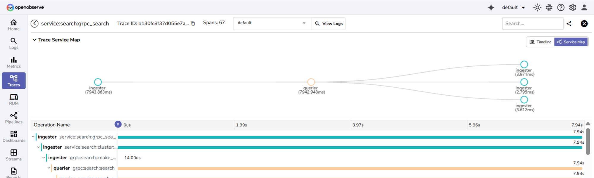
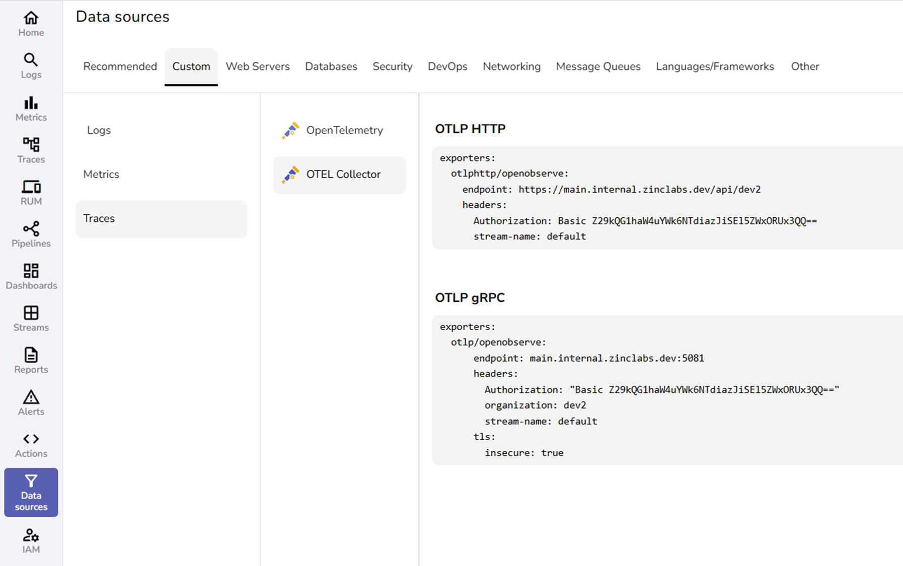
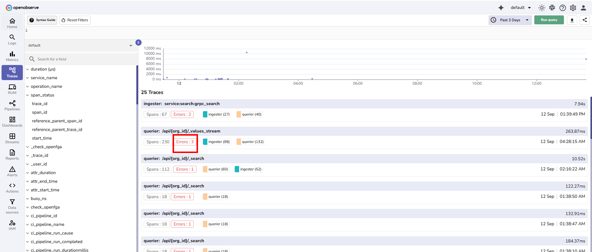

This document explains how to use OpenObserve to collect, view, and analyze distributed traces. It covers how to configure tracing for self-monitoring and external applications, correlate traces with logs, and explore trace data in the UI to identify performance bottlenecks and errors.
=== "Overview"
    !!! note "Who can use it"
        All OpenObserve users can view traces. 

    !!! note "Where to find it"
        Select **Traces** from the left navigation in the OpenObserve UI. 
        

    ## Why traces matter
    When an application serves a request, such as placing an order, it often calls many different services behind the scenes. If something slows down or fails, it can be difficult to know where the problem happened. Traces solve this by recording the journey of a single request as it flows through your system.

    ## What is a trace? 
    A trace is the complete story of one request. It begins when the request enters your system and ends when the final response is sent back.
    A trace is made up of smaller pieces called spans. Each span represents one operation in the request journey. Examples of operations include verifying a user’s login, reserving inventory, or charging a payment card.
    
    - Every trace has a trace_id, which is the unique identifier that ties all its spans together.
    - Every span has its own `span_id`, which shows its place in the request journey.
    - Parent and child relationships between spans make it clear which operation triggered which.

    ## How OpenObserve helps
    OpenObserve collects and stores spans from your services. It then reconstructs the request flow in the Traces UI, where you can see how the request moved across different services, how long each step took, and where issues may have occurred.
    <br><br>
    **Example: Retail Application** <br>
    Imagine a customer clicks **place order** in your online shop. That single action triggers work across several services:

    ```bash
    Browser
    ├─ API Gateway
        |
        orders-service  		    • operation: POST /checkout
        ├─ auth-service           	• operation: verify token
        ├─ inventory-service      	• operation: reserve items
        ├─ payments-service       	• operation: charge card
        │   └─ payments database  	• operation: SQL query
        └─ email-service          	• operation: send receipt
    ```
    ## How this appears as a trace
    **Root span:** orders-service POST /checkout starts when the API receives the request and ends when the response is sent.
    <br>

    **Child spans:**

    - auth-service verify token.
    - inventory-service reserve items.
    - payments-service charge card.
    - payments database SQL query.
    - email-service send receipt.

    !!! note "Note"
        - All spans share one `trace_id`. Each span has a unique `span_id`. The parent and child links show who called whom and in what order.
        - The application component that performs an operation is called a service. For example, auth-service, inventory-service, and payments-service are all services involved in processing the order.
        - The specific action performed by the service is called an operation. For example, the auth-service runs verify token, the inventory-service runs reserve items, and the payments-service runs charge card.
    
    ## Views available in the UI
    **Trace list:** Displays recent traces for the selected time range and selected stream. 
    
    Each row shows:

    - The service and operation name
    - The number of spans
    - The request timestamp
    - The total duration
    - Badges for the services involved
    - The first span determines the label.
    
    

    **Timeline:** Shows spans as color-coded horizontal bars. Parent spans contain child spans. Parent time includes the time of child spans, which may run in parallel.
    
    **Service map:** Shows all services involved in the trace and how long each took.
    
    **Span details:** Provide metadata such as file path, code line, service version, thread ID, and additional attributes. Events and error messages appear when available.
    
=== "How-to"
    <br>
    The following configuration steps show how to set up OpenObserve for self-monitoring and for collecting traces from external applications.

    ## Configure for self-monitoring 

    **Steps** <br>
    ??? "Step 1: Navigate to Data Sources and collect authorization details"
        Go to **Data sources** > **Custom** > **Traces**.
        
        Note the following values:

        - HTTP Endpoint under OTLP HTTP
        - Authorization header value

        

    ??? "Step 2: Configure the environment variables"
        Set the following environment variables on the OpenObserve deployment:
        ```
        ZO_TRACING_ENABLED=true
        ZO_TRACING_SEARCH_ENABLED=true
        OTEL_OTLP_HTTP_ENDPOINT=https://<host>/api/<organization>/v1/traces
        ZO_TRACING_HEADER_KEY=Authorization
        ZO_TRACING_HEADER_VALUE=<paste the Authorization value from the UI>
        ```
        
        Replace `<host>` and `<organization>` with the values you saw in the UI. Keep /v1/traces.
        This indicates that from the instance 

    ??? "Step 4: Apply changes"
        Apply the environment variable changes and restart the service.

    ??? "Verify and view your first trace"

        1. From the left navigation menu, select **Logs**. 
        2. Select a stream and time range, and run a simple log search query. 
        3. From the left navigation menu, go to **Traces**. 
        4. Select the trace stream. 
        5. Set the time range to the last few minutes, and open the newest trace. 
        6. You should see spans from services such as querier, ingester, or alertmanager.

    ## Configure to monitor an external application
    You can send traces directly from an external application to OpenObserve.

    ??? "Step 1: Navigate to Data Sources and collect authorization details"
        In your OpenObserve application, go to Data sources > Custom > Traces.
        
        From the **OTLP HTTP** section, copy the following data:

        - HTTP Endpoint
        - Authorization header value

        From the **OTLP gRPC** section, copy the following data:

        - Endpoint 
        - Headers: Authorization, organization, stream-name
        - TLS setting insecure or secure

    ??? "Step 2: Choose how you want to send the data"
        

        === "OpenTelemetry SDK"
            **You can send the data directly from the application using an OpenTelemetry SDK**
            <br>
            

            In this method, add the copied authorization values in the exporter setup within your code:

            - Set the **endpoint** to the HTTP Endpoint you copied. It ends with /v1/traces.
            - Add the **headers** exactly as shown in the UI.
            - For **HTTP**, add Authorization.
            - For **gRPC**, add Authorization, organization, and stream-name.
            - Set **TLS** to secure or insecure to match the UI if you use gRPC.
        === "OpenTelemetry Collector"
            You can also send data through the **OpenTelemetry Collector**. <br>
            To configure this: 

            - Open your team's Collector config file.
            - In the exporters section, paste the exporter block exactly as shown in **Data sources** > **Custom** > **Traces** > **OTEL Collector** for the protocol you use.

    ??? "Verify and view your first trace"
        1. In the external application, perform an operation. 
        2. In your OpenObserve instance, go to Traces. 
        3. Select the trace stream. 
        4. Set the time range to the last few minutes, and open the newest trace. 
        5. You should see spans from services such as querier, ingester, or alertmanager.

    ## Configure and view log and trace correlation 
    Configure correlation to navigate between traces and their related log records using shared `trace_id` and `span_id` fields.

    ### Understanding log and trace correlation

    - **Logs and Traces Correlation:** Logs become easy to join with traces when each log record includes the active TraceId and SpanId. The OpenTelemetry logs spec calls this out so that a UI can jump from a span to its related logs and back. Field names can be trace_id and span_id or equivalents that you choose. 
    - **Trace context:** A small set of identifiers that travels with each request so the tracing systems can follow the same request across services. In OpenTelemetry this context is carried in a SpanContext that contains a TraceId and a SpanId and flags.
    - **The `traceparent` header:** An HTTP header that passes the current trace context between services. It has four parts in this order: version, trace-id, parent-id, and trace-flags. Example: 
    `traceparent: 00-0af7651916cd43dd8448eb211c80319c-b7ad6b7169203331-01`

    ### Requirements
    - Logs and traces must come from the same application run.
    - Your application must write trace context fields into every log record.
    - OpenObserve must know the exact field names you used in your logs.

    ### What makes logs correlatable
    The spans are generated by the system or application that you are monitoring. They are created by its tracing library or agent, not by OpenObserve.
    <br>
    A span is active while your code is handling an operation. When a span is active, the logging component can read the following identifiers from it and add them to each log line.
    
    - trace_id
    - span_id

    ??? "Step 1: Add trace identifiers to your logs in the application" 
        1. Ensure your tracing library starts a span for each request and keeps the span active during request processing. Many libraries do this automatically once enabled.
        2. When you write a log record during that time, include the current span identifiers. Add `trace_id` and `span_id` to the log record.
        3. Choose log field names that fit your logging format. Examples include `trace_id` and `span_id` or `traceId` and `spanId`. Make a note of the exact names you used. You will map these field names in OpenObserve in the next step.

    ??? "Step 2: Tell OpenObserve how your log fields are named"
        
        1. Open the OpenObserve UI.
        2. Go to **Management** > **Organization Parameters**. 
        3. Under **Log** details: 
        - Set **Trace ID** field name to match your log field name. Example `trace_id` or `traceId`.
        - Set **Span ID** field name to match your log field name. Example `span_id` or `spanId`.
        4. Save the settings.

        !!! note "Why this matters"
            Traces in OpenObserve always use `trace_id` and `span_id` as defined by OTLP.

            Your logs can use different names. The mapping you set here allows the UI to build the correct filter when you open related logs from a span.

    ??? "Step 3. View the correlation in the UI"

        === "From Traces to Logs" 

            1. Open **Traces**.
            2. Select the trace stream.
            3. Choose the time range and select **Run query**.
            4. Open a trace to view its timeline.
            5. Now choose any of these ways to reach the related logs:
            
            **A. Use the header stream selector**:

            - In the trace header, open the stream dropdown next to View Logs.
            - Pick the log stream that holds your application logs.
            - Select View Logs. The Logs page opens, filtered to the current trace_id and span_id.

            **B. Use the magnifier on a span row**:

            - Hover any span in Operation Name.
            - Select the magnifier icon.
            - It goes to the correlated logs stream and shows the log record which is linked to the trace ID and span ID.

            **C. Use the span details panel**:

            - Select a span to open the detailed span view
            - Select View Logs next to the Span Id.
            - It goes to the correlated logs stream and shows the log record which is linked to the trace ID and span ID.

        === "From Logs to Trace"

            1. Open **Logs**.
            2. Select the appropriate log stream.
            3. Select the time range and select **Run query**.
            4. Expand a log record.
            5. Select **View Trace**.
            
            6. The system shows the trace that matches the `trace_id`.

            **Note**: If no results appear after selecting **View Trace**, confirm that in your log stream the trace ID and span ID are available in the `trace_id` and `span_id` respectively. If not, ensure the custom trace ID and span ID fields are configured in the Organization parameter section under Management. 
            

    ## View a trace
    1. Go to **Traces**.
    2. Select the trace stream. 
    3. Select time range. 
    4. Click **Run query**. 
    5. From the query result, select the desired trace. 


    ## Use Trace Timeline and Service Map
    Use Trace Timeline and Service Map to inspect performance and find slow spans:
    
    1. Go to **Traces**. 
    2. From the stream selector, select the trace stream.
    3. Set a time range.
    4. Select **Run query**.
    5. From the list of traces, open a trace.
    6. In the trace view, select the Timeline toggle at the top right corner. 
    7. In **Operation Name**, expand the tree and look for the longest bars. The longest bar indicates the most time consuming span. The duration is shown at the right edge of each bar.
    8. Switch to **Service Map** toggle next to **Timeline** at the top right corner.
    9. The nodes show which services participated and their time contribution for this trace.

    ## Use filters to find the related logs
    1. Go to **Traces**. 
    2. From the stream selector, select the trace stream.
    3. Add a filter in the non-SQL editor to find spans with errors, for example, `span_status = "ERROR"`.4. Set a time range.
    5. Select **Run query**. 
    6. From the list of traces, open a trace. Traces should have an error badge.
    
    7. In the span tree, click the span highlighted in red warning sign. 
    
    8. The detailed span view opens, showing the complete context for that span.  
    
    9. If log and trace correlation is configured, select **View Logs** in the span details panel to open the related logs for further investigation.   
    
    ## Explore the detailed span view
    

    | Tab | What it shows | When to use |
    |-----|---------------|-------------|
    | Tags | Key/value attributes on the span (code location, service identity, status, parent links, etc.). | Identify where the work ran, whether it showed an error, and the parent/child relationship. |
    | Process | Compact identity of the emitting process (service, instance, version). | Confirm the exact instance/version for rollbacks or targeted restarts. |
    | Events | Time-ordered records emitted inside the span (INFO/ERROR messages with context). | Read the span's timeline narrative and error messages without leaving the trace. |
    | Attributes | The full JSON document is stored for this span. | Copy/paste into tickets, verify raw values, or see fields not surfaced elsewhere. |